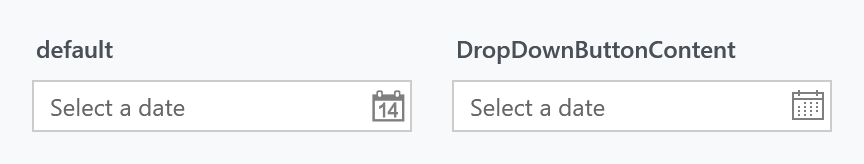

Order: 50
Title: DatePickerHelper
Description: The drop-down button of a DatePicker or TimePicker
---

Applies to `DatePicker` and `TimePickerBase`, which covers `TimePicker` and `DateTimePicker`. All four properties describe the button that opens the calendar or clock.



| Property | Type | Default | |
| --- | --- | --- | --- |
| `DropDownButtonContent` | `object` | `null` | what the button shows |
| `DropDownButtonContentTemplate` | `DataTemplate` | `null` | how that content is drawn |
| `DropDownButtonFontFamily` | `FontFamily` | the system message font | font the content is drawn in |
| `DropDownButtonFontSize` | `double` | the system message font size | its size |

:::{.alert .alert-warning}
The two defaults above are the helper's, not what a styled picker has. The MahApps `DatePicker` style sets `DropDownButtonContent` to a **`Path` geometry string** and `DropDownButtonContentTemplate` to a template that renders it as a `Path`. Set the content to a glyph or a word and leave the template alone, and the template will try to read your text as geometry — the button goes blank rather than showing anything.
:::

Replacing the icon therefore means dealing with both. Either clear the template:

```xml
<DatePicker mah:DatePickerHelper.DropDownButtonContent="&#xE787;"
            mah:DatePickerHelper.DropDownButtonContentTemplate="{x:Null}"
            mah:DatePickerHelper.DropDownButtonFontFamily="Segoe MDL2 Assets"
            mah:DatePickerHelper.DropDownButtonFontSize="16" />
```

or keep the template and give it geometry of your own:

```xml
<DatePicker mah:DatePickerHelper.DropDownButtonContent="M2,4 L14,4 L14,15 L2,15 Z M2,7 L14,7" />
```

## Related

The picker's text box side — watermark, clear button, button width — comes from [TextBoxHelper](textboxhelper), and its corner radius and border brushes from [ControlsHelper](controlshelper).
