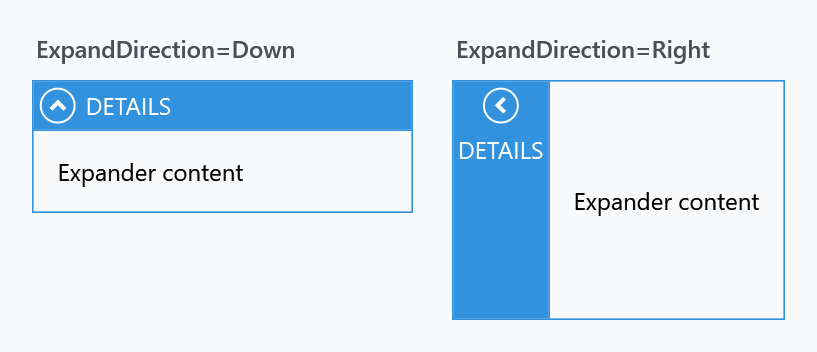

Order: 60
Title: ExpanderHelper
Description: Header styles per direction, and the expand and collapse animations
---

Applies to `Expander`. An expander's header is a `ToggleButton`, and which way it points depends on `ExpandDirection` — so the helper carries one header style per direction rather than one style.



## Header styles

| Property | Applies when | Style the MahApps theme puts there |
| --- | --- | --- |
| `HeaderDownStyle` | `ExpandDirection="Down"` | `MahApps.Styles.ToggleButton.ExpanderHeader.Down` |
| `HeaderUpStyle` | `ExpandDirection="Up"` | `MahApps.Styles.ToggleButton.ExpanderHeader.Up` |
| `HeaderLeftStyle` | `ExpandDirection="Left"` | `MahApps.Styles.ToggleButton.ExpanderHeader.Left` |
| `HeaderRightStyle` | `ExpandDirection="Right"` | `MahApps.Styles.ToggleButton.ExpanderHeader.Right` |

All four are `Style`, and all four are filled in by the `Expander` style — the template picks the one that matches the current direction. Replacing one only changes that direction, so an expander whose direction is bound needs the matching styles set for every value it can take.

```xml
<Expander Header="Details"
          mah:ExpanderHelper.HeaderDownStyle="{StaticResource QuietExpanderHeader}">
    <TextBlock Margin="8" Text="Expander content" />
</Expander>
```

Base your own on the built-in one for the direction you are replacing, or the arrow and the layout go with it:

```xml
<Style x:Key="QuietExpanderHeader"
       BasedOn="{StaticResource MahApps.Styles.ToggleButton.ExpanderHeader.Down}"
       TargetType="{x:Type ToggleButton}">
    <Setter Property="Background" Value="{DynamicResource MahApps.Brushes.Gray10}" />
    <Setter Property="Foreground" Value="{DynamicResource MahApps.Brushes.Text}" />
</Style>
```

## Animations

| Property | Type | |
| --- | --- | --- |
| `ExpandStoryboard` | `Storyboard` | played when the expander opens |
| `CollapseStoryboard` | `Storyboard` | played when it closes |

Both are empty unless you set them. With a storyboard in place the expanded and collapsed events run it instead of switching over in one frame.

`ExpandSiteControl` is read-only and exists for the template's own use; it gives the content site the storyboards are applied to.
