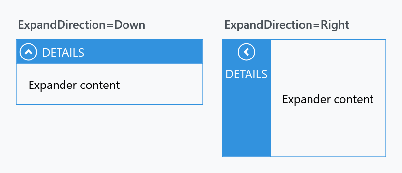

Order: 60
Title: ExpanderHelper
Description: Header styles per direction, and the expand and collapse animations
---

Applies to `Expander`. An expander's header is a `ToggleButton`, and which way it points depends on `ExpandDirection` — so the helper carries one header style per direction rather than one style.



## Header styles

| Property | Applies when | Style the MahApps theme puts there |
| --- | --- | --- |
| `HeaderDownStyle` | `ExpandDirection="Down"` | `MahApps.Styles.ToggleButton.ExpanderHeader.Down` |
| `HeaderUpStyle` | `ExpandDirection="Up"` | `MahApps.Styles.ToggleButton.ExpanderHeader.Up` |
| `HeaderLeftStyle` | `ExpandDirection="Left"` | `MahApps.Styles.ToggleButton.ExpanderHeader.Left` |
| `HeaderRightStyle` | `ExpandDirection="Right"` | `MahApps.Styles.ToggleButton.ExpanderHeader.Right` |

All four are `Style`, and all four are filled in by the `Expander` style — the template picks the one that matches the current direction. Replacing one only changes that direction, so an expander whose direction is bound needs the matching styles set for every value it can take.

```xml
<Expander Header="Details"
          mah:ExpanderHelper.HeaderDownStyle="{StaticResource QuietExpanderHeader}">
    <TextBlock Margin="8" Text="Expander content" />
</Expander>
```

Base your own on the built-in one for the direction you are replacing, or the arrow and the layout go with it:

```xml
<Style x:Key="QuietExpanderHeader"
       BasedOn="{StaticResource MahApps.Styles.ToggleButton.ExpanderHeader.Down}"
       TargetType="{x:Type ToggleButton}">
    <Setter Property="Background" Value="{DynamicResource MahApps.Brushes.Gray10}" />
    <Setter Property="Foreground" Value="{DynamicResource MahApps.Brushes.Text}" />
</Style>
```

## The glyph

The circle and the arrow in the header are drawn in the foreground of the header, which is the colour that reads on whatever the header is painted with. Three properties override that for the glyph alone:

| Property | Type | |
| --- | --- | --- |
| `ToggleButtonForeground` | `Brush` | the circle and the arrow |
| `ToggleButtonForegroundMouseOver` | `Brush` | while the mouse is over the header |
| `ToggleButtonForegroundPressed` | `Brush` | while the header is held down |
| `ToggleButtonBackground` | `Brush` | what the glyph sits on |
| `ToggleButtonBackgroundMouseOver` | `Brush` | the same while the mouse is over the header |
| `ToggleButtonBackgroundPressed` | `Brush` | the same while the header is held down |

**All six are on `develop` and ship with the next release.** Left unset, they hand nothing over: the glyph follows the header and sits on nothing. Set them on the `Expander`; it passes them to the toggle button that draws them. A background left empty is left empty rather than falling back, so the ground under the glyph can be given a colour for one state alone.

```xml
<Expander Header="Details"
          mah:ExpanderHelper.ToggleButtonForeground="{DynamicResource MahApps.Brushes.Gray2}"
          mah:ExpanderHelper.ToggleButtonForegroundMouseOver="{DynamicResource MahApps.Brushes.Accent}">
    <TextBlock Margin="8" Text="Expander content" />
</Expander>
```

**What the glyph does under the mouse changed on `develop`** with [#4386](https://github.com/MahApps/MahApps.Metro/issues/4386). A released version turns the arrow and the circle grey while the mouse is over the header, which on the accent coloured band they sit on leaves a contrast of 1.2 to 1 and next to nothing to see. They keep the foreground of the header now, and what answers a touch is the ring, which grows, and a press, which pushes the glyph in a little. How thick the two strokes are drawn is the theme's to say:

| Resource key | |
| --- | --- |
| `ExpanderToggleButtonEllipseThemeStrokeThickness` | the ring at rest |
| `ExpanderToggleButtonEllipseThemeStrokeThicknessMouseOver` | the ring under the mouse |
| `ExpanderToggleButtonEllipseThemeStrokeThicknessPressed` | the ring while held down |
| `ExpanderToggleButtonArrowThemeStrokeThickness` | the arrow at rest |
| `ExpanderToggleButtonArrowThemeStrokeThicknessMouseOver` | the arrow under the mouse |
| `ExpanderToggleButtonArrowThemeStrokeThicknessPressed` | the arrow while held down |

`ExpanderToggleButtonEllipseThemeSize` is the diameter of the circle, and `ShowToggleButton` takes the glyph away altogether.

## Animations

| Property | Type | |
| --- | --- | --- |
| `ExpandStoryboard` | `Storyboard` | played when the expander opens |
| `CollapseStoryboard` | `Storyboard` | played when it closes |

The helper's own default for both is `null`, but the `Expander` style fills them in — `MahApps.Storyboard.Expander.Expand` and `.Collapse`, a quarter-second opacity fade on the content site. So an expander already animates, and setting these replaces that animation rather than adding one. Set them to `{x:Null}` to have the content switch over in a single frame instead.

On `develop` the Windows 10 and WinUI expanders play `MahApps.Storyboard.Expander.Win10.Expand` and `.Collapse` instead, the slide of the WinUI expander. The content comes out from behind the header by the whole of its height over a third of a second and goes back over a sixth, without fading. A storyboard cannot know how tall the content is, so these two animate `ContentSlide`, a `double` on the content site that says how much of the content still stands behind the header: 1 for all of it, 0 for none. The template moves the site by that part of its height, or of its width when the expander opens sideways, towards the header. A storyboard of your own can animate it the same way. `ContentSlide` is new in `develop` and is not in 2.4.11.

`ExpandSiteControl` is read-only and exists for the template's own use; it gives the content site the storyboards are applied to.
