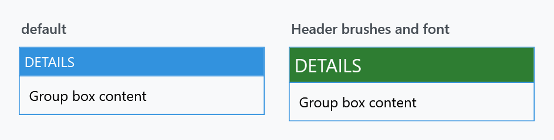

Order: 70
Title: HeaderedControlHelper
Description: The look of a header on a GroupBox, Expander, TabControl or Flyout
---

Applies to `HeaderedContentControl` and `TabControl`, which covers `GroupBox`, `Expander`, `Flyout`, `MetroHeader` and the tab strip. A `HeaderedContentControl` gives you a `Header` but no way to style it — that is what this helper is for.



| Property | Type | Default | |
| --- | --- | --- | --- |
| `HeaderBackground` | `Brush` | the panel default | behind the header |
| `HeaderForeground` | `Brush` | white | the header text |
| `HeaderFontFamily` | `FontFamily` | the system message font | |
| `HeaderFontSize` | `double` | the system message font size | |
| `HeaderFontWeight` | `FontWeight` | the system message font weight | |
| `HeaderFontStretch` | `FontStretch` | `Normal` | |
| `HeaderMargin` | `Thickness` | `0` | padding around the header content |
| `HeaderHorizontalContentAlignment` | `HorizontalAlignment` | `Stretch` | |
| `HeaderVerticalContentAlignment` | `VerticalAlignment` | `Stretch` | |

```xml
<GroupBox Header="Details"
          mah:HeaderedControlHelper.HeaderBackground="{DynamicResource MahApps.Brushes.Accent}"
          mah:HeaderedControlHelper.HeaderForeground="{DynamicResource MahApps.Brushes.IdealForeground}"
          mah:HeaderedControlHelper.HeaderFontSize="16"
          mah:HeaderedControlHelper.HeaderMargin="10 6">
    <TextBlock Margin="4" Text="Group box content" />
</GroupBox>
```

As with the other helpers, the defaults in the table are the helper's own; a styled control shows what its style put there. The MahApps `GroupBox` style sets `HeaderBackground` to `MahApps.Brushes.Accent` and `HeaderFontSize` to the content size, and deliberately sets `HeaderForeground` to `{x:Null}` so the template picks a foreground that reads against that band. Use the theme brushes rather than fixed colours and the header keeps following the theme.

`HeaderFontWeight` is the one to reach for when a header should be quieter — the built-in look is deliberately loud, and dropping the weight tones a nested group box down without giving up the coloured band.
