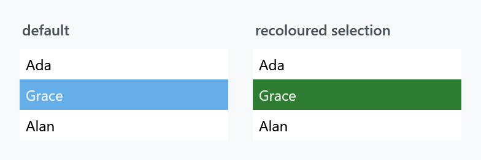

Order: 80
Title: ItemHelper
Description: Per-state brushes for the items of a list
---

Applies to `ListBoxItem` and `TreeViewItem`, which through those covers `ListBox`, `ListView`, `ComboBox` drop-downs and `TreeView`. Every property is a brush for one state an item can be in.



:::{.alert .alert-warning}
**Set these on the item, not on the list.** The properties inherit, so putting them on the `ListBox` looks like it should work — but the MahApps `ListBoxItem` style already sets most of them, and a style setter on the item beats a value inherited from its parent. Use `ItemContainerStyle`.
:::

```xml
<ListBox>
    <ListBox.ItemContainerStyle>
        <Style BasedOn="{StaticResource MahApps.Styles.ListBoxItem}" TargetType="ListBoxItem">
            <Setter Property="mah:ItemHelper.ActiveSelectionBackgroundBrush" Value="#2E7D32" />
            <Setter Property="mah:ItemHelper.ActiveSelectionForegroundBrush" Value="White" />
            <Setter Property="mah:ItemHelper.SelectedBackgroundBrush" Value="#2E7D32" />
            <Setter Property="mah:ItemHelper.SelectedForegroundBrush" Value="White" />
        </Style>
    </ListBox.ItemContainerStyle>
</ListBox>
```

Keep the `BasedOn`, or the item loses its template along with everything else the style sets.

## The states

Each row is a pair — a `...BackgroundBrush` and a `...ForegroundBrush`.

| State | |
| --- | --- |
| `ActiveSelection` | selected, and the keyboard focus is inside the list |
| `Selected` | selected while the focus is elsewhere |
| `Hover` | the pointer is over the item |
| `HoverSelected` | the pointer is over an item that is also selected |
| `MouseLeftButtonPressed` | held down with the left button |
| `MouseRightButtonPressed` | held down with the right button |
| `Disabled` | the item is disabled |
| `DisabledSelected` | disabled and selected |

The split between `ActiveSelection` and `Selected` is the one that catches people out: a list that loses focus draws its selection with the second pair, so recolouring only `ActiveSelection` leaves the selection reverting to the theme colour as soon as the user clicks elsewhere.

## Related

For the items of a `ComboBox` drop-down the same properties apply, set through the combo box's `ItemContainerStyle`. `TreeViewItem` takes them directly; see also [TreeViewItemHelper](treeviewitemhelper) for its expander button.
