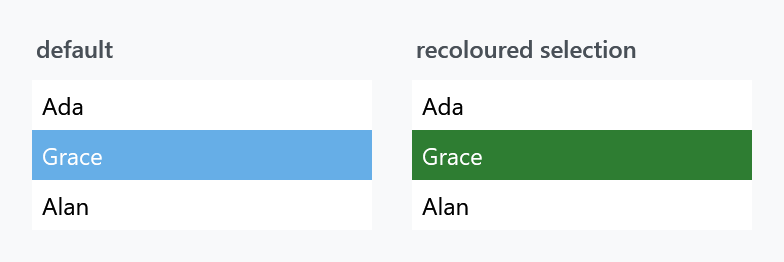

Order: 80
Title: ItemHelper
Description: Per-state brushes for the items of a list
---

Applies to `ListBoxItem` and `TreeViewItem`, which through those covers `ListBox`, `ListView`, `ComboBox` drop-downs and `TreeView`. Every property is a brush for one state an item can be in.



:::{.alert .alert-warning}
**Set these on the item, not on the list.** The properties inherit, so putting them on the `ListBox` looks like it should work — but the MahApps `ListBoxItem` style already sets most of them, and a style setter on the item beats a value inherited from its parent. Use `ItemContainerStyle`.
:::

```xml
<ListBox>
    <ListBox.ItemContainerStyle>
        <Style BasedOn="{StaticResource MahApps.Styles.ListBoxItem}" TargetType="ListBoxItem">
            <Setter Property="mah:ItemHelper.ActiveSelectionBackgroundBrush" Value="#2E7D32" />
            <Setter Property="mah:ItemHelper.ActiveSelectionForegroundBrush" Value="White" />
            <Setter Property="mah:ItemHelper.SelectedBackgroundBrush" Value="#2E7D32" />
            <Setter Property="mah:ItemHelper.SelectedForegroundBrush" Value="White" />
        </Style>
    </ListBox.ItemContainerStyle>
</ListBox>
```

Keep the `BasedOn`, or the item loses its template along with everything else the style sets.

## The states

Each row is a set of three: a `...BackgroundBrush`, a `...ForegroundBrush` and a `...BorderBrush`.

| State | |
| --- | --- |
| `ActiveSelection` | selected, and the keyboard focus is inside the list |
| `Selected` | selected while the focus is elsewhere |
| `Hover` | the pointer is over the item |
| `HoverSelected` | the pointer is over an item that is also selected |
| `MouseLeftButtonPressed` | held down with the left button |
| `MouseRightButtonPressed` | held down with the right button |
| `Disabled` | the item is disabled |
| `DisabledSelected` | disabled and selected |

The split between `ActiveSelection` and `Selected` is the one that catches people out: a list that loses focus draws its selection with the second set, so recolouring only `ActiveSelection` leaves the selection reverting to the theme colour as soon as the user clicks elsewhere.

:::{.alert .alert-info}
**The eight `...BorderBrush` properties are new on `develop`.** In 2.4.11 each state is a pair, background and foreground, and the frame around a row cannot be coloured per state. The Windows 10 and the WinUI list styles are what wanted them: both mark a row by its edge rather than by filling it.
:::

`IsMouseLeftButtonPressed` and `IsMouseRightButtonPressed` are read-only and say which of the two pressed states a row is in, should you want to trigger on that yourself.

## A box saying what is picked

:::{.alert .alert-info}
New on `develop`.
:::

`IsMultiSelectCheckBoxEnabled` puts a check box in front of every row, the way Windows marks a list that takes more than one answer. Set it on the list:

```xml
<ListBox SelectionMode="Multiple" mah:ItemHelper.IsMultiSelectCheckBoxEnabled="True" />
```

The box says what is picked and nothing more. It is the row under it that answers the pointer, so clicking anywhere on the row picks it, exactly as without the box.

Nothing is drawn while `SelectionMode` is `Single`. The flag is weighed against the mode and the answer is handed down the tree, where the read-only `ShowsMultiSelectCheckBox` is what the row templates trigger on. A list that switches between one answer and several therefore gains and loses the boxes on its own.

`MultiSelectCheckBoxSource` is what that weighing writes into, and it is there because a read-only property cannot be the target of a binding. Bind to it only to take the decision over yourself.

## The sort indicator of a ListView

`GridViewHeaderIndicatorBrush` is the colour of the mark a `GridViewHeaderRowPresenter` shows while a column is being dragged into a new place. It is set on the `ListView`, not on an item, and is new on `develop`.

## Related

For the items of a `ComboBox` drop-down the same properties apply, set through the combo box's `ItemContainerStyle`. `TreeViewItem` takes them directly; see also [TreeViewItemHelper](treeviewitemhelper) for its expander button.
