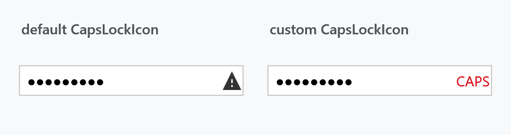
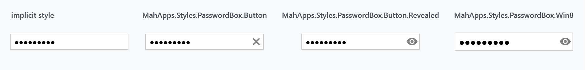

Order: 100
Title: PasswordBoxHelper
Description: Caps lock warning and reveal button of a PasswordBox
---

Applies to `PasswordBox`. Four properties, covering the two things MahApps adds to a password box: the warning that caps lock is on, and the button that reveals what has been typed.

| Property | Type | Default | |
| --- | --- | --- | --- |
| `CapsLockIcon` | `object` | a warning triangle | what the caps lock indicator shows |
| `CapsLockWarningToolTip` | `object` | `Caps lock is on` | its tooltip |
| `RevealButtonContent` | `object` | an eye icon | content of the reveal button |
| `RevealButtonContentTemplate` | `DataTemplate` | `null` | template for that content |

Both content properties are typed `object`, so they take a string, a `Path`, or a whole `Grid`.

## Caps lock

While the box has keyboard focus, an indicator appears inside it whenever <kbd>Caps Lock</kbd> is on. Nothing has to be switched on — it is part of the base `PasswordBox` style, and therefore of the implicit one every `PasswordBox` picks up.



```xml
<PasswordBox mah:PasswordBoxHelper.CapsLockIcon="CAPS"
             mah:PasswordBoxHelper.CapsLockWarningToolTip="Caps Lock is turned on" />
```

The library shows the indicator by looking the template part up and setting its visibility from a key handler, which is why it only appears once the box has been focused.

## The reveal button

The reveal button is not part of the base style. It comes with `MahApps.Styles.PasswordBox.Button.Revealed` (called `MahApps.Styles.PasswordBox.Revealed` on `develop`) or `MahApps.Styles.PasswordBox.Win8`, and shows the password only while it is held down:

```xml
<PasswordBox Style="{StaticResource MahApps.Styles.PasswordBox.Button.Revealed}"
             mah:PasswordBoxHelper.RevealButtonContent="Show" />
```


On `develop` the Windows 10 and the WinUI password box carry it as well, as the eye a UWP box carries, and there it is drawn out of the symbol font rather than as the path icon of the styles above. Both set `RevealButtonContent` and `RevealButtonContentTemplate` for that, so a content of your own wants the template answered too:

```xml
<PasswordBox Style="{StaticResource MahApps.Styles.PasswordBox.Win10}"
             mah:PasswordBoxHelper.RevealButtonContent="Show"
             mah:PasswordBoxHelper.RevealButtonContentTemplate="{x:Null}" />
```



## Related

The full picture, including the watermark, the clear button and binding the password, is on the [PasswordBox styles](../styles/passwordbox) page.
