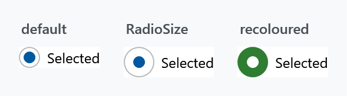

Order: 110
Title: RadioButtonHelper
Description: Size and per-state brushes of a RadioButton
---

Applies to `RadioButton`. Like [CheckBoxHelper](checkboxhelper) it is three sizes plus one naming scheme for the brushes.



## Size

| Property | Type | Default | |
| --- | --- | --- | --- |
| `RadioSize` | `double` | `18` | diameter of the outer circle |
| `RadioCheckSize` | `double` | `10` | diameter of the dot inside it |
| `RadioStrokeThickness` | `double` | `1` | thickness of the outline |
| `RadioBoxHeight` | `double` | `18` | height of the box the circle sits in |

```xml
<RadioButton mah:RadioButtonHelper.RadioSize="26"
             mah:RadioButtonHelper.RadioCheckSize="14"
             Content="Selected" />
```

`RadioBoxHeight` is the odd one out: it does not change what you see, it decides where the circle lands. The template puts the three ellipses in a box of that height, aligned to the top of the control, and centres them inside it. Centring them in the control itself instead would put them on half a device pixel as soon as the display is scaled, and the ring would then be drawn half a pixel off the dot it surrounds.

It is a minimum, so a `RadioSize` larger than the box grows the box with it and the example above needs no second property. Raise it when you want the circle further down a tall row: the `Win10` style ships `32` for its 32 pixel row, the default style `18` for its own height.

The same grid decides the diameters. Windows scales in quarter steps, so a diameter lands on whole device pixels at every step only if it is a multiple of four. That is why the `Win10` style pairs a `RadioSize` of `20` with a `RadioCheckSize` of `12`: both are, and ring and dot stay concentric on a scaled display. Pick your own pair by the same rule if you care about that, `18` and `10` for instance keep the gap between them whole but land on half pixels at 125 and 175 per cent.

:::{.alert .alert-info}
`RadioBoxHeight` is on `develop` and ships with the next release. In a released version the ellipses are centred in the control, which is where the half pixel comes from.
:::

## The brushes

Named `{Part}{Interaction}`, where interaction is nothing at all for the resting state, or `PointerOver`, `Pressed` or `Disabled`.

| Part | |
| --- | --- |
| `Foreground` | the label |
| `Background` | behind the whole control |
| `BorderBrush` | around the whole control |
| `OuterEllipseFill` | inside the circle, while unselected |
| `OuterEllipseStroke` | its outline, while unselected |
| `OuterEllipseCheckedFill` | inside the circle, while selected |
| `OuterEllipseCheckedStroke` | its outline, while selected |
| `CheckGlyphFill` | the dot |
| `CheckGlyphStroke` | the dot's outline |

`Foreground`, `Background` and `BorderBrush` have no resting variant — that is the control's own property. The other six times four combinations make up the rest of the 36.

```xml
<RadioButton mah:RadioButtonHelper.OuterEllipseCheckedFill="#2E7D32"
             mah:RadioButtonHelper.OuterEllipseCheckedStroke="#2E7D32"
             mah:RadioButtonHelper.CheckGlyphFill="White"
             mah:RadioButtonHelper.CheckGlyphStroke="White"
             Content="Selected" />
```

Note there is one set of ellipse brushes for unselected and another for selected, but only one set for the dot — the dot is not drawn when nothing is selected, so it needs no unselected variant.

:::{.alert .alert-info}
This helper says `PointerOver` where `CheckBoxHelper` says `MouseOver`. The two were written at different times and the naming was never reconciled, so a check box and a radio button that should match need different property names for the same state.
:::

## Related

`ToggleButtonHelper.ContentDirection` puts the circle on the right of the label. See [ToggleButtonHelper](togglebuttonhelper).
