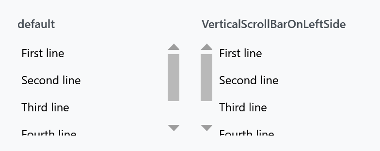

Order: 120
Title: ScrollViewerHelper
Description: Scrollbar side, horizontal wheel scrolling and end-of-scroll commands
---

Applies to `ScrollViewer`, `ItemsControl` and any `UIElement`, so it reaches a list or a grid without you having to find the scroll viewer inside it.



| Property | Type | Default | |
| --- | --- | --- | --- |
| `VerticalScrollBarOnLeftSide` | `bool` | `false` | moves the vertical scrollbar to the left edge |
| `IsHorizontalScrollWheelEnabled` | `bool` | `false` | the mouse wheel scrolls horizontally |
| `BubbleUpScrollEventToParentScrollviewer` | `bool` | `false` | pass the wheel on to an outer scroll viewer at the end of this one |
| `EndOfVerticalScrollReachedCommand` | `ICommand` | `null` | invoked when the bottom is reached |
| `EndOfHorizontalScrollReachedCommand` | `ICommand` | `null` | invoked when the right-hand end is reached |
| `EndOfScrollReachedCommandParameter` | `object` | `null` | passed to either command |

```xml
<ScrollViewer mah:ScrollViewerHelper.VerticalScrollBarOnLeftSide="True">
    <!-- content -->
</ScrollViewer>
```

## Endless scrolling

The two end-of-scroll commands are what you build "load more as the user scrolls" on. The command fires when the user reaches the end, the view model appends the next page, and the scroll viewer carries on:

```xml
<ListBox ItemsSource="{Binding Items}"
         mah:ScrollViewerHelper.EndOfVerticalScrollReachedCommand="{Binding LoadMoreCommand}" />
```

Guard against re-entry in the command itself — reaching the end can raise it more than once while a page is still loading.

## Nested scroll viewers

`BubbleUpScrollEventToParentScrollviewer` is for a scrollable list inside a scrollable page. Without it the wheel stops dead once the inner list is at its end; with it the event is passed on and the page keeps moving, which is what a browser does.

`IsHorizontalScrollWheelEnabled` turns the wheel sideways, which suits a horizontally laid out list where there is nothing to scroll vertically.
