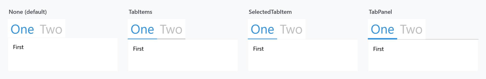
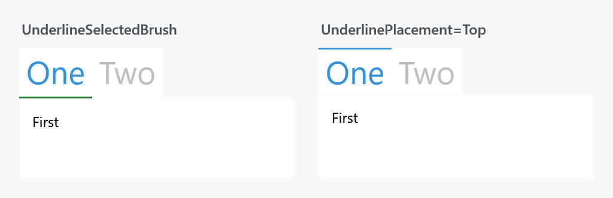

Order: 140
Title: TabControlHelper
Description: The underline under a tab, the transition, and closable tabs
---

Applies to `TabControl` and `TabItem`. Three groups: the underline that marks the selected tab, the animation when the content changes, and closable tabs.

## The underline



| Property | Type | Default | |
| --- | --- | --- | --- |
| `Underlined` | `UnderlinedType` | `None` | what gets an underline |
| `UnderlinePlacement` | `Dock?` | `null` | which side of the tab it sits on |
| `UnderlineBrush` | `Brush` | `null` | under an unselected tab |
| `UnderlineSelectedBrush` | `Brush` | `null` | under the selected tab |
| `UnderlineMouseOverBrush` | `Brush` | `null` | under a tab the pointer is over |
| `UnderlineMouseOverSelectedBrush` | `Brush` | `null` | under the selected tab, pointer over it |

`UnderlinedType` has four values. `None` is the default and draws nothing; `TabItems` underlines every tab; `SelectedTabItem` underlines only the selected one; `TabPanel` draws a line under the whole strip and a coloured one under the selected tab.

```xml
<TabControl mah:TabControlHelper.Underlined="SelectedTabItem"
            mah:TabControlHelper.UnderlineSelectedBrush="{DynamicResource MahApps.Brushes.Accent}" />
```

`UnderlinePlacement` moves it — `Top` puts the marker above the tab rather than below it, which is the older look:



Set `Underlined` on the `TabControl` and it reaches the items; setting it on a single `TabItem` underlines just that one.

## Transitions

| Property | Type | Default | |
| --- | --- | --- | --- |
| `Transition` | `TransitionType` | `Default` | the animation when the selected tab changes |

`TransitionType` is `Default`, `Normal`, `Up`, `Down`, `Right`, `RightReplace`, `Left`, `LeftReplace` or `Custom`. It is the same enum the `TransitioningContentControl` uses, because that is what draws the content.

```xml
<TabControl mah:TabControlHelper.Transition="Left" />
```

## Closable tabs

| Property | Type | Default | |
| --- | --- | --- | --- |
| `CloseButtonEnabled` | `bool` | `false` | show a close button on the tab |
| `CloseTabCommand` | `ICommand` | `null` | invoked when it is clicked |
| `CloseTabCommandParameter` | `object` | `null` | passed to that command |

:::{.alert .alert-warning}
These three are only read by the Visual Studio tab styles — `MahApps.Styles.TabControl.VisualStudio` and `MahApps.Styles.TabItem.VisualStudio` in `Styles/VS/TabControl.xaml`, which `Controls.xaml` does **not** merge. On a tab control with the ordinary styles they have no effect at all.
:::

Merge the dictionary and apply the styles to use them:

```xml
<ResourceDictionary Source="pack://application:,,,/MahApps.Metro;component/Styles/VS/TabControl.xaml" />
```

```xml
<TabControl Style="{StaticResource MahApps.Styles.TabControl.VisualStudio}"
            ItemContainerStyle="{StaticResource MahApps.Styles.TabItem.VisualStudio}"
            mah:TabControlHelper.CloseTabCommand="{Binding CloseTabCommand}" />
```

The VS tab item style sets `CloseButtonEnabled` to `True` itself, so the button is there as soon as the style is.

For a closable tab without the Visual Studio look, use `MetroTabItem` instead — it has its own `CloseButtonEnabled` property, unrelated to this helper.

## Related

`HeaderedControlHelper` styles the tab strip's header. See [HeaderedControlHelper](headeredcontrolhelper).
