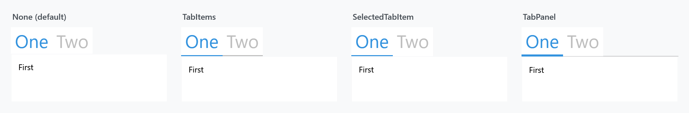
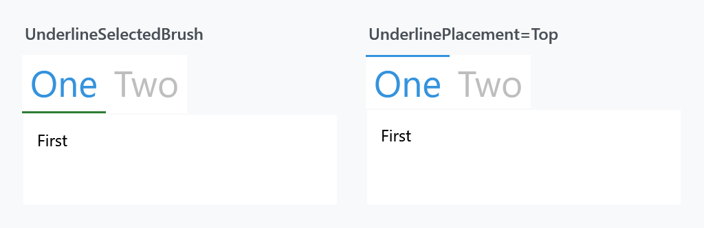

Order: 140
Title: TabControlHelper
Description: The underline under a tab, the transition, and closable tabs
---

Applies to `TabControl` and `TabItem`. Four groups: the underline that marks the selected tab, the animation when the content changes, how wide a tab is, and closable tabs.

## The underline



| Property | Type | Default | |
| --- | --- | --- | --- |
| `Underlined` | `UnderlinedType` | `None` | what gets an underline |
| `UnderlinePlacement` | `Dock?` | `null` | which side of the tab it sits on |
| `UnderlineBrush` | `Brush` | `null` | under an unselected tab |
| `UnderlineSelectedBrush` | `Brush` | `null` | under the selected tab |
| `UnderlineMouseOverBrush` | `Brush` | `null` | under a tab the pointer is over |
| `UnderlineMouseOverSelectedBrush` | `Brush` | `null` | under the selected tab, pointer over it |
| `UnderlineMargin` | `Thickness` | `0` | room around the line, so it need not run the whole width of the tab (on `develop`) |

`UnderlinedType` has four values. `None` is the default and draws nothing; `TabItems` underlines every tab; `SelectedTabItem` underlines only the selected one; `TabPanel` draws a line under the whole strip and a coloured one under the selected tab.

```xml
<TabControl mah:TabControlHelper.Underlined="SelectedTabItem"
            mah:TabControlHelper.UnderlineSelectedBrush="{DynamicResource MahApps.Brushes.Accent}" />
```

`UnderlinePlacement` moves it — `Top` puts the marker above the tab rather than below it, which is the older look:



Set `Underlined` on the `TabControl` and it reaches the items; setting it on a single `TabItem` underlines just that one.

The underline and the caption are painted separately, so a strip that answers the mouse in one colour wants the matching brush from [HeaderedControlHelper](headeredcontrolhelper) as well.

:::{.alert .alert-info}
**A brush cleared to `null` takes the line away in a released version.** Each state is painted from its own brush and nothing stood in for one that was empty, so binding `UnderlineSelectedBrush` to something that can be cleared left the selected tab with no line at all. On `develop` a state nobody handed a brush to falls back to the nearest one that was: the selected tab and a tab under the mouse to `UnderlineBrush`, the selected tab under the mouse to `UnderlineSelectedBrush`. The styles set all four, so a strip nobody says anything to looks the way it always did.

`MetroTabItem` had a second helping of this. The trigger painting the line of the selected tab watched the header rather than the tab, so running the pointer onto the line itself left that state and the line went out from under it. Both templates watch the tab now.
:::

## Transitions

| Property | Type | Default | |
| --- | --- | --- | --- |
| `Transition` | `TransitionType` | `Default` | the animation when the selected tab changes |

`TransitionType` is `Default`, `Normal`, `Up`, `Down`, `Right`, `RightReplace`, `Left`, `LeftReplace` or `Custom`. It is the same enum the `TransitioningContentControl` uses, because that is what draws the content.

```xml
<TabControl mah:TabControlHelper.Transition="Left" />
```

## How wide a tab is

| Property | Type | Default | |
| --- | --- | --- | --- |
| `TabWidthMode` | `TabWidthMode` | `SizeToContent` | whether the room is shared out between the tabs (on `develop`) |

`SizeToContent` is what a tab control has always done: every tab is as wide as what is written on it. `Equal` shares the room out instead, so each tab gets the width divided by the number of them, held between its own `MinWidth` and `MaxWidth`. Where that no longer fits, the strip runs past the edge of the control, which is where `MahApps.Styles.TabControl.AnimatedSingleRow` starts scrolling.

```xml
<TabControl mah:TabControlHelper.TabWidthMode="Equal" />
```

It is the `TabWidthMode` of the WinUI TabView, down to the hundred and the two hundred and forty the [WinUI card style](../styles/tabcontrol) holds a tab between. `Compact`, the third mode WinUI has, is left out: it shrinks every tab but the one showing to its icon, and a tab item here has no icon to shrink to.

A strip down either side and a strip that wraps onto a second row are laid out the way they always were, whatever this says.

## Closable tabs

| Property | Type | Default | |
| --- | --- | --- | --- |
| `CloseButtonEnabled` | `bool` | `false` | show a close button on the tab |
| `CloseTabCommand` | `ICommand` | `null` | invoked when it is clicked |
| `CloseTabCommandParameter` | `object` | `null` | passed to that command |

:::{.alert .alert-warning}
**In a released version these three are only read by the Visual Studio tab styles** — `MahApps.Styles.TabControl.VisualStudio` and `MahApps.Styles.TabItem.VisualStudio` in `Styles/VS/TabControl.xaml`, which `Controls.xaml` does **not** merge. On a tab control with the ordinary styles they have no effect at all.

On `develop` every tab style reads them, the one a control wears with nothing merged included. The button is the one `MetroTabItem` draws and it follows the same rules: out of the way until it is asked for, then showing itself on the tab that is showing and on the one under the pointer. The two WinUI styles put it on every tab instead, which is what the TabView does.
:::

`CloseButtonEnabled` is inherited, so one answer on the `TabControl` reaches every tab under it. A tab with something of its own to say beats it: `MetroTabItem` carries the answer on itself, and the Visual Studio item style sets it.

Merge the dictionary and apply the styles to use them:

```xml
<ResourceDictionary Source="pack://application:,,,/MahApps.Metro;component/Styles/VS/TabControl.xaml" />
```

```xml
<TabControl Style="{StaticResource MahApps.Styles.TabControl.VisualStudio}"
            ItemContainerStyle="{StaticResource MahApps.Styles.TabItem.VisualStudio}"
            mah:TabControlHelper.CloseTabCommand="{Binding CloseTabCommand}" />
```

The VS tab item style sets `CloseButtonEnabled` to `True` itself, so the button is there as soon as the style is.

For a closable tab without the Visual Studio look, use `MetroTabItem`, which has its own `CloseButtonEnabled`. On `develop` it hands that answer and the two about the command to the matching properties here, so a style written for a plain tab draws its button too.

## Related

`HeaderedControlHelper` styles the tab strip's header. See [HeaderedControlHelper](headeredcontrolhelper).
