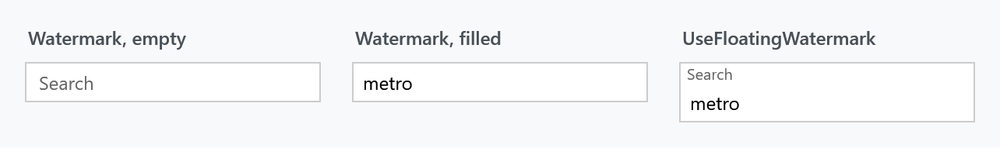
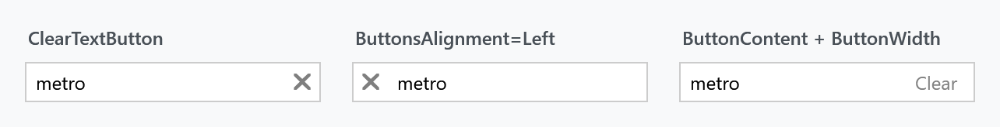

Order: 150
Title: TextBoxHelper
Description: Watermark, clear button and command button for text input controls
---

The most used of the helpers, and the one whose name undersells it. Its templates are read by `TextBox`, `PasswordBox`, `ComboBox`, `DatePicker`, `TimePicker`, `NumericUpDown`, `HotKeyBox`, `ColorPicker` and `ButtonBase` — so the same watermark works on all of them.

## Watermark



| Property | Type | Default | |
| --- | --- | --- | --- |
| `Watermark` | `string` | empty | placeholder shown while the control is empty |
| `WatermarkAlignment` | `TextAlignment` | `Left` | how it is aligned |
| `WatermarkTrimming` | `TextTrimming` | `None` | how it is trimmed when there is not enough room |
| `WatermarkWrapping` | `TextWrapping` | `NoWrap` | whether it wraps |
| `UseFloatingWatermark` | `bool` | `false` | keep it above the content once something is typed |
| `AutoWatermark` | `bool` | `false` | take the watermark from the bound property's `DisplayAttribute` |

```xml
<TextBox mah:TextBoxHelper.Watermark="Search" />

<TextBox mah:TextBoxHelper.Watermark="Search"
         mah:TextBoxHelper.UseFloatingWatermark="True" />
```

A plain watermark disappears with the first character. A floating one moves above the content and stays, which keeps the label visible while the field is being filled in.

`AutoWatermark` saves repeating a label that already exists on the model:

```csharp
[Display(Prompt = "Search")]
public string Query { get; set; }
```

```xml
<TextBox Text="{Binding Query}" mah:TextBoxHelper.AutoWatermark="True" />
```

## Buttons



| Property | Type | Default | |
| --- | --- | --- | --- |
| `ClearTextButton` | `bool` | `false` | show a button that clears the control |
| `TextButton` | `bool` | `false` | show the button without the clearing behaviour |
| `ButtonCommand` | `ICommand` | `null` | invoked when the button is clicked |
| `ButtonCommandParameter` | `object` | the control itself | passed to that command |
| `ButtonContent` | `object` | an ✕ glyph | what the button shows |
| `ButtonContentTemplate` | `DataTemplate` | | how that content is drawn |
| `ButtonTemplate` | `ControlTemplate` | `null` | template of the button itself |
| `ButtonWidth` | `double` | `22` | its width |
| `ButtonFontFamily`, `ButtonFontSize` | | | the font the content is drawn in |
| `ButtonsAlignment` | `ButtonsAlignment` | `Right` | `Left`, `Right` or `Opposite` |

```xml
<TextBox mah:TextBoxHelper.ClearTextButton="True" />

<TextBox mah:TextBoxHelper.ClearTextButton="True"
         mah:TextBoxHelper.ButtonsAlignment="Left" />
```

Clearing does more than empty the control: it pushes the empty value back through the binding, so a bound view model sees it.

`ButtonCommand` turns the same button into one of your own — a search box that searches, for instance. Set both and the click runs the command *and* clears the box.

:::{.alert .alert-info}
Which flag makes the button appear depends on the style. The plain text box and password box templates gate it on `ClearTextButton`; the `.Button` variants of those styles gate it on `TextButton`, which the style sets for you. If a `ButtonCommand` never fires, that is usually why.
:::

## Monitoring

| Property | Type | Default | |
| --- | --- | --- | --- |
| `IsMonitoring` | `bool` | `false` | watch the control's content for changes |
| `HasText` | `bool` | `false` | whether there is content — written by the monitoring, read by you |
| `TextLength` | `int` | `0` | how much — likewise |
| `SelectAllOnFocus` | `bool` | `false` | select the content when the control gains focus |
| `IsWaitingForData` | `bool` | `false` | pulse a glow around the control while a value is being fetched |
| `IsSpellCheckContextMenuEnabled` | `bool` | `false` | give a `TextBox` or `RichTextBox` the spell-check context menu |

`IsMonitoring` is what keeps `HasText` and `TextLength` current, and it is what the watermark and the buttons hang off. The MahApps styles turn it on, so leave it alone unless you have replaced a style without a `BasedOn`.

`HasText` is useful in your own triggers:

```xml
<DataTrigger Binding="{Binding (mah:TextBoxHelper.HasText), ElementName=Search}" Value="True">
    <Setter Property="Visibility" Value="Visible" />
</DataTrigger>
```

## Related

The corner radius, focus and mouse-over borders live in [ControlsHelper](controlshelper). For a password box the same properties apply; see the [PasswordBox styles](../styles/passwordbox) page.
