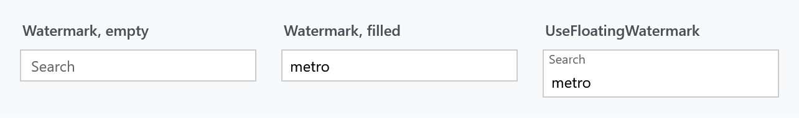
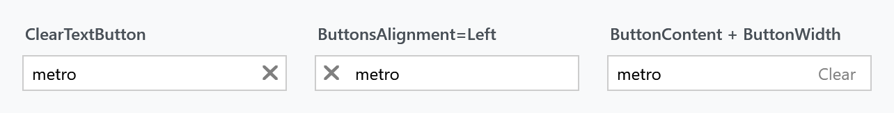

Order: 150
Title: TextBoxHelper
Description: Watermark, clear button and command button for text input controls
---

The most used of the helpers, and the one whose name undersells it. Its templates are read by `TextBox`, `PasswordBox`, `ComboBox`, `DatePicker`, `TimePicker`, `NumericUpDown`, `HotKeyBox`, `ColorPicker` and `ButtonBase` — so the same watermark works on all of them.

## Watermark



| Property | Type | Default | |
| --- | --- | --- | --- |
| `Watermark` | `string` | empty | placeholder shown while the control is empty |
| `WatermarkAlignment` | `TextAlignment` | `Left` | how it is aligned |
| `WatermarkTrimming` | `TextTrimming` | `None` | how it is trimmed when there is not enough room |
| `WatermarkWrapping` | `TextWrapping` | `NoWrap` | whether it wraps |
| `UseFloatingWatermark` | `bool` | `false` | keep it above the content once something is typed |
| `AutoWatermark` | `bool` | `false` | take the watermark from the bound property's `DisplayAttribute` |

```xml
<TextBox mah:TextBoxHelper.Watermark="Search" />

<TextBox mah:TextBoxHelper.Watermark="Search"
         mah:TextBoxHelper.UseFloatingWatermark="True" />
```

A plain watermark disappears with the first character. A floating one moves above the content and stays, which keeps the label visible while the field is being filled in.

`AutoWatermark` saves repeating a label that already exists on the model:

```csharp
[Display(Prompt = "Search")]
public string Query { get; set; }
```

```xml
<TextBox Text="{Binding Query}" mah:TextBoxHelper.AutoWatermark="True" />
```

## Buttons



| Property | Type | Default | |
| --- | --- | --- | --- |
| `ClearTextButton` | `bool` | `false` | show a button that clears the control |
| `ClearTextButtonFollowsFocus` | `bool` | `false` | show that button only while the control has the caret and something is written in it (on `develop`) |
| `ButtonCommand` | `ICommand` | `null` | invoked when the button is clicked |
| `ButtonCommandParameter` | `object` | the control itself | passed to that command |
| `ButtonCommandTarget` | `IInputElement` | `null` | what a routed command is aimed at (on `develop`) |
| `ButtonContent` | `object` | an ✕ glyph | what the button shows |
| `ButtonContentTemplate` | `DataTemplate` | | how that content is drawn |
| `ButtonTemplate` | `ControlTemplate` | `null` | template of the button itself |
| `ButtonWidth` | `double` | `22` | its width |
| `ButtonFontFamily`, `ButtonFontSize` | | | the font the content is drawn in |
| `ButtonsAlignment` | `ButtonsAlignment` | `Right` | `Left`, `Right` or `Opposite` |

```xml
<TextBox mah:TextBoxHelper.ClearTextButton="True" />

<TextBox mah:TextBoxHelper.ClearTextButton="True"
         mah:TextBoxHelper.ButtonsAlignment="Left" />
```

Clearing does more than empty the control: it pushes the empty value back through the binding, so a bound view model sees it.

`ButtonCommand` turns the same button into one of your own — a search box that searches, for instance. Set both and the click runs the command *and* clears the box.

`ClearTextButtonFollowsFocus` asks for the rule a UWP box follows: the delete button is there while the caret is in the control and something is written in it, and gone the rest of the time. The Windows 10 and the WinUI text boxes draw that rule in their own templates; the three pickers share one template across the sets, so the [Win10](../stylevariants/win10) and [WinUI](../stylevariants/winui) picker styles ask for it with this flag. A button carrying a `ButtonCommand` of your own is not the delete button and stays where it is either way.

:::{.alert .alert-info}
**`TextButton` is in the released version only.** In 2.4.11 the `.Button` variants of the text box and password box styles gated the button on it rather than on `ClearTextButton`, which is the usual reason a `ButtonCommand` never fires there. Both the flag and those styles are gone on `develop`: the base style carries the button, so `ClearTextButton` is all there is to set.
:::

## Monitoring

| Property | Type | Default | |
| --- | --- | --- | --- |
| `IsMonitoring` | `bool` | `false` | watch the control's content for changes |
| `HasText` | `bool` | `false` | whether there is content — written by the monitoring, read by you |
| `TextLength` | `int` | `0` | how much — likewise |
| `SelectAllOnFocus` | `bool` | `false` | select the content when the control gains focus |
| `IsSpellCheckContextMenuEnabled` | `bool` | `false` | give a `TextBox` or `RichTextBox` the spell-check context menu |

`IsMonitoring` is what keeps `HasText` and `TextLength` current, and it is what the watermark and the buttons hang off. The MahApps styles turn it on, so leave it alone unless you have replaced a style without a `BasedOn`.

:::{.alert .alert-info}
**`IsWaitingForData` is in the released version only.** It pulsed a glow around the control while a value was being fetched, and 2.4.11 still has it. It went on `develop` along with that generation of the text box styles; a [ProgressRing](../controls/progressring) or an indeterminate [ProgressBar](../styles/progressbar) beside the control does the same job now.
:::

`HasText` is useful in your own triggers:

```xml
<DataTrigger Binding="{Binding (mah:TextBoxHelper.HasText), ElementName=Search}" Value="True">
    <Setter Property="Visibility" Value="Visible" />
</DataTrigger>
```

## Related

The corner radius, focus and mouse-over borders live in [ControlsHelper](controlshelper). For a password box the same properties apply; see the [PasswordBox styles](../styles/passwordbox) page.
