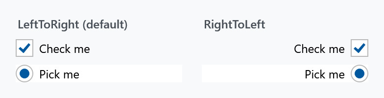

Order: 160
Title: ToggleButtonHelper
Description: Put the box or the circle on the other side of the label
---

Applies to `ToggleButton` and `RadioButton`, and through `ToggleButton` to `CheckBox`. One property.



| Property | Type | Default | |
| --- | --- | --- | --- |
| `ContentDirection` | `FlowDirection` | `LeftToRight` | which side the box or circle sits on |

`LeftToRight` is the usual layout — the box on the left, the label to the right of it. `RightToLeft` swaps them, so the label comes first and the box sits at the far end.

```xml
<CheckBox mah:ToggleButtonHelper.ContentDirection="RightToLeft" Content="Check me" />
```

That is the layout to use for a settings list, where a column of labels on the left with their switches lined up on the right reads better than a ragged column of boxes.

:::{.alert .alert-info}
This is not `FlowDirection` on the control. Setting the control's own `FlowDirection` to `RightToLeft` mirrors the text as well; this only moves the box relative to the label and leaves the label reading normally.
:::

## Related

The size and colours of the box itself are in [CheckBoxHelper](checkboxhelper) and [RadioButtonHelper](radiobuttonhelper).
