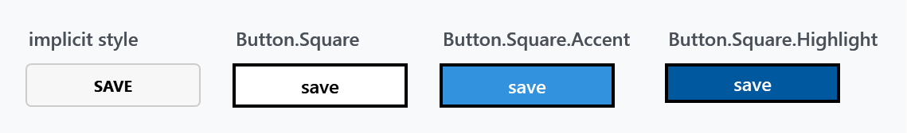
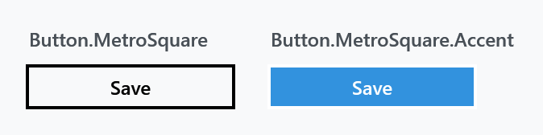
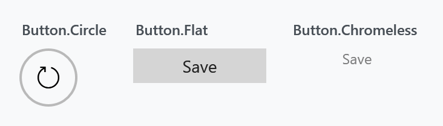
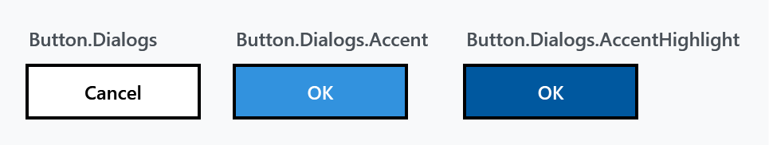

Title: Buttons
Description: The Button and ToggleButton styles
---

Every `Button`, `RepeatButton` and `ToggleButton` in a MahApps application is styled without any markup on your side. Beyond that the library ships a set of keyed styles to pick from — square, circular, flat, chromeless — plus a good many that belong to particular controls.



## The implicit style

`Styles/Controls.xaml` applies `MahApps.Styles.Button` to `Button` **and** `RepeatButton`, and `MahApps.Styles.ToggleButton` to `ToggleButton`. Merging that dictionary — which the [quick start](../guides/quick-start) does — is all it takes:

```xml
<ResourceDictionary Source="pack://application:,,,/MahApps.Metro;component/Styles/Controls.xaml" />
```

The default button is a rounded, bordered button with bold, upper-cased content. The upper-casing is not a font trick: the style sets `ControlsHelper.ContentCharacterCasing` to `Upper`, and setting it back to `Normal` gives you the content as written.

```xml
<Button mah:ControlsHelper.ContentCharacterCasing="Normal" Content="Save" />
```

Along with it the style sets `ControlsHelper.CornerRadius` to `3` and `FocusBorderThickness` to `2`, both of which are yours to override. See [ControlsHelper](../helper/controlshelper).

## The square styles

```xml
<Button Style="{StaticResource MahApps.Styles.Button.Square}" Content="Save" />
```

| Style | |
| --- | --- |
| `MahApps.Styles.Button.Square` | a flat-cornered button with a 2 pixel border |
| `MahApps.Styles.Button.Square.Accent` | the same filled with the accent colour |
| `MahApps.Styles.Button.Square.Highlight` | the same filled with the highlight colour, a darker accent |

:::{.alert .alert-info}
Look at the captions in the figure above: the default style upper-cases its content, but the square styles set `ContentCharacterCasing` to **`Lower`**, so `Content="Save"` comes out as *save*. It is a deliberate part of the look rather than an accident, but it surprises people who expect the content verbatim. Set the property to `Normal` if you want it as written.
:::

`MahApps.Styles.Button.MetroSquare` is a third square variant, and it leaves the casing alone:



| Style | |
| --- | --- |
| `MahApps.Styles.Button.MetroSquare` | transparent with a 2 pixel border and wider padding |
| `MahApps.Styles.Button.MetroSquare.Accent` | the same filled with the accent colour |

## Circle, flat and chromeless



| Style | |
| --- | --- |
| `MahApps.Styles.Button.Circle` | a round, transparent button with a 2 pixel border, meant for an icon rather than text |
| `MahApps.Styles.Button.Flat` | a filled button with no border at all |
| `MahApps.Styles.Button.Chromeless` | no border, no background — the content and nothing else |

The circle button has no content of its own, so give it one:

```xml
<Button Width="48" Height="48" Style="{StaticResource MahApps.Styles.Button.Circle}">
    <TextBlock FontFamily="Segoe MDL2 Assets" FontSize="18" Text="&#xE72C;" />
</Button>
```

`Chromeless` is what the library uses for the small buttons inside a text box or a picker, and it is the one to reach for when a button should read as part of another control rather than as a button.

:::{.alert .alert-info}
The flat button needs no extra import. Older documentation says to merge `Styles/Controls.FlatButton.xaml` — that dictionary still exists, but all it does is make the flat style **implicit for every `Button` in scope**. `MahApps.Styles.Button.Flat` itself lives in `Controls.Buttons.xaml`, which `Controls.xaml` already merges, so referencing it by key works out of the box.
:::

## Dialog buttons

The three styles the built-in dialogs use are public, which is what makes a [custom dialog](../dialogs/custom-dialogs) look like the built-in ones:



| Style | |
| --- | --- |
| `MahApps.Styles.Button.Dialogs` | the plain one |
| `MahApps.Styles.Button.Dialogs.Accent` | for the affirmative action |
| `MahApps.Styles.Button.Dialogs.AccentHighlight` | the highlight variant |

They are `MahApps.Styles.Button.Square` and its variants with a minimum size and `ContentCharacterCasing` back at `Normal` — which is why a dialog button says *Cancel* rather than *cancel*.

## Toggle buttons

`MahApps.Styles.ToggleButton` is the implicit style for `ToggleButton`, and `MahApps.Styles.ToggleButton.Circle` and `.Flat` are the counterparts of `Button.Circle` and `Button.Flat`. They have a page of their own: [ToggleButton](togglebutton).

## The rest

Most of the button styles in the library belong to one control and are not meant to be applied by hand. They are listed here so a name in the resource dictionary is recognisable rather than mysterious:

| Prefix | Belongs to |
| --- | --- |
| `Button.MetroWindow.*`, `Button.WindowCommands`, `ToggleButton.WindowCommands` | the window chrome and its command buttons |
| `Button.DropDown`, `Button.Split`, `Button.Split.Arrow` | `DropDownButton` and `SplitButton` |
| `Button.Calendar.*` | the calendar header and its arrows |
| `Button.Hamburger` | the `HamburgerMenu` toggle |
| `Button.Reveal` | the reveal button of a `PasswordBox` |
| `Button.ToolBar`, `ToggleButton.ToolBar`, `ToggleButton.ToolBarOverflow` | `ToolBar` |
| `Button.FlipView.Navigation` | the `FlipView` arrows |
| `ToggleButton.ExpanderHeader.*` | the `Expander` header, one per direction |
| `ToggleButton.ComboBoxDropDown`, `ToggleButton.ColorPickerDropDown` | the arrow of a `ComboBox` or `ColorPicker` |
| `ToggleButton.TreeViewItem.ExpandCollapse` | the expander of a `TreeViewItem` |
| `*.VisualStudio` | the Visual Studio look, in `Styles/VS/`, which `Controls.xaml` does not merge |
| `Button.FocusVisualStyle.*` | focus adorners used by the styles above |

Basing your own style on one of these is fine — that is how the [Expander](../helper/expanderhelper) and [TreeViewItem](../helper/treeviewitemhelper) helpers expect you to customise them. Applying one to an ordinary button generally is not, since most assume the template around them.
