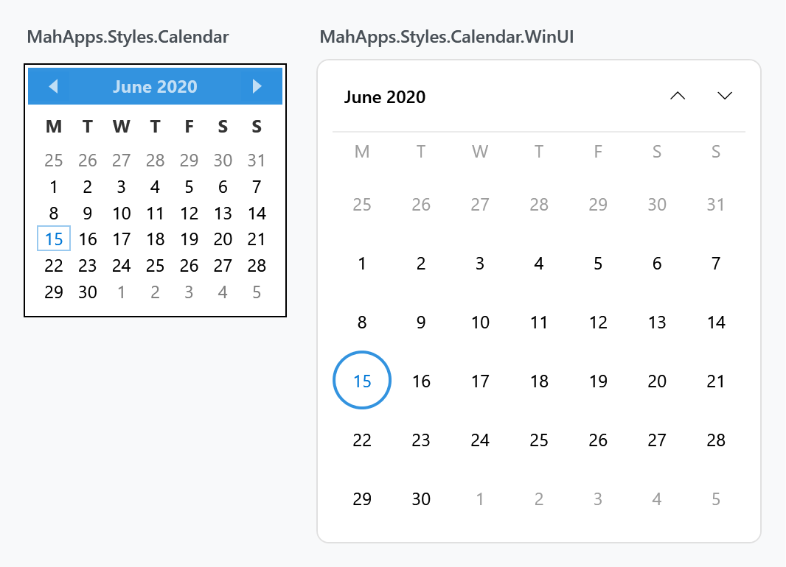
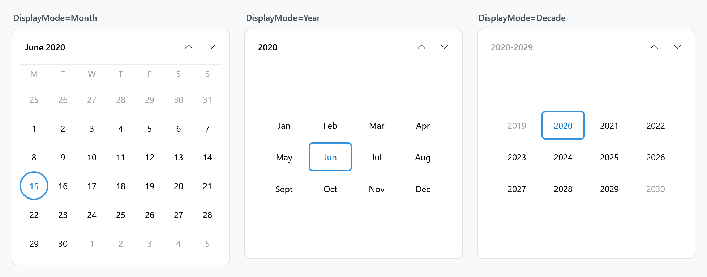
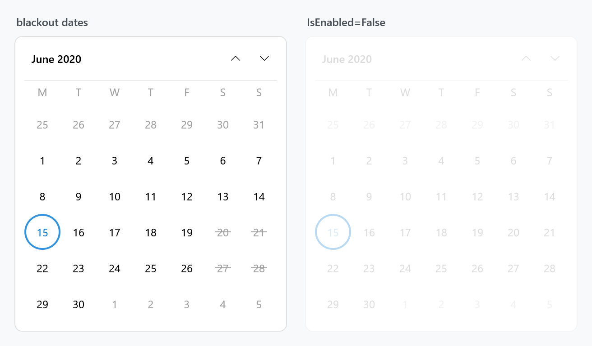
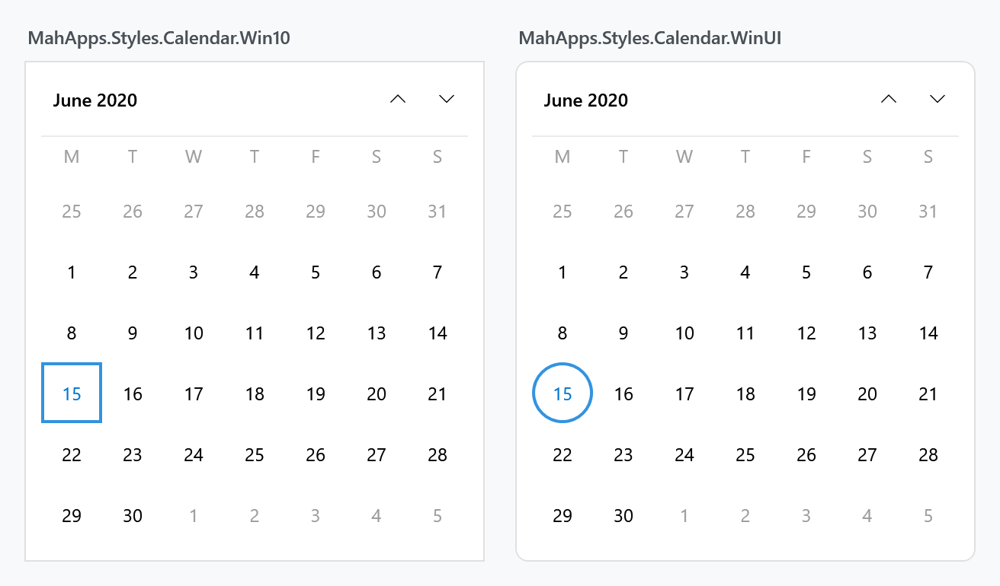

Title: Calendar
Description: The Calendar styles
---

The `Calendar` is styled without any markup on your side, and the same style is what a [DatePicker](datepicker) drops down. Because a calendar is assembled from four controls rather than one, restyling it is a matter of knowing which of the four draws the part you want to change.

## The implicit style

`Styles/Controls.xaml` applies `MahApps.Styles.Calendar` to every `Calendar`. Merging that dictionary — which the [quick start](../guides/quick-start) does — is all it takes:

```xml
<ResourceDictionary Source="pack://application:,,,/MahApps.Metro;component/Styles/Controls.xaml" />
```

## Four controls, four styles

A `Calendar` hosts a `CalendarItem`, which lays out the header and the grid and fills that grid with `CalendarDayButton`s in month mode and `CalendarButton`s in year and decade mode. Each has its own style, and the `Calendar` style hands them down through three properties:

| Property | Style | Draws |
| --- | --- | --- |
| `CalendarItemStyle` | `MahApps.Styles.CalendarItem` | the frame: header bar, day-of-week titles, the grids |
| `CalendarDayButtonStyle` | `MahApps.Styles.CalendarDayButton` | one day cell |
| `CalendarButtonStyle` | `MahApps.Styles.CalendarButton` | one month or year cell |

So changing how a single day looks means replacing `CalendarDayButtonStyle`, not the whole calendar:

```xml
<Calendar CalendarDayButtonStyle="{StaticResource MyDayButton}" />
```

The header's three buttons are styled separately again, by `MahApps.Styles.Button.Calendar.Previous`, `.Next` and `.Header`, which the `CalendarItem` template references by key.

### The three calendar styles

| Style | |
| --- | --- |
| `MahApps.Styles.Calendar.Base` | the frame and the three style properties, without a font |
| `MahApps.Styles.Calendar` | the base plus the control font and size; the implicit style |
| `MahApps.Styles.Calendar.DateTimePicker` | the base with a quieter border, for a picker's drop-down |

## A WinUI look

The built-in calendar is the Metro design the library was named for: a solid accent header bar, bold day titles and square cells. Here is what the same control looks like with a WinUI-flavoured style beside it:



The right-hand one is `MahApps.Styles.Calendar.WinUI`, a drop-in dictionary this site ships as a **[downloadable file](../../assets/xaml/Controls.Calendar.WinUI.xaml)**. It is not part of MahApps.Metro; it is a worked example of how far these four styles can be taken.

It is called *WinUI* rather than *Win10* on purpose. Rounded corners and circular day cells are **Fluent 2**, the refresh that arrived with WinUI 2.6 and Windows 11. The Windows 10 era of Fluent was square throughout — which is what the library's existing `MahApps.Styles.CheckBox.Win10` and `RadioButton.Win10` follow, neither of which sets a corner radius. There is a square variant below.

What it changes:

- no accent header bar — the month button and two chevrons sit on the calendar's own background, as WinUI's `CalendarView` does
- round day cells of a fixed 40×40, so the grid is even and the selection reads as a disc
- **today** is an accent-filled disc, a **selected** day an accent ring, and a day that is both keeps the fill and gains a contrasting ring
- hover and pressed are neutral greys, so the accent only ever means *today* or *selected*
- muted day-of-week titles with a hairline under the row
- rounded outer corners, and month and year cells as rounded rectangles

Every colour comes from the theme brushes, so it follows the accent and works in the light and dark themes.

### Using it

Merge the dictionary and set the style by key:

```xml
<Application.Resources>
    <ResourceDictionary>
        <ResourceDictionary.MergedDictionaries>
            <ResourceDictionary Source="pack://application:,,,/MahApps.Metro;component/Styles/Controls.xaml" />
            <ResourceDictionary Source="pack://application:,,,/MahApps.Metro;component/Styles/Fonts.xaml" />
            <ResourceDictionary Source="pack://application:,,,/MahApps.Metro;component/Styles/Themes/Light.Blue.xaml" />
            <ResourceDictionary Source="Controls.Calendar.WinUI.xaml" />
        </ResourceDictionary.MergedDictionaries>
    </ResourceDictionary>
</Application.Resources>
```

```xml
<Calendar Style="{StaticResource MahApps.Styles.Calendar.WinUI}" />
```

To give a `DatePicker` the same drop-down, hand it to `CalendarStyle`:

```xml
<DatePicker CalendarStyle="{StaticResource MahApps.Styles.Calendar.WinUI}" />
```

And to make it the default for every calendar in the application, add a keyless style based on it:

```xml
<Style BasedOn="{StaticResource MahApps.Styles.Calendar.WinUI}" TargetType="{x:Type Calendar}" />
```

### All three display modes

`DisplayMode` switches the grid between days, months and years. The same rules carry over: the cell holding the selection gets a ring, and the cell is a rounded rectangle rather than a disc.



The header button is disabled in decade mode — there is nothing above a decade to zoom out to — which is why it is dimmed in the third panel.

### Blackout and disabled



A blacked-out date keeps its number and gets a line through it rather than the cross the built-in style draws, which reads better at the size WinUI cells are.

```xml
<Calendar Style="{StaticResource MahApps.Styles.Calendar.WinUI}">
    <Calendar.BlackoutDates>
        <CalendarDateRange Start="2020-06-20" End="2020-06-21" />
    </Calendar.BlackoutDates>
</Calendar>
```

## The square Windows 10 look

Windows 10's design language was square: no rounded corners anywhere, and a selected day marked by a rectangle rather than a disc. `MahApps.Styles.Calendar.Win10` is that variant, in a **[second file](../../assets/xaml/Controls.Calendar.Win10.xaml)** that sits alongside the first.



It matches the naming and the flat look of the library's existing `CheckBox.Win10` and `RadioButton.Win10`, so the three can be used together without the calendar looking out of period.

```xml
<ResourceDictionary Source="Controls.Calendar.Win10.xaml" />
```

```xml
<Calendar Style="{StaticResource MahApps.Styles.Calendar.Win10}" />
```

The Win10 file merges the WinUI one, so adding it brings both families in and you can pick per calendar.

### The difference is one number

Writing the second style turned out to be a five-line job, because the two eras differ in nothing but the corner radius — the selection ring, the today fill, the hover greys and the layout are the same in both. Rather than repeat four templates, the radius reaches them through `ControlsHelper.CornerRadius`, and the Win10 dictionary sets it to zero:

```xml
<Style x:Key="MahApps.Styles.CalendarDayButton.Win10"
       BasedOn="{StaticResource MahApps.Styles.CalendarDayButton.WinUI}"
       TargetType="{x:Type CalendarDayButton}">
    <Setter Property="mah:ControlsHelper.CornerRadius" Value="0" />
</Style>
```

That works in the other direction too — give any of these styles a radius of your own and the cells follow, without touching a template:

```xml
<Style BasedOn="{StaticResource MahApps.Styles.CalendarDayButton.WinUI}" TargetType="{x:Type CalendarDayButton}">
    <Setter Property="mah:ControlsHelper.CornerRadius" Value="6" />
</Style>
```

The header buttons take their radius from the `CalendarItem` rather than carrying their own, so squaring the calendar squares them along with it.

### What is inside the file

The dictionary defines only keyed resources and merges `Controls.Calendar.xaml`, so it can be dropped into an application on its own. It contains:

| Resource | |
| --- | --- |
| `MahApps.Styles.Calendar.WinUI` | the calendar, wiring up the three below |
| `MahApps.Styles.CalendarItem.WinUI` | header, day titles, separator, the two grids |
| `MahApps.Styles.CalendarDayButton.WinUI` | the round day cell |
| `MahApps.Styles.CalendarButton.WinUI` | the rounded month and year cell |
| `MahApps.Styles.Button.Calendar.Header.WinUI`, `.Previous.WinUI`, `.Next.WinUI` | the three header buttons |
| `MahApps.Sizes.CalendarDayButton.WinUI`, three `MahApps.CornerRadius.*` | the sizes, so they can be overridden in one place |

:::{.alert .alert-info}
One thing worth knowing if you write a calendar style yourself: a `CalendarDayButton` has `IsToday`, `IsSelected`, `IsInactive`, `IsBlackedOut` and `IsHighlighted`, but a `CalendarButton` — the month and year cell — has **no `IsSelected`**. The property that says it holds the current selection is `HasSelectedDays`. A trigger on `IsSelected` there fails at load time with *Property can not be null on Trigger*.
:::

## Related

The [DatePicker](datepicker) page covers how the calendar reaches a picker's drop-down and what else that control's style sets.
