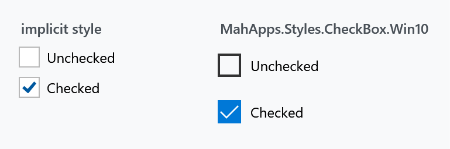
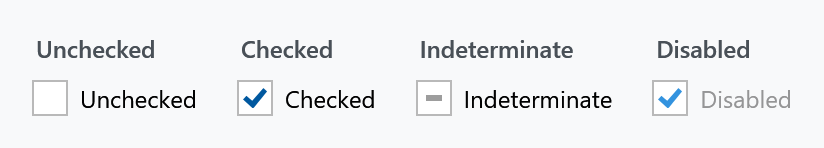
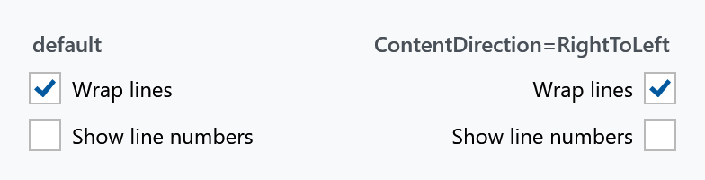
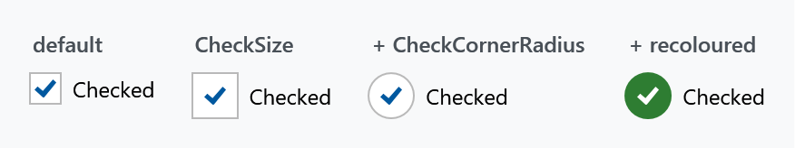

Title: CheckBox
Description: The CheckBox styles
---

Every `CheckBox` in a MahApps application is styled without any markup on your side. There is one alternative style with the Windows 10 look, and everything about the appearance — size, shape, glyph and the colour of each state — is reachable through attached properties.



## The implicit style

`Styles/Controls.xaml` applies `MahApps.Styles.CheckBox` to every `CheckBox`. Merging that dictionary — which the [quick start](../guides/quick-start) does — is all it takes:

```xml
<ResourceDictionary Source="pack://application:,,,/MahApps.Metro;component/Styles/Controls.xaml" />
```

To extend rather than replace, base your own style on the keyed one:

```xml
<Style BasedOn="{StaticResource MahApps.Styles.CheckBox}" TargetType="{x:Type CheckBox}">
    <Setter Property="mah:CheckBoxHelper.CheckSize" Value="22" />
</Style>
```

## The three styles

| Style | |
| --- | --- |
| `MahApps.Styles.CheckBox` | the default: an outlined box with a coloured tick inside it |
| `MahApps.Styles.CheckBox.Win10` | the Windows 10 look: the box fills with the accent colour and the tick turns white |
| `MahApps.Styles.CheckBox.WinUI` (on `develop`) | the WinUI look: a rounded box a shade off the page with a hairline round it, the accent with a tick in it once it is ticked |

```xml
<CheckBox Style="{StaticResource MahApps.Styles.CheckBox.Win10}" Content="Checked" />
```

Both of the Windows styles differ from the default one in more than colour, which matters if you mix them in one dialog:

| | default | Win10 | WinUI |
| --- | --- | --- | --- |
| `CheckSize` | `18` | `20` | `20` |
| `CheckStrokeThickness` | `1` | `2` | `1` |
| `CheckCornerRadius` | `0` | `0` | `4` |
| `MinHeight` | — | `32` | `32` |
| `MinWidth` | — | `120` | `120` |
| `Padding` | `6 0 0 0` | `8 0 0 0` | `8 5 0 0` |
| `VerticalContentAlignment` | `Center` | `Center` | `Top` |

The WinUI box puts its label against the top of the row rather than in the middle of it, the way WinUI has it, so a label of several lines starts level with the box instead of being centred beside it as a block. It also stands on the default style rather than on the Windows 10 one, which is the one place the WinUI set parts company with that habit: the Windows 10 box drops the stroke of its box in the states where the fill says the state on its own, and a WinUI box keeps that stroke in every one of them.

What sits on the accent, the tick and the dot of the [RadioButton](radiobutton), is the ideal foreground the theme works out for that accent rather than a colour of its own. WinUI writes those as black or white per theme, because its accent is a light one in the dark theme and a dark one in the light theme; the accent here is the accent of the theme and stays what it is.

:::{.alert .alert-warning}
`MinWidth="120"` is the one to watch. A Win10 check box is at least 120 pixels wide however short its label, so a row of them in a `StackPanel` with `Orientation="Horizontal"` comes out spaced far apart. Set `MinWidth="0"` where that is not what you want.
:::

## The states



`IsThreeState="True"` lets the value cycle through `null`, and unlike a [ToggleButton](togglebutton) the check box draws that state distinctly — a dash rather than a tick — so the user can tell the three apart.

## Content on the other side

`ToggleButtonHelper.ContentDirection` moves the box to the right of the label. The style's own trigger switches `HorizontalContentAlignment` to `Right` and flips the padding along with it, so the label stays properly spaced:



```xml
<CheckBox mah:ToggleButtonHelper.ContentDirection="RightToLeft" Content="Wrap lines" />
```

That is the layout for a settings list, where labels on the left with the boxes lined up on the right read better than a ragged column. This is not the control's own `FlowDirection`, which would mirror the text as well. See [ToggleButtonHelper](../helper/togglebuttonhelper).

## Changing the look

Everything visual comes from [CheckBoxHelper](../helper/checkboxhelper), which has 81 attached properties — three for size and shape, six glyph properties, and 72 brushes following one naming scheme. The full explanation is on that page; the short version is that the box grows, rounds and recolours without touching the template:



```xml
<CheckBox mah:CheckBoxHelper.CheckSize="26"
          mah:CheckBoxHelper.CheckCornerRadius="13"
          mah:CheckBoxHelper.CheckBackgroundFillChecked="#2E7D32"
          mah:CheckBoxHelper.CheckBackgroundStrokeChecked="#2E7D32"
          mah:CheckBoxHelper.CheckGlyphForegroundChecked="White"
          Content="Checked" />
```

The brushes are named `{Part}{CheckState}{Interaction}` — so `CheckBackgroundFillChecked` is the inside of the box while checked, and `CheckBackgroundFillCheckedMouseOver` the same under the pointer. Recolouring one state changes only that state.

:::{.alert .alert-info}
Both styles set **all 72** brushes themselves — that is what separates them. The default points `CheckBackgroundFill*` at the theme background so the box stays hollow with a coloured tick; Win10 points the same twelve properties at the accent brushes so the box fills and the tick turns white. So you are always overriding a value the style already set, never filling in a blank, and a half-finished override shows up as one state looking out of place rather than as nothing happening at all.
:::

## Related

`RadioButton` is the same idea with a circle instead of a box; see [RadioButtonHelper](../helper/radiobuttonhelper). For a check box that reads as a setting rather than a tick, the `ToggleSwitch` control has an on/off track and its own header.
