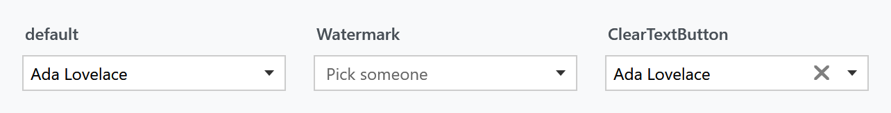
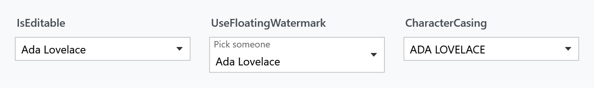
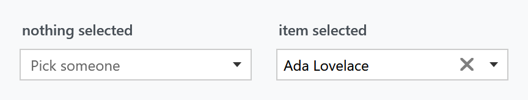
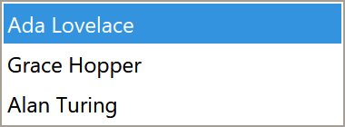
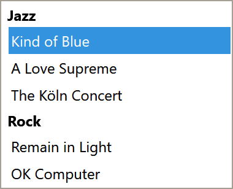

Title: ComboBox
Description: The ComboBox styles
---

Every `ComboBox` in a MahApps application is styled without any markup on your side, drop-down and items included. On top of that come a watermark, a clear button and the editable variant with auto-completion.



## The implicit style

`Styles/Controls.xaml` contains keyless styles for `ComboBox` and `ComboBoxItem`. Merging that dictionary — which the [quick start](../guides/quick-start) does — is all it takes:

```xml
<ResourceDictionary Source="pack://application:,,,/MahApps.Metro;component/Styles/Controls.xaml" />
```

To extend rather than replace, base your own style on the keyed one:

```xml
<Style BasedOn="{StaticResource MahApps.Styles.ComboBox}" TargetType="{x:Type ComboBox}">
    <Setter Property="mah:TextBoxHelper.ClearTextButton" Value="True" />
</Style>
```

## The styles

| Style | Target | |
| --- | --- | --- |
| `MahApps.Styles.ComboBox` | `ComboBox` | the box. What the implicit style applies |
| `MahApps.Styles.ComboBox.Virtualized` | `ComboBox` | the same with UI virtualization switched on |
| `MahApps.Styles.ComboBoxItem` | `ComboBoxItem` | one row in the drop-down |
| `MahApps.Styles.TextBox.ComboBox.Editable` | `TextBox` | the text box an editable combo box types into |
| `MahApps.Styles.ToggleButton.ComboBoxDropDown` | `ToggleButton` | the arrow that opens it |

The last two are building blocks of the template rather than something to set yourself.

## Watermark

```xml
<ComboBox mah:TextBoxHelper.Watermark="Pick someone" />
```

The watermark shows while nothing is selected. `UseFloatingWatermark` keeps it above the box afterwards, which works for the editable variant too:



## Clear button

`ClearTextButton` adds an ✕ that empties the box. Unlike a `DatePicker` — where the button hangs off `ButtonCommand` — the `ComboBox` binds its visibility straight to this property, so the button is there whenever the flag is set:

```xml
<ComboBox mah:TextBoxHelper.ClearTextButton="True" mah:TextBoxHelper.Watermark="Pick someone" />
```

Clearing sets `SelectedItem` to `null` and, on an editable box, empties `Text` as well — pushing both back through their bindings.

### Only when something is selected

A permanently visible ✕ next to an empty box is noise. A trigger on the style hides it again while nothing is selected:



```xml
<Style BasedOn="{StaticResource MahApps.Styles.ComboBox}" TargetType="{x:Type ComboBox}">
    <Setter Property="mah:TextBoxHelper.ClearTextButton" Value="True" />
    <Style.Triggers>
        <DataTrigger Binding="{Binding SelectedItem, RelativeSource={RelativeSource Self}, Converter={x:Static mah:IsNullConverter.Instance}}"
                     Value="True">
            <Setter Property="mah:TextBoxHelper.ClearTextButton" Value="False" />
        </DataTrigger>
    </Style.Triggers>
</Style>
```

`IsNullConverter` is a singleton in the library, so it needs no resource of its own — `{x:Static mah:IsNullConverter.Instance}` is the whole reference. It reports whether the value *is* null, which is why the trigger switches the button **off** rather than on.

### A button of your own

`ButtonContent`, `ButtonContentTemplate`, `ButtonWidth` and `ButtonCommand` reshape the same button:

```xml
<ComboBox mah:TextBoxHelper.ClearTextButton="True"
          mah:TextBoxHelper.ButtonCommand="{Binding SearchCommand}"
          mah:TextBoxHelper.ButtonContent="M42.5,22A12.5,12.5 0 0,1 55,34.5A12.5,12.5 0 0,1 42.5,47C40.14,47 37.92,46.34 36,45.24L26.97,54.27C25.8,55.44 23.9,55.44 22.73,54.27C21.56,53.1 21.56,51.2 22.73,50.03L31.8,40.96C30.66,39.08 30,36.86 30,34.5A12.5,12.5 0 0,1 42.5,22Z">
    <mah:TextBoxHelper.ButtonContentTemplate>
        <DataTemplate>
            <ContentControl Width="16" Height="16" Padding="3"
                            Content="{Binding Mode=OneWay}"
                            Style="{DynamicResource MahApps.Styles.ContentControl.PathIcon}" />
        </DataTemplate>
    </mah:TextBoxHelper.ButtonContentTemplate>
</ComboBox>
```

:::{.alert .alert-warning}
Two things to know before building on this. The button's visibility is bound to `ClearTextButton` alone, so a `ButtonCommand` without that flag leaves the button invisible and the command unreachable. And the click handler runs your command **and then clears the box**, because clearing is what `ClearTextButton` also switches on — there is no way to have one without the other on a `ComboBox`.
:::

## Editable

`IsEditable="True"` lets the user type, which with an `ItemsSource` gives auto-completion:

```xml
<ComboBox IsEditable="True"
          ItemsSource="{Binding Albums}"
          DisplayMemberPath="Title"
          mah:TextBoxHelper.Watermark="Album" />
```

`ComboBoxHelper` adds the two things a `ComboBox` lacks compared with a `TextBox`:

| Property | Type | Default | |
| --- | --- | --- | --- |
| `MaxLength` | `int` | `0` | how many characters may be typed; `0` means no limit |
| `CharacterCasing` | `CharacterCasing` | `Normal` | `Upper` or `Lower` converts as the user types |

Both only do something while `IsEditable` is `True`. See [ComboBoxHelper](../helper/comboboxhelper).

## The drop-down

The drop-down is a list of `ComboBoxItem`s, styled by `MahApps.Styles.ComboBoxItem`:



That style is where the item colours come from, and it sets eleven `ItemHelper` brushes — selected, hovered, disabled and the combinations. To recolour them, derive a container style rather than setting the properties on the `ComboBox`; a style setter on the item beats a value inherited from the box:

```xml
<ComboBox.ItemContainerStyle>
    <Style BasedOn="{StaticResource MahApps.Styles.ComboBoxItem}" TargetType="{x:Type ComboBoxItem}">
        <Setter Property="mah:ItemHelper.ActiveSelectionBackgroundBrush" Value="#2E7D32" />
    </Style>
</ComboBox.ItemContainerStyle>
```

[ItemHelper](../helper/itemhelper) has the full list of states.

### Long lists

`MahApps.Styles.ComboBox.Virtualized` is the base style plus `VirtualizingStackPanel.IsVirtualizing`, `IsVirtualizingWhenGrouping` and recycling mode. Reach for it once the list is long enough that opening it stutters:

```xml
<ComboBox Style="{StaticResource MahApps.Styles.ComboBox.Virtualized}"
          ItemsSource="{Binding Albums}"
          DisplayMemberPath="Title"
          IsEditable="True" />
```

### Grouping

Grouping is WPF's own `GroupStyle`, and works on the virtualized style because of `IsVirtualizingWhenGrouping`. The headers come out styled to match the rest of the drop-down:



```xml
<ComboBox Style="{StaticResource MahApps.Styles.ComboBox.Virtualized}"
          ItemsSource="{Binding GroupedAlbums}"
          DisplayMemberPath="Title">
    <ComboBox.GroupStyle>
        <GroupStyle>
            <GroupStyle.HeaderTemplate>
                <DataTemplate>
                    <TextBlock Margin="4 2" FontWeight="Bold" Text="{Binding Name}" />
                </DataTemplate>
            </GroupStyle.HeaderTemplate>
        </GroupStyle>
    </ComboBox.GroupStyle>
</ComboBox>
```

The grouping itself is not something the `ComboBox` does — it comes from the bound collection being a grouped view:

```csharp
var view = new CollectionViewSource { Source = this.Albums };
view.GroupDescriptions.Add(new PropertyGroupDescription(nameof(Album.Genre)));

this.GroupedAlbums = view.View;
```

`{Binding Name}` in the header template is the group key — the genre string, in this case — not a property of your item type.

## Helper properties

Four helpers reach a `ComboBox`, and their full property tables are on their own pages: [TextBoxHelper](../helper/textboxhelper) for the watermark and the button, [ComboBoxHelper](../helper/comboboxhelper) for the typing rules, [ControlsHelper](../helper/controlshelper) for the border and corner radius, and [ItemHelper](../helper/itemhelper) for the drop-down rows.

What the styles themselves set:

| Property | Set by | To |
| --- | --- | --- |
| `TextBoxHelper.ButtonWidth` | `MahApps.Styles.ComboBox` | `22` |
| `TextBoxHelper.ButtonFontSize` | `MahApps.Styles.ComboBox` | `MahApps.Font.Size.Button.ClearText` |
| `ControlsHelper.FocusBorderBrush` | `MahApps.Styles.ComboBox` | `MahApps.Brushes.ComboBox.Border.Focus` |
| `ControlsHelper.MouseOverBorderBrush` | `MahApps.Styles.ComboBox` | `MahApps.Brushes.ComboBox.Border.MouseOver` |
| eleven `ItemHelper` brushes | `MahApps.Styles.ComboBoxItem` | the theme's selection and hover colours |

Note the focus and mouse-over brushes are the `ComboBox` ones, not the `TextBox` ones the other input controls use.

## Validation

`Validation.ErrorTemplate` is set to `MahApps.Templates.ValidationError`, so a failing rule on `SelectedItem` or `Text` is drawn the way it is on every other MahApps input control. How the popup behaves is [ValidationHelper](../helper/validationhelper).
