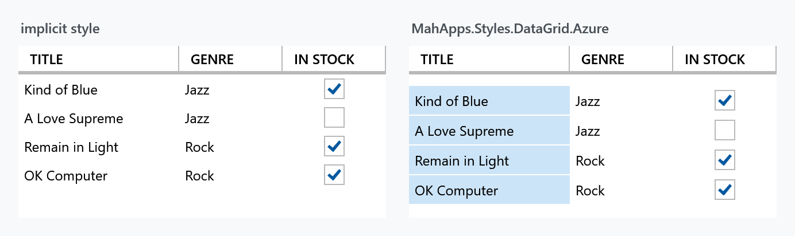

Title: DataGrid
Description: The DataGrid styles
---

`DataGrid` ships with WPF; MahApps restyles it and everything inside it. There is one alternative look, one variant for long grids, and a set of properties for the parts of a grid that WPF gives you no other way to reach.



## The implicit style

`Styles/Controls.xaml` applies `MahApps.Styles.DataGrid` to every `DataGrid`. Merging that dictionary — which the [quick start](../guides/quick-start) does — is all it takes:

```xml
<ResourceDictionary Source="pack://application:,,,/MahApps.Metro;component/Styles/Controls.xaml" />
```

```xml
<DataGrid ItemsSource="{Binding Albums}" />
```

Only the `DataGrid` itself has an implicit style. Everything inside it — rows, cells, headers — is styled because the grid's style hands those styles down:

| Property | Style |
| --- | --- |
| `RowStyle` | `MahApps.Styles.DataGridRow` |
| `CellStyle` | `MahApps.Styles.DataGridCell` |
| `ColumnHeaderStyle` | `MahApps.Styles.DataGridColumnHeader` |
| `RowHeaderStyle` | `MahApps.Styles.DataGridRowHeader` |

So restyling one part means replacing that one property, not the grid:

```xml
<DataGrid CellStyle="{StaticResource MyCell}" />
```

Along with the look the style also sets some behaviour: `GridLinesVisibility` to `None`, `HeadersVisibility` to `Column` — so no row headers unless you ask — and `MinRowHeight` to 25.

## The Azure style

`MahApps.Styles.DataGrid.Azure` is a variant modelled on the grids in the Azure portal. It swaps in Azure versions of the same four styles:

```xml
<DataGrid ItemsSource="{Binding Albums}"
          Style="{StaticResource MahApps.Styles.DataGrid.Azure}" />
```

:::{.alert .alert-info}
The Azure look tints the **first column** with the accent colour, as a stand-in for a row header. It is keyed on `Column.DisplayIndex` being `0`, not on the order you declared the columns in — so if the user drags a column to the front, the tint follows it.
:::

There is also `MahApps.Styles.DataGridRow.AzureWithMargin`, the Azure row with a one-pixel bottom margin, which separates the rows into cards rather than a continuous table:

```xml
<DataGrid Style="{StaticResource MahApps.Styles.DataGrid.Azure}"
          RowStyle="{StaticResource MahApps.Styles.DataGridRow.AzureWithMargin}" />
```

## Padding and selection

`DataGridHelper` carries what WPF leaves out. The full table is on the [DataGridHelper](../helper/datagridhelper) page; the four that matter most here:

| Property | Default | |
| --- | --- | --- |
| `CellPadding` | `0` | padding inside every cell |
| `ColumnHeaderPadding` | `10 0 4 0` | padding inside every column header |
| `SelectionUnit` | `FullRow` | which unit the MahApps styles draw as selected |
| `EnableCellEditAssist` | `false` | a click straight onto a cell's editing control uses it right away |

```xml
<DataGrid mah:DataGridHelper.CellPadding="10 6"
          mah:DataGridHelper.ColumnHeaderPadding="10 8" />
```

`EnableCellEditAssist` is the one that changes how the grid feels: without it, a check box column needs one click to select the cell and another to hit the box.

:::{.alert .alert-warning}
`DataGridHelper.SelectionUnit` is not `DataGrid.SelectionUnit`. The MahApps cell and row styles read the attached one to decide what to highlight; WPF's own property still decides what selection actually does. Set both when you change it.
:::

## Virtualisation

A `DataGrid` virtualises its rows by itself — `EnableRowVirtualization` is `True` out of the box — and the MahApps style sets `ScrollViewer.CanContentScroll` to `True`, so it scrolls by item rather than by pixel. Two things are off until you ask for them: `EnableColumnVirtualization`, and `VirtualizingPanel.IsVirtualizingWhenGrouping`, which is the one that hurts. A grouped grid realises a row for every item it has, and the style's own trigger then switches `CanContentScroll` back off, because item scrolling and non-virtualised groups do not mix. A few hundred grouped rows take seconds to appear that way, and scroll no better afterwards.

`MahApps.Styles.DataGrid.Virtualized` is the base style with all of it turned on: rows, columns, item scrolling, recycled containers and virtualisation while grouping.

```xml
<DataGrid ItemsSource="{Binding GroupedAlbums}"
          Style="{StaticResource MahApps.Styles.DataGrid.Virtualized}" />
```

:::{.alert .alert-info}
**The key is on `develop` and in no release yet.** 2.4.11 does not have it; the four `.Virtualized` styles it does carry belong to [ListBox](listbox), [ListView](listview), [ComboBox](combobox) and [TreeView](treeview). Until it ships, the two properties a grid lacks by default go onto the grid itself:

```xml
<DataGrid VirtualizingPanel.IsVirtualizingWhenGrouping="True"
          VirtualizingPanel.VirtualizationMode="Recycling" />
```
:::

Column virtualisation is the part of that style worth a thought before you use it, which is also why it is a style of its own rather than a change to the implicit one. An `Auto` column width needs every cell of that column measured, and not measuring the cells that are off screen is precisely what column virtualisation does, so the two work against each other. Explicit or star widths keep the layout still while the grid scrolls sideways; otherwise set `EnableColumnVirtualization` back to `False` on the grid and keep the rest.

## Grouping

Grouping is WPF's own, and MahApps styles the group headers through `MahApps.Styles.GroupItem.DataGrid`, whose expander uses `MahApps.Styles.ToggleButton.ExpanderHeader.Down.DataGrid.GroupItem`. Point the grid's `GroupStyle` at it:

```xml
<DataGrid ItemsSource="{Binding GroupedAlbums}">
    <DataGrid.GroupStyle>
        <GroupStyle ContainerStyle="{StaticResource MahApps.Styles.GroupItem.DataGrid}" />
    </DataGrid.GroupStyle>
</DataGrid>
```

As with a [ComboBox](combobox), the grouping itself comes from the bound collection being a grouped view, not from the grid. The container style only dresses the headers; what grouping costs is the virtualisation above.

## Related

The columns and the controls inside them have a page of their own: [DataGrid Columns](datagridcolumns).
