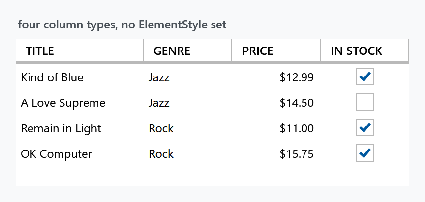

Title: DataGrid Columns
Description: The DataGrid Column styles
---

A `DataGrid` column shows one control when the cell is at rest and a different one while it is being edited, and each needs a style. MahApps supplies both for every built-in column type — and, more usefully, applies them without being asked.



That grid declares four columns and sets no `ElementStyle` or `EditingElementStyle` anywhere:

```xml
<DataGrid ItemsSource="{Binding Albums}" AutoGenerateColumns="False">
    <DataGrid.Columns>
        <DataGridTextColumn Header="Title" Binding="{Binding Title}" />
        <DataGridComboBoxColumn Header="Genre" SelectedValueBinding="{Binding Genre}"
                                ItemsSource="{Binding Genres}" />
        <mah:DataGridNumericUpDownColumn Header="Price" Binding="{Binding Price}"
                                         StringFormat="C" Minimum="0" />
        <DataGridCheckBoxColumn Header="In stock" Binding="{Binding InStock}" />
    </DataGrid.Columns>
</DataGrid>
```

## Why the styles arrive on their own

The MahApps `DataGrid` style sets ten `DataGridHelper.AutoGenerated*ColumnStyle` properties — a display and an editing style for each of the five column types — and, on top of that, sets `DataGridHelper.ColumnStylesHelper` to `{mah:DataGridColumnStylesHelper}`.

That markup extension attaches to the grid, watches `Columns` for changes, and binds each column's `ElementStyle` and `EditingElementStyle` to the matching property. It does this for **every** column, not only the ones `AutoGenerateColumns` produced — which is why the columns above are styled although nothing was set on them.

:::{.alert .alert-warning}
Older documentation tells you to set `ElementStyle="{DynamicResource MetroDataGridCheckBox}"` on a `DataGridCheckBoxColumn`. Do not: that resource no longer exists — it was renamed `MahApps.Styles.CheckBox.DataGrid` in v2 — and setting anything by hand is unnecessary, because the helper above already did it. Set `ElementStyle` only when you want something *other* than the MahApps style, since a value of your own wins over the binding.
:::

## The styles per column type

| Column | At rest | While editing |
| --- | --- | --- |
| `DataGridTextColumn` | `MahApps.Styles.TextBlock.DataGrid` | `MahApps.Styles.TextBox.DataGrid.Editing` |
| `DataGridCheckBoxColumn` | `MahApps.Styles.CheckBox.DataGrid` | `MahApps.Styles.CheckBox.DataGrid` |
| `DataGridComboBoxColumn` | `MahApps.Styles.ComboBox.DataGrid` | `MahApps.Styles.ComboBox.DataGrid.Editing` |
| `DataGridHyperlinkColumn` | `MahApps.Styles.Hyperlink.DataGrid` | `MahApps.Styles.TextBox.DataGrid.Editing` |
| `mah:DataGridNumericUpDownColumn` | `MahApps.Styles.NumericUpDown.DataGrid` | `MahApps.Styles.NumericUpDown.DataGrid.Editing` |

The check box column uses the same style in both, because a check box is already editable where it stands. There is also `MahApps.Styles.CheckBox.DataGrid.Win10` if you want the square Windows 10 box in a grid.

The editing styles trim the control down so it fits inside a cell without the grid jumping — no outer border, tighter padding:


## The numeric column

`DataGridNumericUpDownColumn` is a MahApps control, not a WPF one: a column whose editing element is a [NumericUpDown](../controls/numericupdown), with the spin buttons and the numeric input rules that come with it.

```xml
<mah:DataGridNumericUpDownColumn Header="Price"
                                 Binding="{Binding Price}"
                                 StringFormat="C"
                                 Minimum="0" />
```

`StringFormat`, `Minimum`, `Maximum`, `Interval` and the other `NumericUpDown` settings are properties of the column and are handed to the editor when the cell goes into edit mode.

## Auto-generated columns

With `AutoGenerateColumns="True"` the same ten properties apply, which is what they were built for — you get styled columns from a bound type without touching the generated columns:

```xml
<DataGrid ItemsSource="{Binding Albums}" AutoGenerateColumns="True" />
```

To style them differently, override the property for that column type rather than reaching for the generated column:

```xml
<DataGrid AutoGenerateColumns="True"
          mah:DataGridHelper.AutoGeneratedTextColumnStyle="{StaticResource RightAlignedCell}" />
```

All ten properties are listed on the [DataGridHelper](../helper/datagridhelper) page.

## Related

The grid itself, its Azure variant and the row, cell and header styles are on the [DataGrid](datagrid) page.
