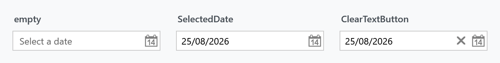
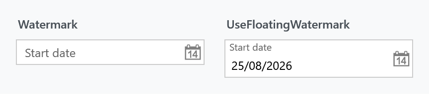
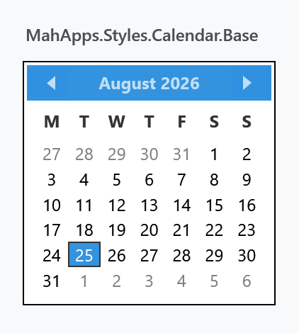

Title: DatePicker
Description: The DatePicker styles
---

Every `DatePicker` in a MahApps application is styled without any markup on your side, and so is the calendar that drops out of it. On top of that the library adds a watermark and a clear button, both through the same attached properties a `TextBox` uses.



## The implicit style

`Styles/Controls.xaml` contains keyless styles for `DatePicker`, `DatePickerTextBox` and `Calendar`. Merging that dictionary — which the [quick start](../guides/quick-start) does — is all it takes:

```xml
<ResourceDictionary Source="pack://application:,,,/MahApps.Metro;component/Styles/Controls.xaml" />
```

Three of them are needed because a `DatePicker` is three controls: the picker itself, the `DatePickerTextBox` inside it, and the `Calendar` in the drop-down.

To extend rather than replace, base your own style on the keyed one:

```xml
<Style BasedOn="{StaticResource MahApps.Styles.DatePicker}" TargetType="{x:Type DatePicker}">
    <Setter Property="mah:TextBoxHelper.ClearTextButton" Value="True" />
</Style>
```

## The styles

| Style | Target | |
| --- | --- | --- |
| `MahApps.Styles.DatePicker` | `DatePicker` | the picker. What the implicit style applies |
| `MahApps.Styles.DatePickerTextBox` | `DatePickerTextBox` | the text box inside it |
| `MahApps.Styles.DatePickerTextBox.TimePickerBase` | `DatePickerTextBox` | the same, used by `TimePicker` and `DateTimePicker`; it only forwards the automation properties from the picker to the box |

Besides the look, the picker style also sets three behavioural defaults you may want to change: `SelectedDateFormat` to `Short`, `IsTodayHighlighted` to `True`, and `CalendarStyle` to `MahApps.Styles.Calendar.Base`.

## The clear button

`ClearTextButton` puts an ✕ next to the calendar button, which empties the picker.

```xml
<DatePicker mah:TextBoxHelper.ClearTextButton="True" />
```

The mechanism is worth knowing, because it is not the one the other input controls use. The button is in the template unconditionally, and a trigger collapses it while `TextBoxHelper.ButtonCommand` is `null` — which it is by default. Setting `ClearTextButton="True"` fires a second trigger that puts `MahAppsCommands.ClearControlCommand` into `ButtonCommand`, and that is what brings the button back.

Two things follow from that:

- Setting your own `ButtonCommand` also makes the button appear, and it replaces the clearing rather than adding to it. That is the way to turn the ✕ into something else — a "today" button, for instance.
- `ClearControlCommand` refuses to run unless `ClearTextButton` is `True` and the picker is not read-only, so the button is disabled rather than misleading in those cases.

The command is public and works on more than a picker — it clears a `TextBox`, `ComboBox` or `TimePicker` the same way, and can be invoked from anywhere:

```xml
<Button Command="{x:Static mah:MahAppsCommands.ClearControlCommand}"
        CommandTarget="{Binding ElementName=StartDate}"
        Content="Clear" />
```

## Watermark

WPF's own `DatePickerTextBox` shows *Select a date* when it is empty. `TextBoxHelper.Watermark` replaces that with your own text, and the floating variant keeps it visible once a date has been picked:



```xml
<DatePicker mah:TextBoxHelper.Watermark="Start date" />

<DatePicker mah:TextBoxHelper.Watermark="Start date"
            mah:TextBoxHelper.UseFloatingWatermark="True" />
```

## The calendar

The drop-down is an ordinary `Calendar`, styled through the picker's `CalendarStyle`. Three calendar styles ship with the library:

| Style | |
| --- | --- |
| `MahApps.Styles.Calendar.Base` | what a `DatePicker` uses in its drop-down |
| `MahApps.Styles.Calendar` | the same plus the control font and size; what a standalone `Calendar` gets from the implicit style |
| `MahApps.Styles.Calendar.DateTimePicker` | the base with a quieter border, for the drop-down of a `DateTimePicker` |



All three build on `MahApps.Styles.CalendarItem`, `MahApps.Styles.CalendarDayButton` and `MahApps.Styles.CalendarButton`, which is where the individual days, the month and year buttons and the header live. Restyling one day cell means replacing `CalendarDayButtonStyle` rather than the whole calendar.

```xml
<DatePicker CalendarStyle="{StaticResource MyCalendar}" />
```

## Helper properties

Three helpers reach a `DatePicker`, and their full property tables are on their own pages: [DatePickerHelper](../helper/datepickerhelper) for the drop-down button, [TextBoxHelper](../helper/textboxhelper) for the watermark and the clear button, and [ControlsHelper](../helper/controlshelper) for the border, the corner radius and read-only.

What the style itself sets, since those are the values you would be overriding:

| Property | To |
| --- | --- |
| `DatePickerHelper.DropDownButtonContent` | the calendar glyph, as `Path` geometry |
| `DatePickerHelper.DropDownButtonContentTemplate` | the template that draws that geometry |
| `TextBoxHelper.IsMonitoring` | `True` |
| `TextBoxHelper.ButtonWidth` | `22` |
| `TextBoxHelper.ButtonFontSize` | `MahApps.Font.Size.Button.ClearText` |
| `TextBoxHelper.ButtonTemplate` | the chromeless button template |
| `ControlsHelper.FocusBorderBrush` | `MahApps.Brushes.TextBox.Border.Focus` |
| `ControlsHelper.MouseOverBorderBrush` | `MahApps.Brushes.TextBox.Border.MouseOver` |

`ButtonCommand` is deliberately absent from that list — it is set by the trigger described above, not by the style.

The drop-down button's content and template are set as a pair, so replacing the calendar icon means dealing with both. [DatePickerHelper](../helper/datepickerhelper) has the detail.

## Read-only

`DatePicker` has no `IsReadOnly` of its own. `ControlsHelper.IsReadOnly` fills the gap: it disables the drop-down button, makes the text box read-only, and stops the clear command from running.

```xml
<DatePicker mah:ControlsHelper.IsReadOnly="True" SelectedDate="{Binding StartDate}" />
```

That leaves the date readable and selectable, which is what a disabled picker does not.

## Validation

`Validation.ErrorTemplate` is set to `MahApps.Templates.ValidationError`, so a failing validation rule on `SelectedDate` is drawn the way it is on every other MahApps input control. How the popup behaves is [ValidationHelper](../helper/validationhelper).

## Related

`TimePicker` and `DateTimePicker` are MahApps controls of their own rather than styles of a WPF one, and they reuse both the `DatePickerTextBox.TimePickerBase` style and `DatePickerHelper`.
