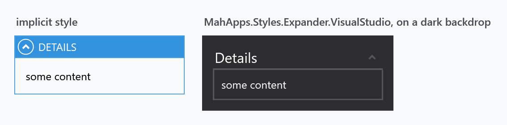
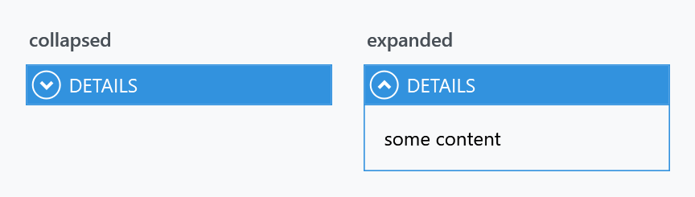
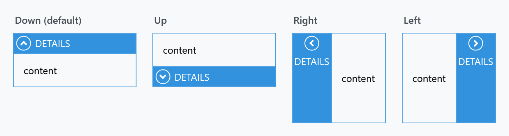
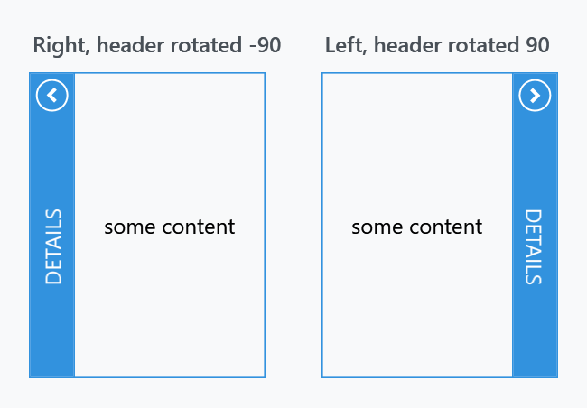

Title: Expander
Description: The Expander styles
---

An `Expander` gets the same accent header band as a [GroupBox](groupbox), plus a toggle arrow and a fade when it opens. Its header is a `ToggleButton`, and which way that button points depends on `ExpandDirection` — which is why the style carries four header styles rather than one.



## The implicit style

`Styles/Controls.xaml` applies `MahApps.Styles.Expander` to every `Expander`. Merging that dictionary — which the [quick start](../guides/quick-start) does — is all it takes:

```xml
<ResourceDictionary Source="pack://application:,,,/MahApps.Metro;component/Styles/Controls.xaml" />
```

## The two styles

| Style | Lives in | |
| --- | --- | --- |
| `MahApps.Styles.Expander` | `Controls.xaml` | the implicit one |
| `MahApps.Styles.Expander.VisualStudio` | `Styles/VS/Controls.xaml` | the Visual Studio tool-window look |

:::{.alert .alert-warning}
As with the [GroupBox](groupbox), the Visual Studio style is not merged by `Controls.xaml` — add `Styles/VS/Controls.xaml` and `Styles/VS/Colors.xaml` first — and it is drawn for the dark Visual Studio theme, which is why the figure shows it on a dark backdrop.
:::

## Open and closed



Opening and closing is animated: the style points `ExpanderHelper.ExpandStoryboard` and `CollapseStoryboard` at `MahApps.Storyboard.Expander.Expand` and `.Collapse`, a quarter-second opacity fade on the content. Setting those properties **replaces** that animation rather than adding one, and setting them to `{x:Null}` makes the content switch over in a single frame.

## The four directions

`ExpandDirection` decides which edge the content unfolds from, and the header rotates to match:



### Turning the header text on its side

Look at the last two panels above: with `Left` and `Right` the band is vertical but the text stays horizontal, so a longer header runs out of room. The built-in styles do not rotate it — that is left to you, with a `LayoutTransform` on the header content:



```xml
<Expander ExpandDirection="Right" IsExpanded="True" Height="170" Header="Details">
    <Expander.HeaderTemplate>
        <DataTemplate>
            <TextBlock VerticalAlignment="Center" Text="{Binding}">
                <TextBlock.LayoutTransform>
                    <RotateTransform Angle="-90" />
                </TextBlock.LayoutTransform>
            </TextBlock>
        </DataTemplate>
    </Expander.HeaderTemplate>
    <TextBlock Margin="12" VerticalAlignment="Center" Text="some content" />
</Expander>
```

For `ExpandDirection="Left"` — the band on the right-hand side — use `Angle="90"` instead, so the text reads downwards rather than upwards.

Use `LayoutTransform` rather than `RenderTransform`: the former rotates before layout, so the band ends up as narrow as the rotated text is tall. A `RenderTransform` would turn the text but leave the band sized for the horizontal version.

:::{.alert .alert-info}
Rotate through `HeaderTemplate`, not by assigning a `TextBlock` to `Header`. Both put a rotated text block in the band, but a template keeps the header a string, so the style's upper-casing still applies and the white foreground still inherits — the figure above sets neither, and `Header="Details"` still comes out as *DETAILS* in white. Hand `Header` an element instead and you lose both: the casing no longer applies, and the text falls back to the dark default, which then has to be set back to `MahApps.Brushes.IdealForeground` by hand.
:::

Each direction has its own header style, and the `Expander` style fills in all four:

| Property | Applies when | Style it is given |
| --- | --- | --- |
| `ExpanderHelper.HeaderDownStyle` | `ExpandDirection="Down"` | `MahApps.Styles.ToggleButton.ExpanderHeader.Down` |
| `ExpanderHelper.HeaderUpStyle` | `Up` | `...ExpanderHeader.Up` |
| `ExpanderHelper.HeaderLeftStyle` | `Left` | `...ExpanderHeader.Left` |
| `ExpanderHelper.HeaderRightStyle` | `Right` | `...ExpanderHeader.Right` |

Replacing one changes only that direction, so an expander whose direction is bound needs the matching styles set for every value it can take:

```xml
<Expander Header="Details"
          mah:ExpanderHelper.HeaderDownStyle="{StaticResource QuietExpanderHeader}">
    <TextBlock Margin="8" Text="some content" />
</Expander>
```

Base your own on the built-in one for that direction, or the arrow and the layout go with it:

```xml
<Style x:Key="QuietExpanderHeader"
       BasedOn="{StaticResource MahApps.Styles.ToggleButton.ExpanderHeader.Down}"
       TargetType="{x:Type ToggleButton}">
    <Setter Property="Background" Value="{DynamicResource MahApps.Brushes.Gray10}" />
    <Setter Property="Foreground" Value="{DynamicResource MahApps.Brushes.Text}" />
</Style>
```

The four all derive from `MahApps.Styles.ToggleButton.ExpanderHeader.Base`, so a change meant for every direction belongs there instead.

## Header casing and colours

As on a `GroupBox`, the style sets `ControlsHelper.ContentCharacterCasing` to `Upper`, and the header's colours and font come from `HeaderedControlHelper`:

```xml
<Expander Header="Details"
          mah:ControlsHelper.ContentCharacterCasing="Normal"
          mah:HeaderedControlHelper.HeaderBackground="{DynamicResource MahApps.Brushes.Gray10}"
          mah:HeaderedControlHelper.HeaderForeground="{DynamicResource MahApps.Brushes.Text}" />
```

See [HeaderedControlHelper](../helper/headeredcontrolhelper) for the full list, and [ExpanderHelper](../helper/expanderhelper) for the header styles and storyboards.

## Related

[GroupBox](groupbox) is the same header on a control that does not fold, and a `DataGrid` group header uses `MahApps.Styles.ToggleButton.ExpanderHeader.Down.DataGrid.GroupItem`, a fifth variant of the same base — see [DataGrid](datagrid).
