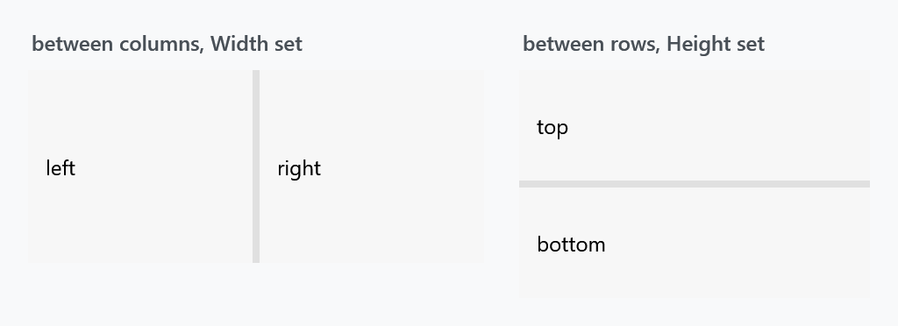
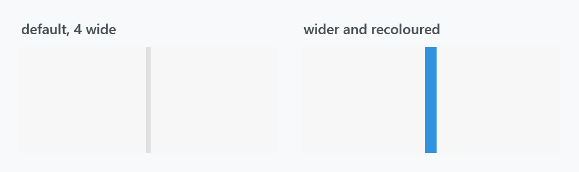

Title: GridSplitter
Description: The GridSplitter styles
---

`GridSplitter` is the bar a user drags to resize two panes of a `Grid`. MahApps keeps WPF's template and changes four things: the colour, both alignments, and — a behavioural one — the drag preview.



## The implicit style

`Styles/Controls.xaml` applies `MahApps.Styles.GridSplitter` to every `GridSplitter`. Merging that dictionary — which the [quick start](../guides/quick-start) does — is all it takes:

```xml
<ResourceDictionary Source="pack://application:,,,/MahApps.Metro;component/Styles/Controls.xaml" />
```

There is no second style. The whole thing is five setters:

| Property | Set to | |
| --- | --- | --- |
| `Background` | `MahApps.Brushes.Gray8` | the bar itself; WPF's default is a system brush |
| `HorizontalAlignment` | `Stretch` | |
| `VerticalAlignment` | `Stretch` | |
| `ShowsPreview` | `True` | drag shows a ghost bar and resizes on release |
| `PreviewStyle` | `MahApps.Styles.GridSplitter.Preview` | what that ghost bar looks like |

## Give it a Width or a Height

:::{.alert .alert-warning}
This is the one that catches people. `GridSplitter.ResizeDirection` defaults to `Auto`, and WPF resolves that by looking first at the alignments: a non-stretched `HorizontalAlignment` means it resizes columns, a non-stretched `VerticalAlignment` means rows. **MahApps sets both to `Stretch`**, so neither test applies and WPF falls through to comparing the rendered size — columns if it is taller than wide, rows otherwise.

That works out only if you give the splitter a size. Set `Width` for a splitter between columns and `Height` for one between rows, as both figures here do, or set `ResizeDirection` explicitly.
:::

```xml
<Grid>
    <Grid.ColumnDefinitions>
        <ColumnDefinition Width="*" />
        <ColumnDefinition Width="Auto" />
        <ColumnDefinition Width="*" />
    </Grid.ColumnDefinitions>

    <Border Grid.Column="0" />
    <GridSplitter Grid.Column="1" Width="4" />
    <Border Grid.Column="2" />
</Grid>
```

Note the `Auto` column the splitter sits in: giving the splitter its own definition rather than overlaying it on a pane keeps the two panes from resizing under it.

WPF's own default style sets `HorizontalAlignment` to `Right`, so a splitter that resized columns without a `Width` under the plain WPF style needs one under this style.

## The drag preview

`ShowsPreview` is `True` here where WPF defaults it to `False`. The difference is when the panes move: with the preview on, dragging shows a translucent bar and the panes jump to the new sizes when the mouse is released; with it off, they follow the pointer live.

`MahApps.Styles.GridSplitter.Preview` is what that bar looks like — a rectangle in the theme foreground at half opacity. Both are ordinary properties, so either can be changed:

```xml
<GridSplitter Width="4" ShowsPreview="False" />
```

## Changing the look

There is no template to replace: the bar is just the control's `Background`, and its thickness is the `Width` or `Height` you gave it.



```xml
<GridSplitter Grid.Column="1"
              Width="10"
              Background="{DynamicResource MahApps.Brushes.Accent}" />
```

A wider bar is easier to grab. If you want a slim line that is still easy to hit, keep the `Width` generous and draw the line with a `Border` inside a template of your own rather than making the control itself thin.
