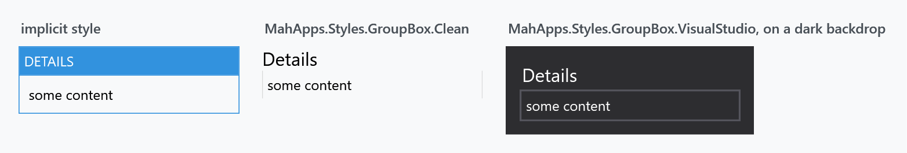
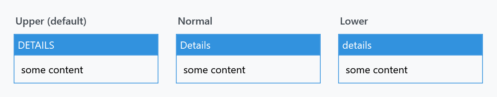
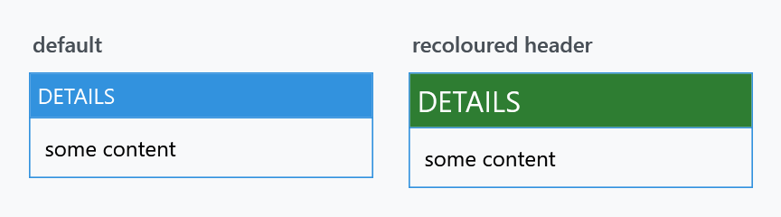

Title: GroupBox
Description: The GroupBox styles
---

A `GroupBox` gets an accent-filled header band and a bordered body. There are two alternative styles, and the header is reachable through attached properties rather than a template.



## The implicit style

`Styles/Controls.xaml` applies `MahApps.Styles.GroupBox` to every `GroupBox`. Merging that dictionary — which the [quick start](../guides/quick-start) does — is all it takes:

```xml
<ResourceDictionary Source="pack://application:,,,/MahApps.Metro;component/Styles/Controls.xaml" />
```

## The three styles

| Style | Lives in | |
| --- | --- | --- |
| `MahApps.Styles.GroupBox` | `Controls.xaml` | the implicit one: accent header band, bordered body |
| `MahApps.Styles.GroupBox.Clean` | `Styles/Clean/Controls.xaml` | no band; the header is plain text above a hairline |
| `MahApps.Styles.GroupBox.VisualStudio` | `Styles/VS/Controls.xaml` | the Visual Studio tool-window look |

:::{.alert .alert-warning}
The last two are **not** merged by `Controls.xaml`. Add the dictionary they live in before using them, or the `Style` reference resolves to nothing. The Visual Studio one also needs `Styles/VS/Colors.xaml`, and it is drawn for the dark Visual Studio theme — on a light background its header all but disappears, which is why the figure above puts it on a dark backdrop.
:::

```xml
<GroupBox Header="Details" Style="{DynamicResource MahApps.Styles.GroupBox.Clean}">
    <GroupBox.Resources>
        <ResourceDictionary Source="pack://application:,,,/MahApps.Metro;component/Styles/Clean/Controls.xaml" />
    </GroupBox.Resources>
    <TextBlock Text="some content" />
</GroupBox>
```

```xml
<GroupBox Header="Details" Style="{DynamicResource MahApps.Styles.GroupBox.VisualStudio}">
    <GroupBox.Resources>
        <ResourceDictionary>
            <ResourceDictionary.MergedDictionaries>
                <ResourceDictionary Source="pack://application:,,,/MahApps.Metro;component/Styles/VS/Controls.xaml" />
                <ResourceDictionary Source="pack://application:,,,/MahApps.Metro;component/Styles/VS/Colors.xaml" />
            </ResourceDictionary.MergedDictionaries>
        </ResourceDictionary>
    </GroupBox.Resources>
    <TextBlock Text="some content" />
</GroupBox>
```

Merging the dictionary once in `App.xaml` is tidier than per control; it is shown here on the control only to keep the sample self-contained.

## Header casing

The style sets `ControlsHelper.ContentCharacterCasing` to `Upper`, so a header reads as capitals whatever you typed. Set it back to have the text as written:



```xml
<GroupBox Header="Details" mah:ControlsHelper.ContentCharacterCasing="Normal" />
```

## Restyling the header

The header's colours, font and padding come from `HeaderedControlHelper`, so they can be changed without replacing the template:



```xml
<GroupBox Header="Details"
          mah:HeaderedControlHelper.HeaderBackground="{DynamicResource MahApps.Brushes.Accent}"
          mah:HeaderedControlHelper.HeaderForeground="{DynamicResource MahApps.Brushes.IdealForeground}"
          mah:HeaderedControlHelper.HeaderFontSize="16"
          mah:HeaderedControlHelper.HeaderMargin="10 6" />
```

The style sets three of these itself: `HeaderBackground` to the accent brush, `HeaderFontSize` to the content size, and `HeaderForeground` deliberately to `{x:Null}` so the template can pick a foreground that reads against the band. The full list is on the [HeaderedControlHelper](../helper/headeredcontrolhelper) page.

## Related

[Expander](expander) is the same header on a control that folds away, and uses the same helper.
