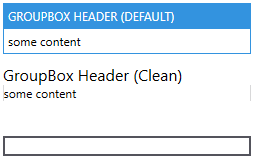

Title: GroupBox
Description: The GroupBox style
---

## Character Casing of `Header`

The default character casing for the `Header` property is `Upper`.

You can change this by setting the property `ContentCharacterCasing` of `ControlsHelper` to a different value. This is similar to the documentation of `ContentControlEx`.

### Example

```xml
<!-- xmlns:mah="http://metro.mahapps.com/winfx/xaml/controls" -->

<StackPanel>
    <GroupBox Header="My upper Header"
              mah:ControlsHelper.ContentCharacterCasing="Upper"
              Margin="5" />
    <GroupBox Header="My normal Header"
              mah:ControlsHelper.ContentCharacterCasing="Normal"
              Margin="5" />
    <GroupBox Header="My lower Header"
              mah:ControlsHelper.ContentCharacterCasing="Lower"
              Margin="5" />
</StackPanel>
```


## Different Styles of `GroupBox`

There are different styles available for `GroupBox`. You can change this by setting the property `Style`.

The style `Visual Studio` is optimized for a dark theme.

### Example

```xml
<StackPanel Margin="10">
    <GroupBox Header="GroupBox Header (default)"
              Margin="5">
        <TextBlock Text="some content" />
    </GroupBox>

    <GroupBox Margin="5"
              Header="GroupBox Header (Clean)"
              Style="{DynamicResource MahApps.Styles.GroupBox.Clean}">
        <GroupBox.Resources>
            <ResourceDictionary Source="pack://application:,,,/MahApps.Metro;component/Styles/Clean/Controls.xaml" />
        </GroupBox.Resources>
        <TextBlock Text="some content" />
    </GroupBox>

    <GroupBox Margin="5"
              Header="GroupBox Header (VisualStudio)"
              Style="{DynamicResource MahApps.Styles.GroupBox.VisualStudio}">
        <GroupBox.Resources>
            <ResourceDictionary>
                <ResourceDictionary.MergedDictionaries>
                    <ResourceDictionary Source="pack://application:,,,/MahApps.Metro;component/Styles/VS/Controls.xaml" />
                    <ResourceDictionary Source="pack://application:,,,/MahApps.Metro;component/Styles/VS/Colors.xaml" />
                </ResourceDictionary.MergedDictionaries>
            </ResourceDictionary>
        </GroupBox.Resources>
        <TextBlock Text="some content" />
    </GroupBox>
</StackPanel>
```

#### Light theme

```xml
<!-- Theme setting in App.xaml-->
<!-- <ResourceDictionary Source="pack://application:,,,/MahApps.Metro;component/Styles/Themes/Light.Blue.xaml" /> -->
```



#### Dark theme

```xml
<!-- Theme setting in App.xaml-->
<!-- <ResourceDictionary Source="pack://application:,,,/MahApps.Metro;component/Styles/Themes/Dark.Blue.xaml" /> -->
```


