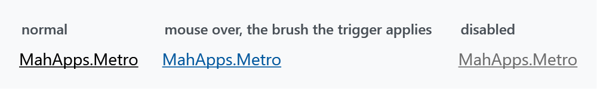
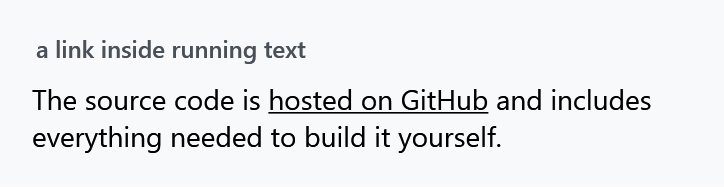

Title: Hyperlink
Description: The Hyperlink styles
---

A `Hyperlink` is an inline, not a control, so it lives inside a `TextBlock` and is styled rather than templated. MahApps gives it the Metro treatment: underlined, in the ordinary text colour, and only coloured once the pointer is over it.



:::{.alert .alert-info}
Note the first panel. A MahApps hyperlink is **not** blue at rest — it takes `MahApps.Brushes.Text`, the same colour as the words around it, and relies on the underline to mark it as a link. The accent-ish colour is the hover state. That is a deliberate part of the look, but it surprises people expecting the browser convention.
:::

## The implicit style

`Styles/Controls.xaml` applies `MahApps.Styles.Hyperlink` to every `Hyperlink`. Merging that dictionary — which the [quick start](../guides/quick-start) does — is all it takes:

```xml
<ResourceDictionary Source="pack://application:,,,/MahApps.Metro;component/Styles/Controls.xaml" />
```

```xml
<TextBlock>
    The source code is <Hyperlink NavigateUri="https://github.com/MahApps/MahApps.Metro">hosted on GitHub</Hyperlink>
    and includes everything needed to build it yourself.
</TextBlock>
```



## What the style does

`MahApps.Styles.Hyperlink` is based on WPF's own default hyperlink style rather than replacing it, and adds two setters and three triggers:

| | |
| --- | --- |
| `Foreground` | `MahApps.Brushes.Text` |
| `TextDecorations` | `Underline` |
| on `IsMouseOver` | `Foreground` becomes `MahApps.Brushes.Highlight` |
| on `IsEnabled="False"` | `Foreground` becomes the system grey-text colour |
| on `IsEnabled="True"` | `Cursor` becomes `Hand`, with `ForceCursor="True"` |

`ForceCursor` is the one worth knowing about: it makes the hand cursor win over whatever the surrounding control would otherwise show, so a link inside a control with its own cursor still looks clickable.

To make links read as links in the browser sense, override the foreground — either on the link or through a style of your own:

```xml
<Style BasedOn="{StaticResource MahApps.Styles.Hyperlink}" TargetType="{x:Type Hyperlink}">
    <Setter Property="Foreground" Value="{DynamicResource MahApps.Brushes.Accent}" />
</Style>
```

Keep the `BasedOn`, or the underline, the hover colour and the hand cursor go with it.

## Navigating

The style does nothing about navigation — that is WPF's job, and WPF does not open a browser for you. Handle `RequestNavigate`:

```csharp
private void OnRequestNavigate(object sender, RequestNavigateEventArgs e)
{
    Process.Start(new ProcessStartInfo(e.Uri.AbsoluteUri) { UseShellExecute = true });
    e.Handled = true;
}
```

```xml
<Hyperlink NavigateUri="https://mahapps.com" RequestNavigate="OnRequestNavigate">mahapps.com</Hyperlink>
```

## In a DataGrid

`MahApps.Styles.Hyperlink.DataGrid` is what a `DataGridHyperlinkColumn` uses for its cells. Despite the name it targets **`TextBlock`**, not `Hyperlink`: a hyperlink column puts a `TextBlock` in the cell and the link inside it, so the style dresses the block and carries a nested `Hyperlink` style in its `Style.Resources` for the link itself.

You do not need to set it — the `DataGrid` style wires it up through `DataGridHelper`, as it does for every other column type. See [DataGrid Columns](datagridcolumns).
