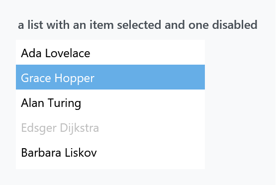
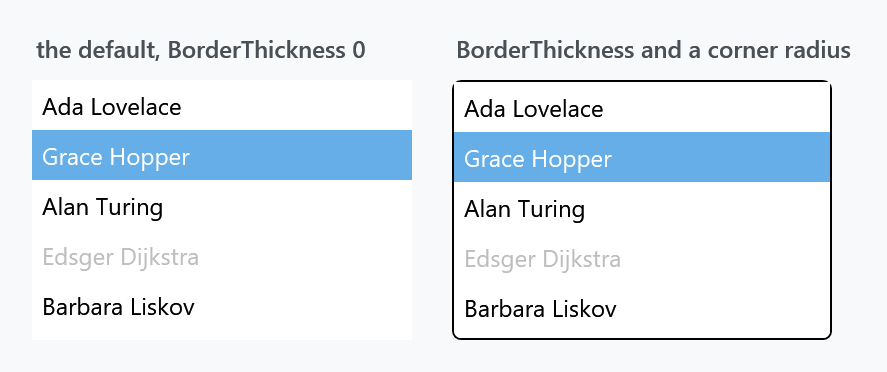
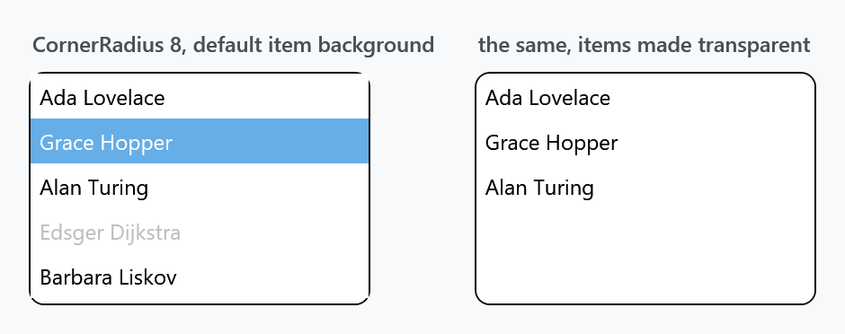
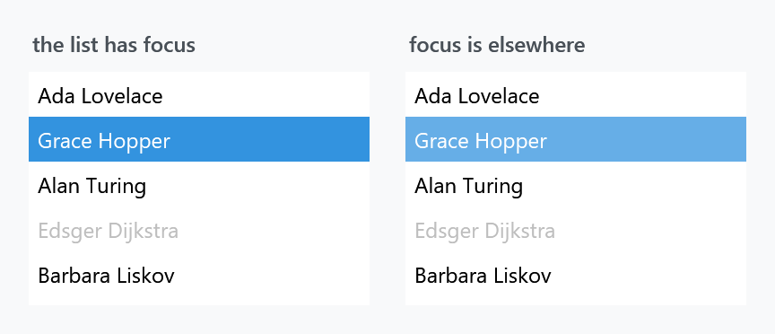

Title: ListBox
Description: The ListBox and ListBoxItem styles
---

Two implicit styles, one for the list and one for the items in it. `Styles/Controls.xaml` applies both, so the [quick start](../guides/quick-start) is the whole setup.



```xml
<ListBox>
    <ListBoxItem Content="Ada Lovelace" />
    <ListBoxItem Content="Grace Hopper" IsSelected="True" />
    <ListBoxItem Content="Alan Turing" />
    <ListBoxItem Content="Edsger Dijkstra" IsEnabled="False" />
    <ListBoxItem Content="Barbara Liskov" />
</ListBox>
```

| Style | |
| --- | --- |
| `MahApps.Styles.ListBox` | the implicit one |
| `MahApps.Styles.ListBoxItem` | the implicit item style |
| `MahApps.Styles.ListBox.Virtualized` | the same list with recycling virtualisation switched on |

## No border

:::{.alert .alert-warning}
`BorderThickness` is **`0`** — the source even says so in a comment. A MahApps list has no frame, which surprises people coming from WPF's default. `BorderBrush`, meanwhile, is `MahApps.Brushes.ThemeForeground`, so switching the border on gives you a black box rather than the grey hairline you probably wanted. Set both.
:::



```xml
<ListBox BorderThickness="1"
         BorderBrush="{DynamicResource MahApps.Brushes.Control.Border}"
         mah:ControlsHelper.CornerRadius="4" />
```

`ControlsHelper.CornerRadius` is template-bound on the border, so a rounded list costs one attached property — with a caveat.

:::{.alert .alert-warning}
**Rounded corners are bitten out at the top.** The template root is a plain `Border`, and a `Border` clips its own background to its `CornerRadius` but **not its child**. The item style paints an opaque `MahApps.Brushes.ThemeBackground` behind every item, so the first item's square corners cover the arc:



The bottom corners survive in the figure only because the last item ends above them.

The one-line fix is to stop the items painting, and let the list's own background show through:

```xml
<ListBox.ItemContainerStyle>
    <Style BasedOn="{StaticResource MahApps.Styles.ListBoxItem}" TargetType="{x:Type ListBoxItem}">
        <Setter Property="Background" Value="Transparent" />
    </Style>
</ListBox.ItemContainerStyle>
```

Or wrap the list in a `mah:ClipBorder`, which does clip its child, and leave the `ListBox` square:

```xml
<mah:ClipBorder BorderBrush="{DynamicResource MahApps.Brushes.Control.Border}"
                BorderThickness="1"
                CornerRadius="4">
    <ListBox BorderThickness="0" />
</mah:ClipBorder>
```

[ListView](listview) and [TreeView](treeview) have the same template shape and the same caveat.
:::

## Two selection colours



A selected item is drawn one way while the list has focus and another way when focus is elsewhere — the accent proper against a lighter tint of it. That is WPF's `Selector.IsSelectionActive` and MahApps gives the two states different brushes:

| State | Brush | Default |
| --- | --- | --- |
| selected, list focused | `ItemHelper.ActiveSelectionBackgroundBrush` | `MahApps.Brushes.Accent` |
| selected, focus elsewhere | `ItemHelper.SelectedBackgroundBrush` | `MahApps.Brushes.Accent2` |

Recolouring only one of the two is the usual mistake: the list looks right until the user clicks somewhere else.

## The item states

Everything the item template draws comes from [ItemHelper](../helper/itemhelper) — a pair of brushes, background and foreground, for each state. The style fills in eleven of them:

| Set by the style | |
| --- | --- |
| `ActiveSelection*` | accent, ideal foreground |
| `Selected*` | `Accent2` |
| `Hover*` | `Accent3`, ordinary text colour |
| `HoverSelected*` | accent |
| `DisabledForegroundBrush` | `MahApps.Brushes.Gray` |
| `DisabledSelected*` | `Gray7` |

Five are deliberately left unset: `DisabledBackgroundBrush` and the two pairs for `MouseLeftButtonPressed*` and `MouseRightButtonPressed*`. That is not an oversight — `ItemHelper` only attaches the mouse handlers that track the pressed state **when one of those brushes is set**, so an item that does not want a pressed colour costs nothing:

```xml
<ListBox.ItemContainerStyle>
    <Style BasedOn="{StaticResource MahApps.Styles.ListBoxItem}" TargetType="{x:Type ListBoxItem}">
        <Setter Property="mah:ItemHelper.MouseLeftButtonPressedBackgroundBrush" Value="{DynamicResource MahApps.Brushes.AccentBase}" />
        <Setter Property="mah:ItemHelper.MouseLeftButtonPressedForegroundBrush" Value="{DynamicResource MahApps.Brushes.IdealForeground}" />
    </Style>
</ListBox.ItemContainerStyle>
```

:::{.alert .alert-info}
Set these on the **item**, through `ItemContainerStyle`, not on the `ListBox`. The properties inherit, so setting them on the list looks like it should work — but the item style already sets most of them, and a style setter on the item beats a value inherited from its parent. [ItemHelper](../helper/itemhelper) has the full list of twenty-odd brushes.
:::

## Scrolling and virtualisation

The style bakes in the scroll settings, so a `ScrollViewer` of your own around a `ListBox` is never needed: both bars are `Auto`, `CanContentScroll` is `True` — item-by-item scrolling — and `PanningMode` is `Both` for touch, with `Stylus.IsFlicksEnabled` off.

`MahApps.Styles.ListBox.Virtualized` adds the four properties that turn on a recycling `VirtualizingStackPanel`:

```xml
<ListBox Style="{StaticResource MahApps.Styles.ListBox.Virtualized}" ItemsSource="{Binding ManyItems}" />
```

The base style already swaps in a virtualising panel if you set `VirtualizingStackPanel.IsVirtualizing="True"` yourself; the variant is the same thing with the other three properties along for the ride.

Grouping is the exception the template handles for you: with `IsGrouping` on and `IsVirtualizingWhenGrouping` off, it turns `CanContentScroll` back off, because item-based scrolling and non-virtualised groups do not mix.

## Visual Studio

`Styles/VS/ListBox.xaml` holds `MahApps.Styles.ListBox.VisualStudio` and `MahApps.Styles.ListBoxItem.VisualStudio`. As with the other Visual Studio styles they are not merged by `Controls.xaml` — add `Styles/VS/Controls.xaml` and `Styles/VS/Colors.xaml` — and they are drawn for the dark shell.

## Related

[ListView](listview) is the same idea with columns, and [ComboBox](combobox) drop-downs use `ListBoxItem` too, so the brushes above colour them as well. The [HamburgerMenu](../controls/HamburgerMenu) pane is a `ListBox` with its own item styles.
