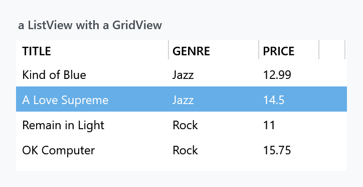
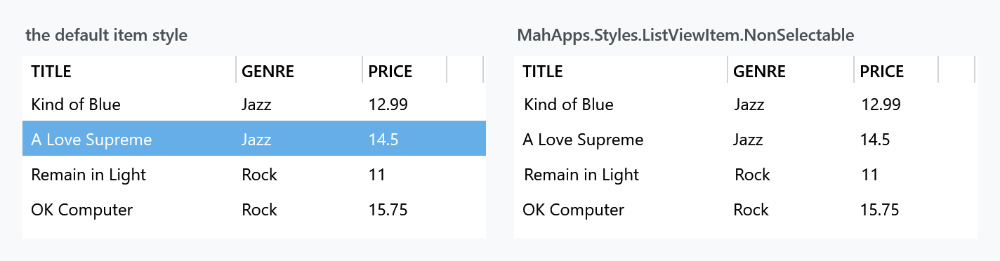
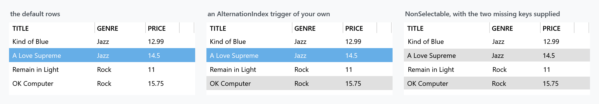

Title: ListView
Description: The ListView, ListViewItem and GridViewColumnHeader styles
---

Three implicit styles cover a `ListView`: the list, its rows, and the column headers a `GridView` puts above them. `Styles/Controls.xaml` applies all three.



```xml
<ListView ItemsSource="{Binding Albums}">
    <ListView.View>
        <GridView>
            <GridViewColumn Width="150" Header="Title" DisplayMemberBinding="{Binding Title}" />
            <GridViewColumn Width="90" Header="Genre" DisplayMemberBinding="{Binding Genre}" />
            <GridViewColumn Width="60" Header="Price" DisplayMemberBinding="{Binding Price}" />
        </GridView>
    </ListView.View>
</ListView>
```

| Style | |
| --- | --- |
| `MahApps.Styles.ListView` | the implicit one |
| `MahApps.Styles.ListViewItem` | the implicit row style |
| `MahApps.Styles.GridViewColumnHeader` | the implicit header style |
| `MahApps.Styles.ListView.Virtualized` | the same list with recycling virtualisation |
| `MahApps.Styles.ListViewItem.NonSelectable` | rows that cannot be selected |

Everything about the row states — the two selection colours, hover, disabled — works exactly as it does on a [ListBox](listbox), through the same [ItemHelper](../helper/itemhelper) brushes, with the same defaults. That page has the detail; only what is different here is below.

## Column headers

The headers are upper-cased. `MahApps.Styles.GridViewColumnHeader` sets `ControlsHelper.ContentCharacterCasing` to `Upper` and the weight to `SemiBold`, so `Header="Title"` comes out as *TITLE*. Set the casing back if you would rather it did not:

```xml
<GridViewColumn Header="Title">
    <GridViewColumn.HeaderContainerStyle>
        <Style BasedOn="{StaticResource MahApps.Styles.GridViewColumnHeader}" TargetType="{x:Type GridViewColumnHeader}">
            <Setter Property="mah:ControlsHelper.ContentCharacterCasing" Value="Normal" />
        </Style>
    </GridViewColumn.HeaderContainerStyle>
</GridViewColumn>
```

The header content sits in a `mah:ContentControlEx`, which is what makes the casing work, and a `Thumb` on the right edge is the resize gripper.

The list's own template wraps everything in `MahApps.Styles.ScrollViewer.GridView` rather than the ordinary scroll viewer — that is the one that keeps the header row in place while the rows scroll under it. See [ScrollBar](scrollbars).

## Pixel scrolling by default

:::{.alert .alert-info}
`MahApps.Styles.ListView` sets `ScrollViewer.CanContentScroll` to **`False`**, where [ListBox](listbox) sets it to `True`. A `ListView` therefore scrolls by pixel, which is smooth and right for rows of differing heights, and it means the list is **not** virtualised: every row is realised up front.

For a long list use `MahApps.Styles.ListView.Virtualized`, which turns `CanContentScroll` back on together with recycling virtualisation and deferred scrolling:

```xml
<ListView Style="{StaticResource MahApps.Styles.ListView.Virtualized}" ItemsSource="{Binding ManyRows}" />
```
:::

The rest of the list style is the same as the `ListBox` one: `BorderThickness` `0` with `BorderBrush` on `ThemeForeground`, `ControlsHelper.CornerRadius` on the border, both scrollbars `Auto`.

A rounded corner is bitten out at the top for the same reason it is on a [ListBox](listbox) — the template root is a plain `Border` and the opaque item background covers the arc. That page has the two workarounds.

## Rows that cannot be selected

`MahApps.Styles.ListViewItem.NonSelectable` is for a grid that only displays. It drops the selection triggers, sets `IsTabStop` to `False` and leaves one hover colour:



```xml
<ListView ItemContainerStyle="{StaticResource MahApps.Styles.ListViewItem.NonSelectable}" />
```

:::{.alert .alert-warning}
Two things about this style are worth knowing before you reach for it.

Its hover colour is the literal **`#e0eff8`** — a pale blue written into the template rather than a theme brush. Under the dark base theme it stays pale blue.

It also carries `AlternationIndex` triggers meant to shade every other row, and they point at `AlternateRow1BackgroundBrush` and `AlternateRow2BackgroundBrush` — **resource keys that do not exist anywhere in MahApps.Metro v2**. They are v1.x names that survived the rename. The `DynamicResource` finds nothing, so the rows are not striped.
:::

:::{.alert .alert-info}
Both are already fixed in `develop` and will arrive with the next release: `MahApps.Styles.ListViewItem.NonSelectable` is now based on `MahApps.Styles.ListViewItem` and uses theme brushes throughout, which removes the hardcoded colour and the two dead keys along with the triggers that used them.
:::

## Striping the rows

`AlternationCount` is `2` on the list style, so the index is being counted for you — the ordinary row style simply has no trigger reading it. Two routes get you stripes:



The middle panel adds a trigger of its own, which is the one to use — it works today and after the fix above:

```xml
<ListView.ItemContainerStyle>
    <Style BasedOn="{StaticResource MahApps.Styles.ListViewItem}" TargetType="{x:Type ListViewItem}">
        <Style.Triggers>
            <Trigger Property="ItemsControl.AlternationIndex" Value="1">
                <Setter Property="Background" Value="{DynamicResource MahApps.Brushes.Gray8}" />
            </Trigger>
        </Style.Triggers>
    </Style>
</ListView.ItemContainerStyle>
```

The right-hand panel is the non-selectable style with the two missing keys defined, which brings its own triggers to life and is what pins the diagnosis:

```xml
<ListView.Resources>
    <SolidColorBrush x:Key="AlternateRow1BackgroundBrush" Color="Transparent" />
    <SolidColorBrush x:Key="AlternateRow2BackgroundBrush" Color="{StaticResource MahApps.Colors.Gray8}" />
</ListView.Resources>
```

That second route stops working once the fix ships, since the triggers go with it. Prefer the first.

:::{.alert .alert-info}
Pick the grey with care. `MahApps.Brushes.Gray10` is the obvious-looking choice and it is **`#F7F7F7`** under the light theme — eight steps off white, which is invisible on most screens. `Gray8` is `#E0E0E0` and reads as a stripe, and it inverts sensibly in the dark theme, where it is `#454545`.
:::

Note in the middle panel that the selected row keeps its selection colour: `Background` is what the trigger sets, and the selection brushes are applied on top of it by the template.

## Related

[ListBox](listbox) is the same list without columns, and [DataGrid](datagrid) is the editable, sortable one — reach for that when the rows are data rather than a list of things.
