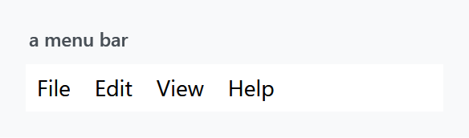
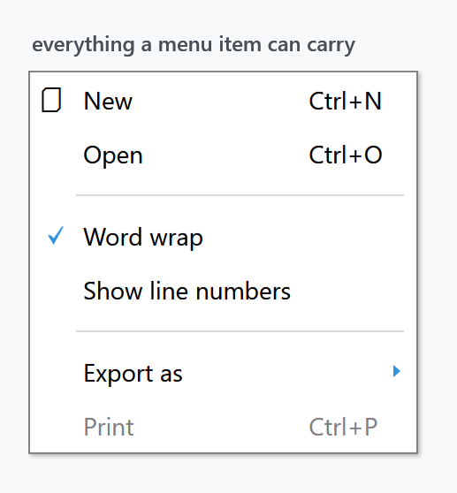
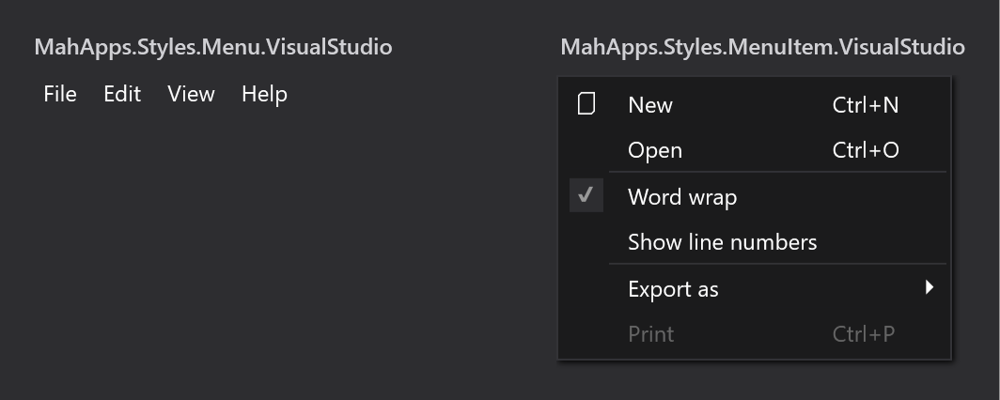

Title: Menus
Description: The Menu, ContextMenu and MenuItem styles
---

Three styles, all applied implicitly by `Styles/Controls.xaml`: `MahApps.Styles.Menu` for the bar, `MahApps.Styles.ContextMenu` for the popup, and `MahApps.Styles.MenuItem` for what goes in either. The [quick start](../guides/quick-start) is the whole setup.



```xml
<Menu>
    <MenuItem Header="_File" />
    <MenuItem Header="_Edit" />
    <MenuItem Header="_View" />
    <MenuItem Header="_Help" />
</Menu>
```

## Menu items

`MahApps.Styles.MenuItem` picks a template per `Role` — top-level header, top-level item, submenu header, submenu item — and each of those handles the icon, the check mark, the gesture text and the submenu arrow:



```xml
<ContextMenu>
    <MenuItem Header="New" InputGestureText="Ctrl+N">
        <MenuItem.Icon>
            <TextBlock FontFamily="{DynamicResource MahApps.Fonts.Family.SymbolTheme}" Text="&#xE8A5;" />
        </MenuItem.Icon>
    </MenuItem>
    <MenuItem Header="Open" InputGestureText="Ctrl+O" />
    <Separator />
    <MenuItem Header="Word wrap" IsCheckable="True" IsChecked="True" />
    <MenuItem Header="Show line numbers" IsCheckable="True" />
    <Separator />
    <MenuItem Header="Export as">
        <MenuItem Header="PDF" />
        <MenuItem Header="HTML" />
    </MenuItem>
    <MenuItem Header="Print" InputGestureText="Ctrl+P" IsEnabled="False" />
</ContextMenu>
```

Everything in that figure comes out of the box — none of it needs a style of its own. The columns line up because the `ContextMenu` style sets `Grid.IsSharedSizeScope="True"`, so the icon, text and gesture columns are measured across all the items at once. `InputGestureText` is only a label: it does not create the shortcut, your `KeyBinding` or `RoutedCommand` does.

Padding differs by role — `7 5 8 6` for the two top-level ones, `2 6 2 6` in a submenu — which is why a bar item is wider than tall and a popup item the other way round.

The separator is styled through `{x:Static MenuItem.SeparatorStyleKey}` and is a two-pixel groove inset 20 units from the left, so it starts past the icon column rather than cutting across it.

## The popup

`MahApps.Styles.ContextMenu` sets `HasDropShadow="True"` and its template applies `MahApps.DropShadowEffect.Menu`, offsetting the border by `0 0 6 6` to leave room for it. It also sets `OverridesDefaultStyle="True"`, so it does not inherit anything from WPF's own context menu style.

| Property | Set to |
| --- | --- |
| `Background` | `MahApps.Brushes.ContextMenu.Background` |
| `BorderBrush` | `MahApps.Brushes.ContextMenu.Border` |
| `FontSize` | `MahApps.Font.Size.ContextMenu`, 14 |
| `HasDropShadow` | `True` |
| `Grid.IsSharedSizeScope` | `True` |
| `VerticalContentAlignment` | `Center` |

## System keys

Both styles reach for system resources rather than theme ones:

```xml
<Setter Property="Foreground" Value="{DynamicResource {x:Static SystemColors.MenuTextBrushKey}}" />
<Setter Property="FontFamily" Value="{DynamicResource {x:Static SystemFonts.MenuFontFamilyKey}}" />
```

The colour still follows the theme, because MahApps **redefines that system key** in the theme dictionary — `SystemColors.MenuTextBrushKey` is given `MahApps.Colors.ThemeForeground` there. Change the base theme and menu text changes with it.

The fonts are a different matter. MahApps does not redefine the `SystemFonts.Menu*` keys, so the family, style and weight of menu text come from the reader's **Windows** settings, not from `Fonts.xaml`. Menus are the one place in a MahApps window where that is true, and it is deliberate — menus are a shell affordance. Only the size is the library's, from `MahApps.Font.Size.Menu` and `.ContextMenu`.

## The text box context menu

`Controls.ContextMenu.xaml` also holds a ready-made menu:

```xml
<ContextMenu x:Key="MahApps.TextBox.ContextMenu" x:Shared="False">
    <MenuItem Command="ApplicationCommands.Cut" />
    <MenuItem Command="ApplicationCommands.Copy" />
    <MenuItem Command="ApplicationCommands.Paste" />
</ContextMenu>
```

The styles for [TextBox](textbox), [PasswordBox](passwordbox), [DatePicker](datepicker), `DateTimePicker` and `HotKeyBox` all point their `ContextMenu` at it. `x:Shared="False"` gives each control its own instance, which a context menu needs.

Redefining that key in `App.xaml` — after the MahApps dictionaries — swaps the context menu of every one of those controls at once, which is easier than setting `ContextMenu` on each.

## Spell checking

`TextBoxHelper.IsSpellCheckContextMenuEnabled` turns on the spell-check entries for a `TextBox` or `RichTextBox`, and MahApps styles them through four `ComponentResourceKey`s on `mah:Spelling`: `SuggestionMenuItemStyleKey` (bold, header bound to the suggestion), `IgnoreAllMenuItemStyleKey`, `NoSuggestionsMenuItemStyleKey` and `SeparatorStyleKey`.

```xml
<TextBox SpellCheck.IsEnabled="True"
         mah:TextBoxHelper.IsSpellCheckContextMenuEnabled="True" />
```

See [TextBoxHelper](../helper/textboxhelper).

## Visual Studio variants



`Styles/VS/` holds `MahApps.Styles.Menu.VisualStudio`, `MahApps.Styles.MenuItem.VisualStudio` and `MahApps.Styles.ContextMenu.VisualStudio`, plus its own `MenuItem.SeparatorStyleKey` and its own `MahApps.TextBox.ContextMenu`.

:::{.alert .alert-warning}
These are **not** merged by `Controls.xaml`. Add `Styles/VS/Controls.xaml` and `Styles/VS/Colors.xaml` first, and note that they are drawn for the dark Visual Studio shell — which is why the figure sits on a dark ground.

`MahApps.Styles.Menu.VisualStudio` is only two setters, a background and a foreground, with no `Template` and no `BasedOn`. Applying it therefore *replaces* the MahApps menu template with WPF's default rather than restyling it. If you want the MahApps bar in Visual Studio colours, base your own style on `MahApps.Styles.Menu` and set the background yourself.
:::

## Items from a CompositeCollection

To share part of a menu, declare it as a `CompositeCollection` resource and pull it in through `ItemsSource`:

```xml
<CompositeCollection x:Key="ContextMenuBase" x:Shared="False">
    <MenuItem Command="ApplicationCommands.New" />
    <MenuItem Command="ApplicationCommands.Delete" />
    <Separator />
</CompositeCollection>
```

```xml
<ContextMenu>
    <ContextMenu.ItemsSource>
        <CompositeCollection>
            <CollectionContainer Collection="{StaticResource ContextMenuBase}" />
            <MenuItem Command="ApplicationCommands.Print" />
        </CompositeCollection>
    </ContextMenu.ItemsSource>
</ContextMenu>
```

That works, but floods the output window:

:::{.alert .alert-danger}
System.Windows.Data Error: 4 : Cannot find source for binding with reference 'RelativeSource FindAncestor, AncestorType='System.Windows.Controls.ItemsControl', AncestorLevel='1''. BindingExpression:Path=VerticalContentAlignment; DataItem=null; target element is 'MenuItem' (Name=''); target property is 'VerticalContentAlignment' (type 'VerticalAlignment')
:::

The two bindings it is complaining about are in `MahApps.Styles.MenuItem` itself:

```xml
<Setter Property="HorizontalContentAlignment" Value="{Binding HorizontalContentAlignment, RelativeSource={RelativeSource AncestorType={x:Type ItemsControl}}}" />
<Setter Property="VerticalContentAlignment" Value="{Binding VerticalContentAlignment, RelativeSource={RelativeSource AncestorType={x:Type ItemsControl}}}" />
```

They are what lets a `ContextMenu` set the alignment for all of its items — the same pattern WPF's own item styles use. A `MenuItem` declared inside a `CompositeCollection` resource, though, is built before it belongs to anything, so the ancestor lookup finds no `ItemsControl` and logs. The menu itself is fine; only the log is noisy.

Replacing the two bindings with fixed values silences it:

```xml
<Style BasedOn="{StaticResource {x:Type MenuItem}}" TargetType="{x:Type MenuItem}">
    <Setter Property="HorizontalContentAlignment" Value="Left" />
    <Setter Property="VerticalContentAlignment" Value="Center" />
</Style>
```

The cost is the feature those bindings provided: alignment set on a `ContextMenu` no longer reaches its items.
