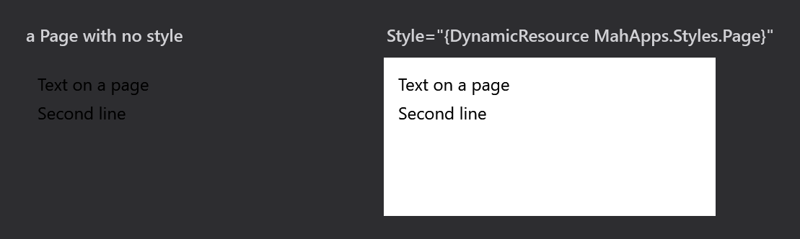

Title: Page
Description: The Page style
---

`MahApps.Styles.Page` is three setters and no template, and it is the one style on this site you have to apply by hand — `Styles/Controls.xaml` does not make it implicit.

```xml
<Page x:Class="MetroDemo.Navigation.InterestingPage"
      xmlns="http://schemas.microsoft.com/winfx/2006/xaml/presentation"
      xmlns:x="http://schemas.microsoft.com/winfx/2006/xaml"
      Title="Interesting Page"
      Style="{DynamicResource MahApps.Styles.Page}">

    <StackPanel>
        <TextBlock>Sorry, nothing is here.</TextBlock>
    </StackPanel>
</Page>
```

| Property | Set to |
| --- | --- |
| `Background` | `MahApps.Brushes.ThemeBackground` |
| `Foreground` | `MahApps.Brushes.ThemeForeground` |
| `TextElement.FontSize` | `MahApps.Font.Size.Content` |

Those three will look familiar: they are exactly what the `MetroWindow` style hands down to everything inside it — see [Text](text). The `Page` style exists because a page does not get them.

## A Frame is a wall

A `Page` is hosted by a `Frame`, whether directly or inside a [MetroNavigationWindow](../controls/MetroNavigationWindow), and a `Frame` is a boundary for **property value inheritance**. `Foreground` and `TextElement.FontSize` set on the window stop there; the page starts again from WPF's own defaults.

It is a boundary for **resource lookup** as well. A `ResourceDictionary` merged into an element above the frame does not reach the page inside it — a `DynamicResource` in the page resolves from `Application.Resources` instead.



Both frames above sit on the same dark surface. The left page has no style, so it has no background and keeps WPF's near-black default text — invisible against it. The right one is the same page with `MahApps.Styles.Page`, which gives it the theme background and the theme foreground.

:::{.alert .alert-info}
Under the **light** base theme the difference is easy to miss: WPF's default font size is 12 and `MahApps.Font.Size.Content` is also 12, and WPF's default foreground is black where `MahApps.Brushes.ThemeForeground` is near-black. Only the background differs, and against a light window even that hardly shows.

Switch to a dark theme, or put the page on any dark surface, and an unstyled page becomes unreadable. That is the case the style is for, and it is why applying it is worth the line even when the light theme looks fine without it.
:::

## Applying it everywhere

Since the style is keyed rather than implicit, every page needs the attribute. One implicit style in `App.xaml`, after the MahApps dictionaries, saves repeating it:

```xml
<Style BasedOn="{StaticResource MahApps.Styles.Page}" TargetType="{x:Type Page}" />
```

There is nothing in the style that makes this unsafe — it sets no template and touches no layout, so an implicit `Page` style has none of the reach an implicit [TextBlock](text) style would.

## Related

[MetroNavigationWindow](../controls/MetroNavigationWindow) is the window that hosts pages, and [Text](text) explains where the same three values come from for everything that is not behind a frame.
