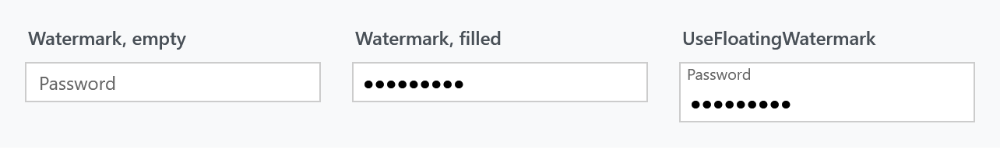
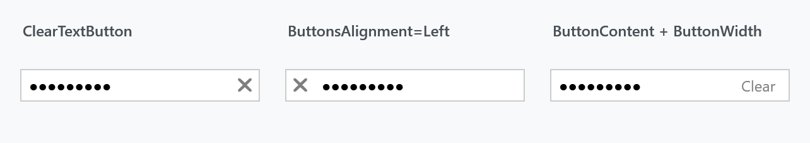

Title: PasswordBox
Description: The PasswordBox styles
---

Every `PasswordBox` in a MahApps application is styled without any markup on your side. On top of that the library adds a caps lock warning, a watermark, a clear button, a reveal button and a bindable password — all through attached properties, so nothing has to be subclassed.


## The implicit style

`Styles/Controls.xaml` contains a keyless style for `PasswordBox` that is based on `MahApps.Styles.PasswordBox`. Merging that dictionary — which the [quick start](../guides/quick-start) does — is all it takes:

```xml
<ResourceDictionary Source="pack://application:,,,/MahApps.Metro;component/Styles/Controls.xaml" />
```

From then on a plain `<PasswordBox />` is the MahApps one. Because the implicit style is keyless it also applies inside MahApps' own controls, which is why the [login dialog](../dialogs/login-dialogs) gets the caps lock warning for free.

To extend it rather than replace it, base your own style on the keyed one:

```xml
<Style BasedOn="{StaticResource MahApps.Styles.PasswordBox}" TargetType="{x:Type PasswordBox}">
    <Setter Property="mah:TextBoxHelper.ClearTextButton" Value="True" />
</Style>
```

Leaving out the `BasedOn` throws the template away with it, and with the template go the caps lock indicator, the watermark and the buttons.

## The explicit styles

Four styles are meant to be set on a `PasswordBox`. Each inherits from the one above it, so everything the base style offers keeps working.

| Style | |
| --- | --- |
| `MahApps.Styles.PasswordBox` | the base. What the implicit style applies |
| `MahApps.Styles.PasswordBox.Button` | adds a command button, driven by `TextBoxHelper.ButtonCommand`. Gone on `develop` |
| `MahApps.Styles.PasswordBox.Button.Revealed` | adds a button that shows the password while it is held down. Called `MahApps.Styles.PasswordBox.Revealed` on `develop` |
| `MahApps.Styles.PasswordBox.Win8` | the revealed style with a larger font, no focus visual and `AllowDrop` |
| `MahApps.Styles.PasswordBox.Win10` | the revealed box in the look UWP drew on Windows 10. On `develop` |
| `MahApps.Styles.PasswordBox.WinUI` | the same box in the look Windows 11 draws. On `develop` |

:::{.alert .alert-info}
Two of those names changed after 2.4.11 and the keys on `develop` are fewer: `MahApps.Styles.PasswordBox.Button.Revealed` is now `MahApps.Styles.PasswordBox.Revealed`, and `MahApps.Styles.PasswordBox.Button` is gone, since the base style runs `ClearControlCommand` itself rather than leaving the button to a style of its own. Three styles instead of four, and on `develop` the code below needs the shorter name.
:::

```xml
<PasswordBox Style="{StaticResource MahApps.Styles.PasswordBox.Button.Revealed}" />
```

:::{.alert .alert-info}
`MahApps.Styles.PasswordBox.Win8` is a leftover name from the Windows 8 era. It differs from `MahApps.Styles.PasswordBox.Button.Revealed` only in `FontSize="15"`, `FocusVisualStyle="{x:Null}"` and `AllowDrop="True"` — reach for the revealed style unless you specifically want those three.
:::

Two more styles live in the same dictionary. They are building blocks of the templates above rather than something to set yourself: `MahApps.Styles.Button.Reveal` styles the reveal button, and `MahApps.Styles.TextBox.PasswordBox.Revealed` styles the borderless `TextBox` the revealed password is drawn into.

### The reveal button

The revealed styles show the password only while the button is pressed — releasing it hides the password again, so it cannot be left switched on by accident. The button appears only once something has been typed.

Its content is an attached property, so the eye icon can be swapped out:

```xml
<PasswordBox Style="{StaticResource MahApps.Styles.PasswordBox.Button.Revealed}"
             mah:PasswordBoxHelper.RevealButtonContent="Show" />
```

## The Windows 10 and WinUI styles

:::{.alert .alert-info}
**`MahApps.Styles.PasswordBox.Win10` and `MahApps.Styles.PasswordBox.WinUI` are on `develop` and ship with the next release.** Neither is in 2.4.11.
:::

Two further styles draw the box the way Windows draws one rather than the way Metro does. Each is the [text box](textbox) of the same look with the eye of a UWP password box where that one keeps its delete button: `MahApps.Styles.PasswordBox.Win10` is a fill darker than the page with a frame two pixels thick that turns accent-coloured once the caret is in, `MahApps.Styles.PasswordBox.WinUI` a light translucent fill with a line along its bottom edge and rounded corners.

Both stand on `MahApps.Styles.PasswordBox.Revealed`, so the eye shows the password while it is held down and hides it again on release. UWP has it there while the caret is in the box and something is written in it, and that is the rule here as well, for the eye and for the clear button alike. A password box nobody is writing in carries neither of the two.

```xml
<PasswordBox Style="{StaticResource MahApps.Styles.PasswordBox.Win10}"
             mah:TextBoxHelper.ClearTextButton="True"
             mah:TextBoxHelper.Watermark="The one you never write down" />
```

The eye and the clear button are drawn as one button with two glyphs, the way UWP draws them, so both wear `TextBoxHelper.ButtonTemplate` and both take the colour of the text in the box. They carry a style key each, `MahApps.Styles.Button.TextControl.Reveal` and `MahApps.Styles.Button.TextControl.Delete`, so a word about the eye need not be a word about every delete button in the application.

The border thicknesses and the padding are resources here too, the same four keys the text box of that look reads, and [TextBox](textbox) covers what each of them does.

Each of the two is also part of a whole style set, applied to every control at once rather than box by box: see [Win 10 (UWP)](../stylevariants/win10) and [WinUI](../stylevariants/winui).

## The caps lock warning

While the box has keyboard focus, an indicator appears inside it whenever <kbd>Caps Lock</kbd> is on. Nothing has to be switched on — it is part of the base style, and therefore of the implicit one.


```xml
<PasswordBox mah:PasswordBoxHelper.CapsLockIcon="CAPS"
             mah:PasswordBoxHelper.CapsLockWarningToolTip="Caps Lock is turned on" />
```

Both are typed `object`, so anything goes in: a string, a `Path`, a whole `Grid`.

## Watermark



```xml
<PasswordBox mah:TextBoxHelper.Watermark="Password" />

<PasswordBox mah:TextBoxHelper.Watermark="Password"
             mah:TextBoxHelper.UseFloatingWatermark="True" />
```

A plain watermark disappears as soon as the first character is typed. A floating one moves above the content instead and stays there, which keeps the label visible while the password is being entered.

## Buttons

The base style and the `.Button` styles put the same button in the same place, but gate it differently — which is the thing to know before wondering why a `ButtonCommand` never fires.

| | Button appears when | What clicking it does |
| --- | --- | --- |
| `MahApps.Styles.PasswordBox` | `TextBoxHelper.ClearTextButton` is `True` | clears the box |
| `MahApps.Styles.PasswordBox.Button` | always — the style sets `TextBoxHelper.TextButton` | runs `ButtonCommand` |
| `MahApps.Styles.PasswordBox.Button.Revealed` | `TextBoxHelper.ClearTextButton` is `True` | clears the box |
| `MahApps.Styles.PasswordBox.Win10`, `.WinUI` | `TextBoxHelper.ClearTextButton` is `True` and the caret is in the box | clears the box |

On `develop` the middle row is gone with the style, and the last one is called `MahApps.Styles.PasswordBox.Revealed`.

### Clear button



```xml
<PasswordBox mah:TextBoxHelper.ClearTextButton="True" />

<PasswordBox mah:TextBoxHelper.ClearTextButton="True"
             mah:TextBoxHelper.ButtonsAlignment="Left" />

<PasswordBox mah:TextBoxHelper.ClearTextButton="True"
             mah:TextBoxHelper.ButtonContent="Clear"
             mah:TextBoxHelper.ButtonFontFamily="{DynamicResource MahApps.Fonts.Family.Control}"
             mah:TextBoxHelper.ButtonFontSize="12"
             mah:TextBoxHelper.ButtonWidth="48" />
```

Clearing calls `PasswordBox.Clear()` and pushes the empty value back through the password binding described below, so a bound view model sees the change.

### Command button

`MahApps.Styles.PasswordBox.Button` reuses the same button for a command of your own:

```xml
<PasswordBox Style="{StaticResource MahApps.Styles.PasswordBox.Button}"
             mah:TextBoxHelper.ButtonCommand="{Binding CheckStrengthCommand}"
             mah:TextBoxHelper.ButtonContent="&#xE1CF;"
             mah:TextBoxHelper.ButtonFontFamily="Segoe MDL2 Assets" />
```

Without a `ButtonCommand` the button is still shown — the style sets `TextButton="True"` — but clicking it does nothing. Setting `ClearTextButton="True"` as well makes it run the command *and* clear the box.

## Helper properties

Three helpers reach a `PasswordBox`, and their full property tables are on their own pages: [PasswordBoxHelper](../helper/passwordboxhelper) for the caps lock indicator and the reveal button, [TextBoxHelper](../helper/textboxhelper) for the watermark and the buttons, and [ControlsHelper](../helper/controlshelper) for the border and the corner radius.

What is worth knowing here is which of them the style already sets, because those are the values you are overriding rather than setting:

| Property | Set by | To |
| --- | --- | --- |
| `PasswordBoxHelper.CapsLockIcon` | the base style | the warning triangle |
| `TextBoxHelper.IsMonitoring` | the base style | `True` |
| `TextBoxHelper.ButtonWidth` | the base style | `22` |
| `TextBoxHelper.ButtonFontSize` | the base style | `MahApps.Font.Size.Button.ClearText` |
| `ControlsHelper.FocusBorderBrush` | the base style | `MahApps.Brushes.TextBox.Border.Focus` |
| `ControlsHelper.MouseOverBorderBrush` | the base style | `MahApps.Brushes.TextBox.Border.MouseOver` |
| `TextBoxHelper.TextButton` | `.Button` | `True` |
| `TextBoxHelper.ButtonTemplate` | `.Button`, `.Button.Revealed` | the chromeless button template |
| `PasswordBoxHelper.RevealButtonContent` | `.Button.Revealed` | the eye icon |
| `TextBoxHelper.ButtonWidth` | `.Win10`, `.WinUI` | `30`, the width UWP and WinUI give that button |
| `TextBoxHelper.ButtonTemplate` | `.Win10`, `.WinUI` | the chrome a UWP box draws behind its buttons |
| `PasswordBoxHelper.RevealButtonContent` | `.Win10`, `.WinUI` | the eye out of the symbol font |
| `ControlsHelper.CornerRadius` | `.WinUI` | `3` |

`IsMonitoring` is the load-bearing one: it keeps `HasText` current and raises the events the caps lock indicator and the floating watermark hang off. Leave it alone unless you have replaced the style without a `BasedOn`.

Apart from the WinUI style, which rounds its corners by three, nothing sets `ControlsHelper.CornerRadius`, so that one starts at zero:

```xml
<PasswordBox mah:ControlsHelper.CornerRadius="4"
             mah:ControlsHelper.FocusBorderBrush="{DynamicResource MahApps.Brushes.Accent}" />
```

## Binding the password

`PasswordBox.Password` is not a dependency property, so it cannot be bound. MahApps works around that with `PasswordBoxBindingBehavior`, and the base style attaches the behaviour for you — the attached property is all you need:

```xml
<PasswordBox mah:PasswordBoxBindingBehavior.Password="{Binding Password, UpdateSourceTrigger=PropertyChanged}" />
```

It binds two-way by default, so setting the property from the view model fills the box as well.

:::{.alert .alert-warning}
This hands the password around as a plain `string`, which lives in memory until the garbage collector happens to reclaim it and cannot be wiped. Where that matters, read `PasswordBox.SecurePassword` from the control instead of binding.
:::

## Validation and busy state

`Validation.ErrorTemplate` is set to `MahApps.Templates.ValidationError`, so a failing validation rule on the password binding is drawn the same way as on any other MahApps input control. `TextBoxHelper.IsWaitingForData` runs a pulsing glow around the box, which suits a password that is being checked against a server:

```xml
<PasswordBox mah:TextBoxHelper.IsWaitingForData="{Binding IsLoading}" />
```
