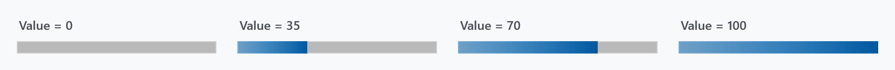
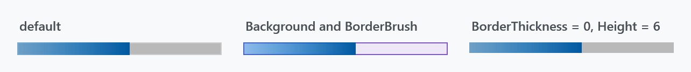
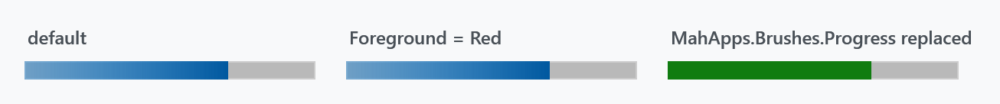
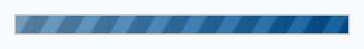
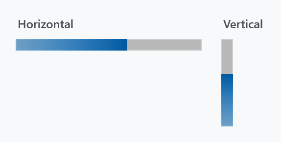

Title: ProgressBar
Description: The ProgressBar styles
---

WPF's `ProgressBar` gets a flat track and a gradient indicator, plus a striped indeterminate state in place of the sliding block.



The gradient runs across the *indicator*, not across the track, so it is fully traversed at every value — the bar always ends in the darker blue.

## The implicit style

`Styles/Controls.xaml` applies `MahApps.Styles.ProgressBar` to every `ProgressBar`. Merging that dictionary — which the [quick start](../guides/quick-start) does — is all it takes:

```xml
<ResourceDictionary Source="pack://application:,,,/MahApps.Metro;component/Styles/Controls.xaml" />
```

```xml
<ProgressBar Width="190" Height="12" Value="70" />
```

There is no second style for `ProgressBar`. What the style sets beyond the template:

| Property | Set to | |
| --- | --- | --- |
| `Background` | `MahApps.Brushes.Gray5` | the track |
| `BorderBrush` | `MahApps.Brushes.Control.Border` | |
| `BorderThickness` | `1` | |
| `Foreground` | `MahApps.Brushes.Highlight` | see the warning below — the template ignores it |
| `IsTabStop` | `False` | |
| `Maximum` | `100` | |
| `MinHeight`, `MinWidth` | `10` | |

## Colours

The track and its frame are ordinary template bindings, so `Background`, `BorderBrush` and `BorderThickness` work as you would expect:



```xml
<ProgressBar Width="190" Height="12" Value="55"
             Background="#FFEDE7F6"
             BorderBrush="#FF7E57C2" />
```

The indicator is a different matter:

:::{.alert .alert-warning}
**`Foreground` does nothing on a `ProgressBar`.** The template fills both the determinate indicator and the indeterminate stripes from `{DynamicResource MahApps.Brushes.Progress}` rather than from a template binding, so the style's own `Foreground` setter is dead and so is any value you set. This is unlike WPF's default template, and unlike [MetroProgressBar](../controls/metroprogressbar), whose template does bind `Foreground`.
:::



Because the lookup is a `DynamicResource`, the way to recolour a single bar is to put a `MahApps.Brushes.Progress` of your own in its resources:

```xml
<ProgressBar Width="190" Height="12" Value="70">
    <ProgressBar.Resources>
        <SolidColorBrush x:Key="MahApps.Brushes.Progress" Color="#FF107C10" />
    </ProgressBar.Resources>
</ProgressBar>
```

The same key in `App.xaml` — or in the resources of any ancestor — recolours everything below it. `MahApps.Brushes.Progress` is a `LinearGradientBrush` in the theme, from `MahApps.Colors.Highlight` to `MahApps.Colors.Accent3`; a plain `SolidColorBrush` is a perfectly good replacement, as above.

## Indeterminate



```xml
<ProgressBar Width="190" Height="12" IsIndeterminate="True" />
```

`IsIndeterminate` swaps the indicator for a full-width fill in the same progress brush, overlaid with a skewed, repeating gradient that scrolls sideways — diagonal stripes rather than WPF's single travelling block. The four stops of that overlay come from `MahApps.Colors.ProgressIndeterminate1` through `4`; they are translucent greys, so they darken and lighten whatever is underneath instead of bringing a colour of their own.

For an activity indicator that is not a bar, see [ProgressRing](../controls/progressring).

## Vertical



```xml
<ProgressBar Width="12" Height="90" Orientation="Vertical" Value="60" />
```

`Orientation="Vertical"` rotates the whole template by -90°, so the bar fills from the bottom up. Swap `Width` and `Height` when you turn it: the rotation is a `LayoutTransform` applied inside the template, so the control's own `Width` is still the thin dimension.

## MetroProgressBar

`MetroProgressBar` is a separate control with its own template, not a variant of this style. It looks the same when determinate, but its indeterminate state is a row of five dots sweeping across — and it does honour `Foreground`. See [MetroProgressBar](../controls/metroprogressbar).

```xml
<mah:MetroProgressBar Width="190" IsIndeterminate="True" />
```

It is also what the [progress dialog](../dialogs/progress-dialogs) uses.
