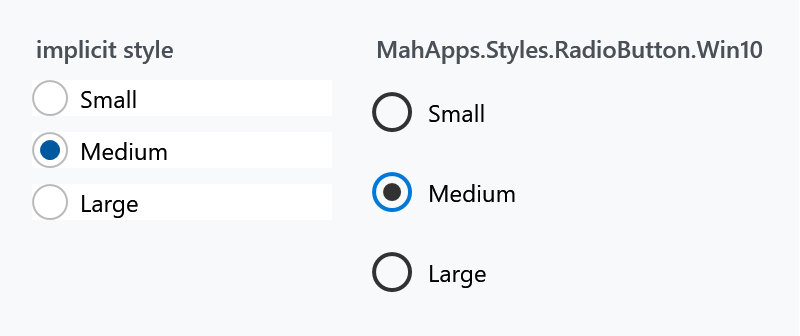
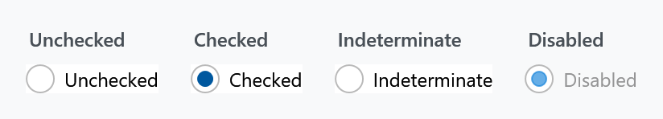
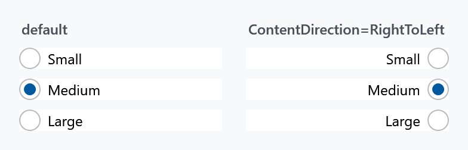
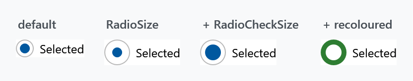

Title: RadioButton
Description: The RadioButton styles
---

Every `RadioButton` in a MahApps application is styled without any markup on your side. As with the [CheckBox](checkbox) there is one alternative style with the Windows 10 look, and the whole appearance is reachable through attached properties.



## The implicit style

`Styles/Controls.xaml` applies `MahApps.Styles.RadioButton` to every `RadioButton`. Merging that dictionary — which the [quick start](../guides/quick-start) does — is all it takes:

```xml
<ResourceDictionary Source="pack://application:,,,/MahApps.Metro;component/Styles/Controls.xaml" />
```

To extend rather than replace, base your own style on the keyed one:

```xml
<Style BasedOn="{StaticResource MahApps.Styles.RadioButton}" TargetType="{x:Type RadioButton}">
    <Setter Property="mah:RadioButtonHelper.RadioSize" Value="22" />
</Style>
```

## The three styles

| Style | |
| --- | --- |
| `MahApps.Styles.RadioButton` | the default: a thin ring with a filled dot when selected |
| `MahApps.Styles.RadioButton.Win10` | the Windows 10 look: a heavier ring, and the ring turns accent-coloured when selected |
| `MahApps.Styles.RadioButton.WinUI` (on `develop`) | the WinUI look: a hairline ring on a fill a shade off the page, filled with the accent and a dot in the middle once it is picked |

```xml
<RadioButton Style="{StaticResource MahApps.Styles.RadioButton.Win10}" Content="Medium" />
```

Both of the Windows styles differ from the default one in more than colour, as with the check box:

| | default | Win10 | WinUI |
| --- | --- | --- | --- |
| `RadioSize` | `18` | `20` | `20` |
| `RadioCheckSize` | `10` | `12` | `12` |
| `RadioStrokeThickness` | `1` | `2` | `1` |
| `MinHeight` | — | `32` | `32` |
| `MinWidth` | — | `120` | `120` |
| `Padding` | `6 0 0 0` | `8 0 0 0` | `8 6 0 0` |
| `VerticalContentAlignment` | `Center` | `Center` | `Top` |

The dot of the WinUI button is twelve at rest, fourteen under the pointer and ten while the button is held down, which is the whole of the animation WinUI plays there and the one part of it a style can say. It is set through `RadioButtonHelper.RadioCheckSize` in two triggers, so your own style can answer either state differently.

:::{.alert .alert-warning}
`MinWidth="120"` applies here too. A Win10 radio button is at least 120 pixels wide however short its label, which spreads a horizontal row of them far apart. Set `MinWidth="0"` where that is not what you want.
:::

## The states



:::{.alert .alert-info}
`RadioButton` inherits `IsThreeState` from `ToggleButton`, and the value does cycle through `null` — but the style draws the indeterminate state **exactly like unchecked**, so nobody can tell them apart. The [CheckBox](checkbox) is the one control of the three whose style gives that state a mark of its own. A radio button is a pick-one control anyway, so there is rarely a reason to reach for three states here.
:::

## Grouping

Grouping is WPF's own and needs no MahApps involvement: radio buttons in the same container are mutually exclusive, and `GroupName` groups them across containers.

```xml
<StackPanel>
    <RadioButton GroupName="Size" Content="Small" />
    <RadioButton GroupName="Size" Content="Medium" IsChecked="True" />
    <RadioButton GroupName="Size" Content="Large" />
</StackPanel>
```

## Content on the other side

`ToggleButtonHelper.ContentDirection` moves the ring to the right of the label. The style's own trigger switches `HorizontalContentAlignment` to `Right` and flips the padding with it, so the spacing stays correct:



```xml
<RadioButton mah:ToggleButtonHelper.ContentDirection="RightToLeft" Content="Medium" />
```

This is not the control's own `FlowDirection`, which would mirror the text as well. See [ToggleButtonHelper](../helper/togglebuttonhelper).

## Changing the look

Everything visual comes from [RadioButtonHelper](../helper/radiobuttonhelper) — three properties for size and 36 brushes following one naming scheme:



```xml
<RadioButton mah:RadioButtonHelper.RadioSize="26"
             mah:RadioButtonHelper.RadioCheckSize="16"
             mah:RadioButtonHelper.OuterEllipseCheckedFill="#2E7D32"
             mah:RadioButtonHelper.OuterEllipseCheckedStroke="#2E7D32"
             mah:RadioButtonHelper.CheckGlyphFill="White"
             mah:RadioButtonHelper.CheckGlyphStroke="White"
             Content="Selected" />
```

`RadioSize` is the outer ring, `RadioCheckSize` the dot inside it — set the second close to the first and the dot fills the ring, as in the last panel above.

The brushes are named `{Part}{Interaction}`, where the interaction is nothing at all for the resting state, or `PointerOver`, `Pressed` or `Disabled`. Note that the ring has separate brushes for selected and unselected — `OuterEllipseFill` against `OuterEllipseCheckedFill` — while the dot has only one set, since it is not drawn at all when nothing is selected.

:::{.alert .alert-info}
Both styles set 33 of the 36 brushes themselves; the three left out are the resting `Foreground`, `Background` and `BorderBrush`, which are the control's own properties and which both styles set directly instead. So an override always replaces a value the style already put there.

Watch the naming when you style a check box and a radio button to match: this helper says `PointerOver` where `CheckBoxHelper` says `MouseOver`. Same state, different word.
:::

## Related

[CheckBox](checkbox) for the many-of-several counterpart, and [ToggleButton](togglebutton) for a button that stays pressed.
