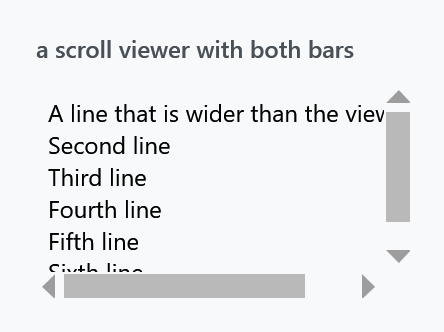
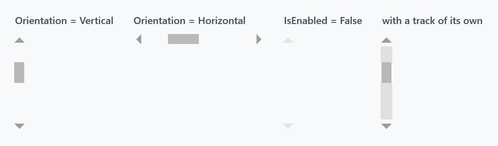
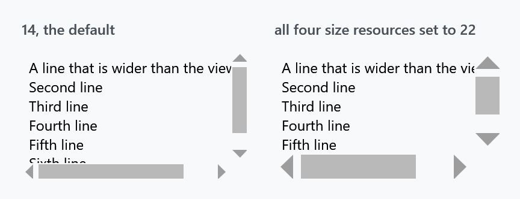
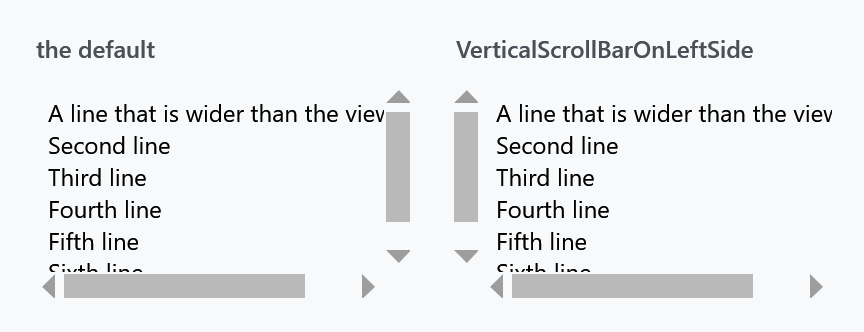
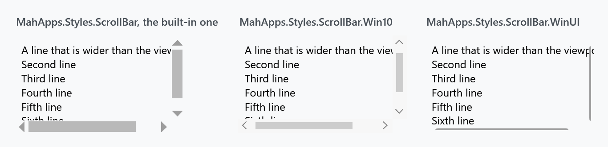
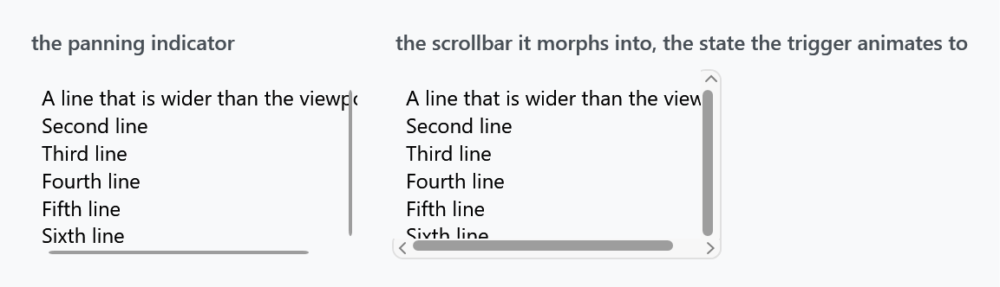
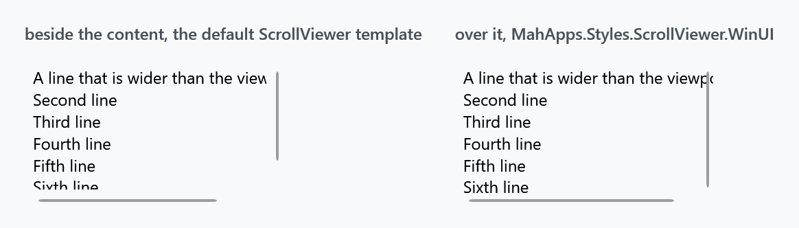
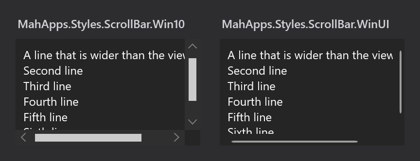
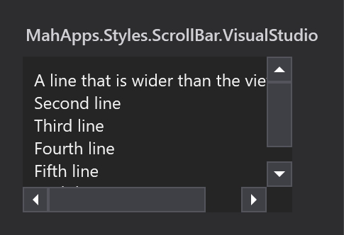

Title: ScrollBar
Description: The ScrollBar and ScrollViewer styles
---

Two styles, both applied implicitly by `Styles/Controls.xaml`: `MahApps.Styles.ScrollBar` for the bar and `MahApps.Styles.ScrollViewer` for what holds it. The [quick start](../guides/quick-start) is the whole setup.



## There is no track

The most obvious difference from WPF's scrollbar is what is missing:



A MahApps scrollbar is two arrows and a thumb over whatever is behind it. Nothing paints a groove: the template root has no `Background` binding, and the two page-repeat buttons that fill the space either side of the thumb take `Background="Transparent"` from `MahApps.Styles.RepeatButton.ScrollBarLarge`.

:::{.alert .alert-warning}
Because of that, **setting `Background` on a `ScrollBar` does nothing.** The track is those two repeat buttons, so a track of your own means restyling them — the fourth panel above is:

```xml
<ScrollBar.Resources>
    <Style x:Key="MahApps.Styles.RepeatButton.ScrollBarLarge"
           BasedOn="{StaticResource MahApps.Styles.RepeatButton.ScrollBarLarge}"
           TargetType="{x:Type RepeatButton}">
        <Setter Property="Background" Value="{DynamicResource MahApps.Brushes.Gray8}" />
    </Style>
</ScrollBar.Resources>
```

Put the same style in `App.xaml` instead and every scrollbar gets the track.
:::

The third panel is the disabled state, and it is worth knowing: `IsEnabled="False"` fades the whole bar to half opacity **and** takes the thumb to `Opacity="0"`, so a disabled scrollbar is two faint arrows and nothing between them.

## What the style sets

`MahApps.Styles.ScrollBar` has only two plain setters — `OverridesDefaultStyle` and `SnapsToDevicePixels`. Everything else hangs off two `Orientation` triggers, which pick the template and set the cross-axis size:

| | Horizontal | Vertical |
| --- | --- | --- |
| `Template` | `MahApps.Templates.ScrollBar.Horizontal` | `...Vertical` |
| size | `Height` = `MahApps.Sizes.ScrollBar.Height` | `Width` = `MahApps.Sizes.ScrollBar.Width` |

The thumb is `MahApps.Brushes.Thumb`, with two overlay rectangles in `MahApps.Brushes.ThemeForeground` sitting at zero opacity. Hover and press animate those to 0.6 and 0.8 through `MahApps.Storyboard.ScrollBarThumbMouseOver` and `MahApps.Storyboard.ScrollBarThumbPressed` — both keyed resources, so either can be replaced without touching the template.

The arrows are `MahApps.Styles.RepeatButton.ScrollBarSmall`: `MahApps.Brushes.Gray3` at rest, `Gray1` under the pointer, and the **accent colour while pressed**. Their shape is the odd part — the template binds `Path.Data` to the button's own `Content`, so the arrow is a geometry string sitting in a `Content` property:

```xml
<RepeatButton Content="M240.125,160L400.125,320 80.125,320 240.125,160z"
              Style="{DynamicResource MahApps.Styles.RepeatButton.ScrollBarSmall}" />
```

A `Viewbox` scales it, so the coordinate space of the geometry does not matter.

## Size

Four resources, all `12` by default, and a consistent change needs all four:



```xml
<ResourceDictionary xmlns:sys="clr-namespace:System;assembly=mscorlib">
    <sys:Double x:Key="MahApps.Sizes.ScrollBar.Width">22</sys:Double>
    <sys:Double x:Key="MahApps.Sizes.ScrollBar.Height">22</sys:Double>
    <sys:Double x:Key="MahApps.Sizes.ScrollBar.HorizontalRepeatButton.Width">22</sys:Double>
    <sys:Double x:Key="MahApps.Sizes.ScrollBar.VerticalRepeatButton.Height">22</sys:Double>
</ResourceDictionary>
```

The first two are the thickness of the bar itself; the other two size the arrow buttons. Override only the first pair and the bar gets wider while the arrows stay small in the middle of it.

:::{.alert .alert-info}
**The default was `14` up to and including 2.4.11 and is `12` on `develop`.** The figure above is the released version, so its default bar is the wider one. Nothing else about the four resources changed.
:::

The vertical template also overrides `SystemParameters.VerticalScrollBarButtonHeightKey` to `50` inside the track, which is what `Track` uses as the minimum thumb length — so a vertical thumb never shrinks below 50 units however long the content is. The horizontal template sets no equivalent.

## ScrollViewer

`MahApps.Styles.ScrollViewer` is a template and one trigger. The template is the usual two-by-two grid — content, vertical bar, horizontal bar — and the trigger is on [ScrollViewerHelper](../helper/scrollviewerhelper):



```xml
<ScrollViewer mah:ScrollViewerHelper.VerticalScrollBarOnLeftSide="True">
    <!-- content -->
</ScrollViewer>
```

That helper also carries the mouse wheel behaviour — horizontal scrolling, bubbling to an outer scroll viewer, and the end-of-scroll commands you would build endless scrolling on. Its page has the full list; none of it is in this style.

## Two nicer alternatives

The built-in scrollbar is spare to the point of being hard to find. There are two alternatives, both written entirely against theme brushes so they follow the light and dark base themes:



| Style | |
| --- | --- |
| `MahApps.Styles.ScrollBar.Win10` | the bar a UWP window draws: a two-unit line that opens into a square 16-unit bar with a filled track and a chevron at either end |
| `MahApps.Styles.ScrollBar.WinUI` | the same idea in Fluent shape, a thin indicator that morphs into a rounded bar on a panel |

Both are keyed, so nothing changes until you apply one, either per bar or through an implicit style:

```xml
<Style BasedOn="{StaticResource MahApps.Styles.ScrollBar.WinUI}" TargetType="{x:Type ScrollBar}" />
```

Either style set already does that for you: [Win 10 (UWP)](../stylevariants/win10) applies the Windows 10 bar, [WinUI](../stylevariants/winui) the WinUI one, and each of them applies the overlaying scroll viewer below with it.

Both are two-state bars, which is the part that matters for layout: while the pointer is elsewhere a bar paints two of its sixteen units and nothing else, so it is meant to lie *over* the content rather than beside it.

:::{.alert .alert-info}
**Both keys are on `develop` and in no release yet.** 2.4.11 has neither, and for that version this site ships the same two looks as drop-in dictionaries, written before they moved into the library and keyed the same way, so nothing has to be renamed afterwards. The Windows 10 file is the older, always-visible desktop bar, which is what the figure above shows as well; the style in the library opens and closes the way this page describes. [`Controls.ScrollBar.Win10.xaml`](../../assets/xaml/Controls.ScrollBar.Win10.xaml) and [`Controls.ScrollBar.WinUI.xaml`](../../assets/xaml/Controls.ScrollBar.WinUI.xaml). Merge one after `Controls.xaml` and apply it the same way:

```xml
<ResourceDictionary Source="pack://application:,,,/MahApps.Metro;component/Styles/Controls.xaml" />
<ResourceDictionary Source="Styles/Controls.ScrollBar.WinUI.xaml" />
```
:::

### Two visualisations, twice

Microsoft's [scroll viewer guidance](https://learn.microsoft.com/windows/apps/develop/ui/controls/scroll-controls) treats the Fluent scrollbar as two separate visualisations rather than one state with a hover effect: a panning indicator, and the traditional scrollbar thumb. Which one you see depends on how the region is being scrolled.

The indicator is a two-unit line at the edge of the content, and that is all there is while the pointer is elsewhere. When the pointer moves over it, it **morphs into the scrollbar proper**: a six-unit thumb on a rounded panel, with a chevron button at each end.



**The outer edge is the anchor.** The indicator sits flush against the edge of the content, and everything that appears on hover grows *inwards* — leftwards for a vertical bar, upwards for a horizontal one. `IsMouseOver` runs all of it over 0.12 seconds:

| | at rest | expanded |
| --- | --- | --- |
| panel | 6 units wide, invisible | 16 units, opaque |
| thumb | 2 units, flush at the edge | 6 units, 5 in from it — centred in the panel |
| chevrons | not there | fading in at both ends |

The thumb slides inwards through a `ThicknessAnimation` on its `Margin` while a `DoubleAnimation` widens it, so the two move together and the edge stays put. The exit actions reverse everything.

The chevrons take their rows the moment they appear, so the track shortens and the thumb shifts slightly. That is not a flaw to design around: the two visualisations genuinely have different track lengths in WinUI too, because the indicator runs the full height and the expanded bar does not.

The Windows 10 bar works the same way, with its own numbers and one difference in structure. Its chevrons keep their rows the whole time and are only faded, so its track never changes length and its line never jumps, which is how the system XAML of the Windows SDK arranges it. Square rather than rounded, a filled track at nine tenths opacity instead of a panel, and a thumb that grows to the full sixteen units instead of to six:

| | at rest | expanded |
| --- | --- | --- |
| track | invisible | 16 units, 0.9 opacity |
| thumb | 2 units, two units in from the edge | 16 units, flush |
| chevrons | in place, invisible | in place, visible |

The timings of both are the ones the platform carries: `ScrollBarOpacityChangeDuration`, 0.083 seconds, for anything that fades, and `ScrollBarExpandDuration`, 0.167, with a key spline of `0,0,0,1`, for anything that grows. The delay before a bar opens is the one place where these styles deviate. UWP and WinUI both wait `ScrollBarExpandBeginTime`, four tenths of a second, but they start counting when the pointer enters the scrolling region, so the bar stands open by the time the pointer arrives. A WPF trigger only knows about the bar itself, and waiting four tenths once the pointer is already on it reads as a bar that will not open, so these wait a tenth. Leaving a bar snaps it back, as the platform's empty `Collapsed` state does.

For the template root to see the pointer at all, it is `Background="Transparent"` rather than unset. Without that, only the two-unit line answers hit tests and the bar never expands.

### The bar goes over the content

The same guidance is explicit about layout:

> overlaid as 16px on top of the content inside your ScrollViewer

That matters more than it sounds. WPF's `ScrollViewer` template puts each bar in its own grid cell, so sixteen units are reserved whether or not anything is drawn in them — around a two-unit line, most of that column is empty:



There is therefore a scroll viewer whose template lays both bars over the content instead of beside it. One template, `MahApps.Templates.ScrollViewer.Overlay`, carried by a style per look, since a bar that paints two of its sixteen units asks the same of its viewer whichever of the two it is:

```xml
<Style BasedOn="{StaticResource MahApps.Styles.ScrollViewer.WinUI}" TargetType="{x:Type ScrollViewer}" />
```

`MahApps.Styles.ScrollViewer.Win10` is the other one, and the two style sets apply theirs along with the bar.

Take the guidance's other half with it: leave sixteen units of padding at the edge of anything interactive, or the expanded bar will cover it.

`ScrollViewerHelper.VerticalScrollBarOnLeftSide` still works — it flips the bar's `HorizontalAlignment` rather than swapping grid columns.

### Both follow the theme



Every brush in the two is a `MahApps.Brushes.Gray*` or `ThemeBackground`, so there is nothing to change when the base theme flips. The figure above is the same markup with `Dark.Blue` merged instead of `Light.Blue`.

Sizes are resources too — `MahApps.Sizes.ScrollBar.WinUI` for the bar, `.Indicator` and `.Thumb` for the two thumb widths, `.Thumb.MinLength` for how short the thumb may get, and `MahApps.Sizes.ScrollBar.Win10` for the other one — so a thicker bar is one `sys:Double` rather than an edited template.

:::{.alert .alert-info}
One part of the Fluent behaviour is missing, and it needs code rather than a template. In WinUI the indicator is *conscious of the input method*: it appears while the region is scrolled by touch or wheel and fades out again afterwards. These styles show the indicator whenever the content is scrollable, which is what a plain WPF `ScrollBar` can express on its own.
:::

## Visual Studio



`MahApps.Styles.ScrollBar.VisualStudio` is 18 units thick instead of 12, and unlike the default it does draw a track and puts its arrows in boxes.

:::{.alert .alert-warning}
It is **not** merged by `Controls.xaml`. Add `Styles/VS/ScrollBar.xaml` — or `Styles/VS/Controls.xaml`, which pulls it in — along with `Styles/VS/Colors.xaml`, and note that it is drawn for the dark Visual Studio shell.
:::

Being keyed, it is not applied to anything by itself. Give it an implicit style so the scroll viewers inside pick it up:

```xml
<Style BasedOn="{StaticResource MahApps.Styles.ScrollBar.VisualStudio}" TargetType="{x:Type ScrollBar}" />
```

## Other scroll viewer styles

Three more exist for particular places, and none of them is meant to be applied by hand:

| Style | |
| --- | --- |
| `MahApps.Styles.ScrollViewer.GridView` | the one a [ListView](listview) uses so its column headers stay put while the rows scroll |
| `MahApps.Styles.ScrollViewer.Hamburger` | inside the [HamburgerMenu](../controls/HamburgerMenu) pane |
| `{ComponentResourceKey MenuScrollViewer}` | a menu that is taller than the screen — see [Menus](menus) |
