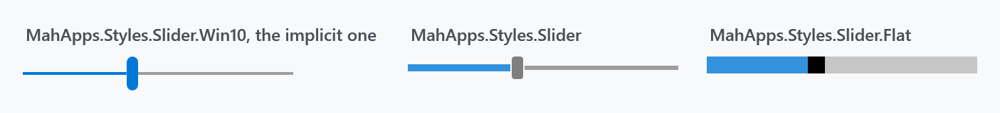
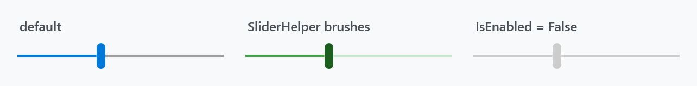
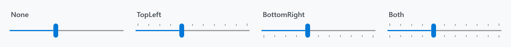
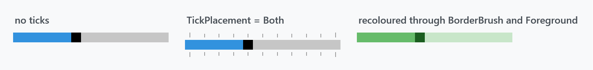
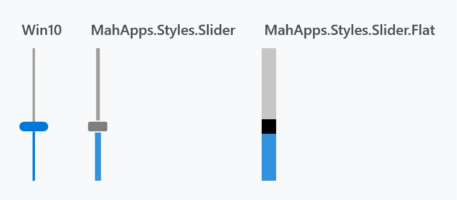
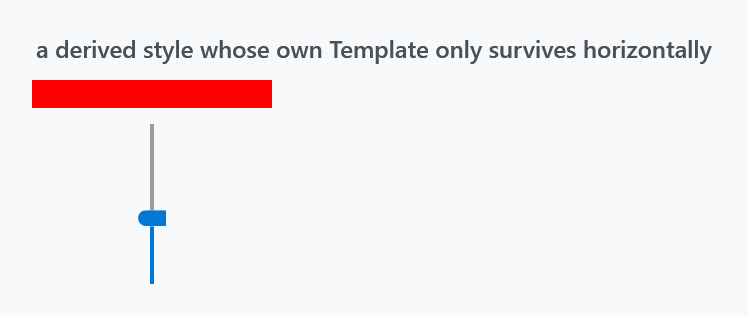

Title: Slider
Description: The Slider styles
---

Three styles, all in `Controls.xaml` and all ready to use without loading anything extra.



| Style | |
| --- | --- |
| `MahApps.Styles.Slider.Win10` | **the implicit one** — a 2px track and a tall rounded thumb |
| `MahApps.Styles.Slider` | a thicker track and a small grey thumb |
| `MahApps.Styles.Slider.Flat` | a solid block with a rectangular thumb cut into it |

:::{.alert .alert-warning}
Note which one is implicit. `Styles/Controls.xaml` applies **`MahApps.Styles.Slider.Win10`** to every `Slider` — `MahApps.Styles.Slider`, despite the plainer name, is the one you have to ask for. Basing a style of your own on `MahApps.Styles.Slider` therefore changes the look as well as whatever you meant to change.
:::

```xml
<Slider Width="190" Value="40" />
```

```xml
<Slider Width="190" Value="40" Style="{DynamicResource MahApps.Styles.Slider}" />
```

Both `Controls.Slider.xaml` and `Controls.FlatSlider.xaml` are merged by `Controls.xaml`, so the [quick start](../guides/quick-start) is all the setup any of the three needs.

Besides the look, the Win10 style sets `IsMoveToPointEnabled="True"`, which the other two leave at WPF's `False`: clicking the track jumps the thumb to where you clicked instead of paging by `LargeChange`.

All three set `Minimum="0"`, `Maximum="100"` and `Value="0"`, so a slider without a range still shows something sensible.

## Colours

The Win10 and default styles get their colours from [SliderHelper](../helper/sliderhelper) — twelve attached brushes covering the thumb, the track and the filled part of the track, each in a resting, hover, pressed and disabled variant.



```xml
<Slider Width="190" Value="40"
        mah:SliderHelper.ThumbFillBrush="#FF1B5E20"
        mah:SliderHelper.TrackValueFillBrush="#FF43A047"
        mah:SliderHelper.TrackFillBrush="#FFC8E6C9" />
```

The styles fill in all twelve, so a slider recoloured with only the three above reverts to the theme colour under the pointer. Set the `Hover` and `Pressed` variants too if it should stay green while it is being dragged.

`Foreground` is not the track colour on these two — it is what the tick marks are drawn in.

## Ticks

`TickPlacement` is off by default and needs `TickFrequency` to be worth switching on:



```xml
<Slider Width="190" Value="40" TickFrequency="10" TickPlacement="Both" />
```

The tick bars are part of the template, above and below the track, so turning them on makes the control taller rather than crowding the groove.

## The flat style



```xml
<Slider Width="190" Value="40" Style="{DynamicResource MahApps.Styles.Slider.Flat}" />
```

This one is built differently and the difference shows when you try to change it. It sets `OverridesDefaultStyle="True"` and **ignores `SliderHelper` completely** — its three parts come from three ordinary properties of the slider:

| | |
| --- | --- |
| `Foreground` | the filled part of the bar |
| `Background` | the rest of it |
| `BorderBrush` | the thumb |

```xml
<Slider Width="190" Value="40"
        Style="{DynamicResource MahApps.Styles.Slider.Flat}"
        Foreground="#FF66BB6A"
        Background="#FFC8E6C9"
        BorderBrush="#FF1B5E20" />
```

:::{.alert .alert-warning}
`BorderBrush` for the thumb is easy to miss, and the same trap as above applies here in a sharper form: the style's own `IsMouseOver` trigger reassigns `Background` and `Foreground` from the theme, so a hand-coloured flat slider goes back to grey and accent the moment the pointer is over it. To keep a colour, base a style on this one and override the trigger rather than setting the properties on the control.
:::

The bar is 12 units thick by default, from `MahApps.Sizes.Slider.Flat.Horizontal.MinHeight`, and the thumb is a square of that size. Its tick bars are its own — 6 units, in the disabled-thumb grey rather than in `Foreground`.

## Vertical



```xml
<Slider Height="110" Orientation="Vertical" Value="40" />
```

Each style carries a second template and a trigger that swaps to it on `Orientation="Vertical"`, so the thumb turns with the slider and the fill runs from the bottom.

:::{.alert .alert-warning}
That trigger is why a derived style cannot replace the template with a single setter. A `Setter` for `Template` is beaten by the inherited trigger's setter, so a custom template applies horizontally and is silently discarded the moment the slider is vertical:



```xml
<Style BasedOn="{StaticResource MahApps.Styles.Slider.Win10}" TargetType="{x:Type Slider}">
    <Setter Property="Template" Value="{StaticResource MyTemplate}" />
    <Style.Triggers>
        <Trigger Property="Orientation" Value="Vertical">
            <Setter Property="Template" Value="{StaticResource MyVerticalTemplate}" />
        </Trigger>
    </Style.Triggers>
</Style>
```

Repeat the trigger, as above, or drop the `BasedOn` and start from `{x:Type Slider}`.
:::

## Related

[RangeSlider](../controls/rangeslider) is the two-thumb version and uses the same `SliderHelper` brushes. The colour picker's channel sliders are `MahApps.Styles.Slider.ColorComponent` and its variants, which are not meant to be used on their own — see [ColorPicker](../controls/ColorPicker).
