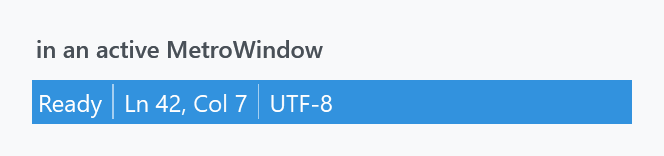
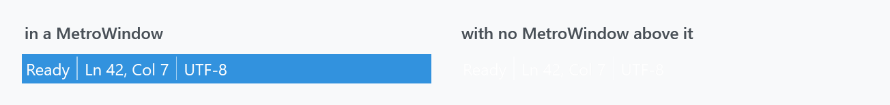
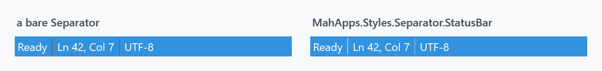

Title: StatusBar
Description: The StatusBar and StatusBarItem styles
---

Two implicit styles, applied by `Styles/Controls.xaml`. A MahApps status bar is not a grey strip at the bottom of the window — it is a second title bar, in the accent colour, and it dims with the window.



```xml
<mah:MetroWindow>
    <DockPanel>
        <StatusBar DockPanel.Dock="Bottom">
            <StatusBarItem Content="Ready" />
            <Separator Style="{StaticResource MahApps.Styles.Separator.StatusBar}" />
            <StatusBarItem Content="Ln 42, Col 7" />
            <Separator Style="{StaticResource MahApps.Styles.Separator.StatusBar}" />
            <StatusBarItem Content="UTF-8" />
        </StatusBar>
        <!-- content -->
    </DockPanel>
</mah:MetroWindow>
```

| Style | |
| --- | --- |
| `MahApps.Styles.StatusBar` | the implicit one |
| `MahApps.Styles.StatusBarItem` | the implicit item style |
| `MahApps.Styles.Separator.StatusBar` | the separator between items — **keyed, see below** |
| `MahApps.Styles.StatusBar.Clean` | the Clean variant, dark text instead of light |

## It borrows the window title colour

The style has no `Background` setter. Two `MultiDataTrigger`s supply one by reaching up to the `MetroWindow`:

| Window | Background |
| --- | --- |
| active | the window's `WindowTitleBrush` |
| not active | its `NonActiveWindowTitleBrush` |

So the bar matches the title bar, accent and all, and greys out with it when the window loses focus. That is also why `Foreground` is `MahApps.Brushes.IdealForeground` — the colour picked to read against the accent — and why the separator and the item border use it too.

:::{.alert .alert-warning}
**Outside a `MetroWindow` the bar disappears.** The two triggers bind through `FindAncestor` to a `MetroWindow`; with none above it they supply nothing, the background stays unset, and light text is left on the page:



Both panels are the same markup. If you need a status bar in a plain `Window`, in a dialog, or anywhere else outside the window chrome, set `Background` and `Foreground` yourself:

```xml
<StatusBar Background="{DynamicResource MahApps.Brushes.Accent}"
           Foreground="{DynamicResource MahApps.Brushes.IdealForeground}" />
```
:::

## The separator is not applied for you



A `<Separator/>` inside a `StatusBar` takes its style from `StatusBar.SeparatorStyleKey`, and **MahApps does not define that key**. The bar therefore gets the separator the system theme supplies, which is inset from the top and bottom of the strip and drawn for a grey one rather than for an accent-coloured one. The MahApps separator is `IdealForeground` at 0.75 opacity over the whole height of the bar, which is what belongs there.

`MahApps.Styles.Separator.StatusBar` exists; it just has to be asked for, on every separator:

```xml
<Separator Style="{StaticResource MahApps.Styles.Separator.StatusBar}" />
```

:::{.alert .alert-warning}
**An implicit style will not do it for all of them.** While it prepares the containers, a `StatusBar` hands every separator a resource reference to `SeparatorStyleKey`, and that beats an implicit `TargetType="{x:Type Separator}"` style, so one put in the bar's resources without a key changes nothing. Under the key it does, and then the one line really is all of them:

```xml
<StatusBar.Resources>
    <Style x:Key="{x:Static StatusBar.SeparatorStyleKey}"
           BasedOn="{StaticResource MahApps.Styles.Separator.StatusBar}"
           TargetType="{x:Type Separator}" />
</StatusBar.Resources>
```

The same style under the same key in `App.xaml` covers every status bar in the application. Naming the style on the separator itself keeps working either way, since a style set there is a local value and the bar leaves that alone.
:::

## Fonts

Like [menus](menus), the status bar takes its font family, style and weight from the Windows shell settings rather than from `Fonts.xaml`:

```xml
<Setter Property="FontFamily" Value="{DynamicResource {x:Static SystemFonts.StatusFontFamilyKey}}" />
```

Only the size is the library's, `MahApps.Font.Size.StatusBar`, which is 12. MahApps redefines the system *colour* keys in its themes but not the system *font* keys, so this really is the user's status-bar font.

## Items

`MahApps.Styles.StatusBarItem` is short: `Padding` of 3, content left-aligned and vertically centred, a `BorderBrush` of `IdealForeground` with no thickness, and a disabled foreground of `Gray2`.

A `StatusBarItem` is a `ContentControl`, so anything goes in it — a [ProgressBar](progressbar) for a background job is the usual second inhabitant of a status bar:

```xml
<StatusBarItem>
    <ProgressBar Width="120" Height="10" IsIndeterminate="True" />
</StatusBarItem>
```

## Something at the right end

A status bar arranges its items in a `DockPanel`, so `DockPanel.Dock="Right"` is what moves one to the other side. That alone does not do it: the panel a status bar brings has `LastChildFill` on, the last item therefore takes everything that is left over, and its content stays where it started. Hand the bar a panel of its own and the docking works:

```xml
<StatusBar>
    <StatusBar.ItemsPanel>
        <ItemsPanelTemplate>
            <DockPanel LastChildFill="False" />
        </ItemsPanelTemplate>
    </StatusBar.ItemsPanel>
    <StatusBarItem Content="Ready" />
    <StatusBarItem DockPanel.Dock="Right" Content="Ln 42, Col 7" />
</StatusBar>
```

That is WPF's doing rather than the library's: a status bar with no style at all behaves the same way.

## The Clean variant

`Styles/Clean/StatusBar.xaml` holds `MahApps.Styles.StatusBar.Clean` and `MahApps.Styles.Separator.Clean`. Each is the ordinary style with one setter changed — the foreground and the separator colour move from `IdealForeground` to `MahApps.Brushes.ThemeForeground`, so the text is dark rather than light.

:::{.alert .alert-warning}
The dictionary is not merged by `Controls.xaml`; add `Styles/Clean/StatusBar.xaml` first. And note that the variant does **not** change the background — the window-title triggers are inherited along with everything else, so on a dark accent you would be putting dark text on it. It is meant for the Clean style set, where the title brush is light.
:::

```xml
<StatusBar Style="{DynamicResource MahApps.Styles.StatusBar.Clean}" />
```
