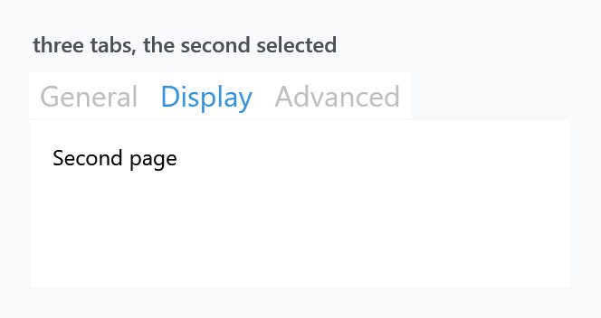
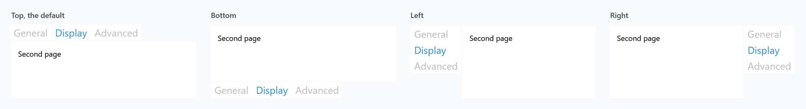
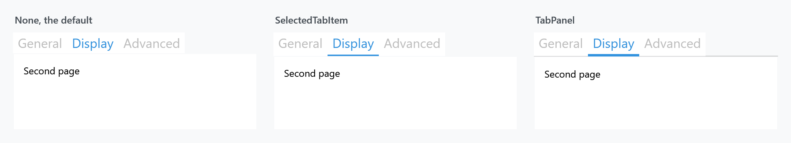

Title: TabControl
Description: The TabControl and TabItem styles
---

Two implicit styles cover a plain WPF `TabControl` — the control and its items — plus two keyed variants that animate the page change. `Styles/Controls.xaml` applies the implicit pair.



```xml
<TabControl SelectedIndex="1">
    <TabItem Header="General"><TextBlock Margin="10" Text="First page" /></TabItem>
    <TabItem Header="Display"><TextBlock Margin="10" Text="Second page" /></TabItem>
    <TabItem Header="Advanced"><TextBlock Margin="10" Text="Third page" /></TabItem>
</TabControl>
```

| Style | |
| --- | --- |
| `MahApps.Styles.TabControl` | the implicit one |
| `MahApps.Styles.TabItem` | the implicit item style |
| `MahApps.Styles.TabControl.Animated` | the page fades in when the tab changes |
| `MahApps.Styles.TabControl.AnimatedSingleRow` | the same, with a strip that scrolls instead of wrapping |

:::{.alert .alert-info}
Tab headers are **large** — the font size comes from `HeaderedControlHelper.HeaderFontSize`, which the theme puts well above body text. That is the Metro look, and it is the first thing people want to change:

```xml
<TabItem Header="General" mah:HeaderedControlHelper.HeaderFontSize="16" />
```

Every figure on this page sets it to 16, or three tabs would not fit in the width shown.
:::

## The two animated variants

```xml
<TabControl Style="{StaticResource MahApps.Styles.TabControl.Animated}" />
```

`Animated` wraps the content in a `MetroContentControl`, so switching tabs fades and slides the new page in instead of swapping it instantly.

`AnimatedSingleRow` does the same and additionally keeps the header strip on one line. Where the default `TabPanel` wraps overflowing tabs onto a second row, this one puts them in a scroll viewer with a left and a right button:

```xml
<TabControl Style="{StaticResource MahApps.Styles.TabControl.AnimatedSingleRow}" />
```

Both are keyed, so they have to be asked for. They are ordinary `TabControl` styles — for the MahApps controls that do the same thing, see [MetroTabControl](../controls/MetroTabControl).

## Where the strip sits



`TabStripPlacement` is WPF's, and the item template has a trigger for each of the four values, so the selected tab and its underline turn to face the content whichever side the strip is on.

## The underline



The marker under the selected tab is off by default. It comes from [TabControlHelper](../helper/tabcontrolhelper), which has four values for `Underlined` and a brush for each state:

```xml
<TabControl mah:TabControlHelper.Underlined="SelectedTabItem"
            mah:TabControlHelper.UnderlineSelectedBrush="{DynamicResource MahApps.Brushes.Accent}" />
```

`TabPanel` — the third panel — draws a hairline under the whole strip as well as the coloured marker, which is the more familiar look. The `mah:Underline` element that draws it is part of both templates, the control's and the item's, which is why one attached property on the `TabControl` reaches everything.

That helper also carries the `Transition` for the page change and the properties for closable tabs; its page has the full list.

## What the styles set

`MahApps.Styles.TabControl` is short: a `ThemeBackground`, a **`{x:Null}` `BorderBrush`** — so there is no frame around the content, unlike WPF's default — and the template.

`MahApps.Styles.TabItem` is the interesting one. Its `Background` is bound to the parent `TabControl`'s, so a recoloured control carries its tabs with it:

```xml
<Setter Property="Background"
        Value="{Binding RelativeSource={RelativeSource FindAncestor, AncestorType={x:Type TabControl}}, Path=Background, Mode=OneWay, FallbackValue=Transparent}" />
```

`BorderThickness` is `0` while `BorderBrush` is the accent — the border is what the selected-tab marker uses, so switching the thickness on gives you an accent frame rather than a hairline.

The header sits in a `mah:ContentControlEx`, so `ControlsHelper.ContentCharacterCasing` works on a tab header, and `HeaderedControlHelper` supplies the font.

## Related

[MetroTabControl](../controls/MetroTabControl) is the MahApps control with closable tabs and a choice about whether tab contents stay in memory; [MetroTabItem](../controls/MetroTabItem) is its item.
