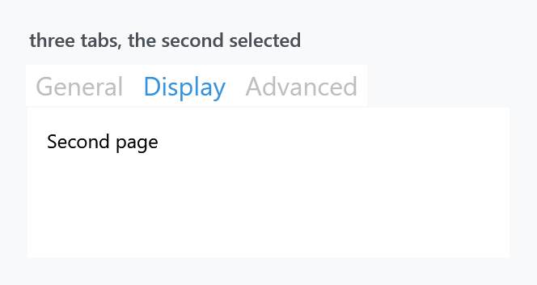
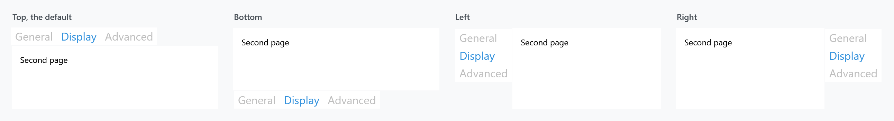
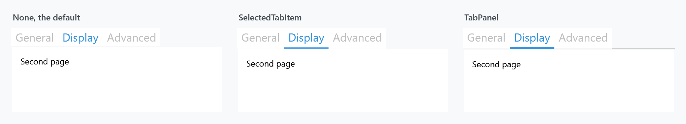

Title: TabControl
Description: The TabControl and TabItem styles
---

Two implicit styles cover a plain WPF `TabControl` — the control and its items — plus two keyed variants that animate the page change. `Styles/Controls.xaml` applies the implicit pair.



```xml
<TabControl SelectedIndex="1">
    <TabItem Header="General"><TextBlock Margin="10" Text="First page" /></TabItem>
    <TabItem Header="Display"><TextBlock Margin="10" Text="Second page" /></TabItem>
    <TabItem Header="Advanced"><TextBlock Margin="10" Text="Third page" /></TabItem>
</TabControl>
```

| Style | |
| --- | --- |
| `MahApps.Styles.TabControl` | the implicit one |
| `MahApps.Styles.TabItem` | the implicit item style |
| `MahApps.Styles.TabControl.Animated` | the page fades in when the tab changes |
| `MahApps.Styles.TabControl.AnimatedSingleRow` | the same, with a strip that scrolls instead of wrapping |
| `MahApps.Styles.TabControl.Win10`, `MahApps.Styles.TabItem.Win10` | the two above under the name of that set (on `develop`) |
| `MahApps.Styles.TabControl.WinUI`, `MahApps.Styles.TabItem.WinUI` | the TabView of Windows 11 (on `develop`) |
| `MahApps.Styles.TabControl.WinUI.SelectorBar` and its item | the other WinUI reading of a strip (on `develop`) |

:::{.alert .alert-info}
Tab headers are **large** — the font size comes from `HeaderedControlHelper.HeaderFontSize`, which the theme puts well above body text. That is the Metro look, and it is the first thing people want to change:

```xml
<TabItem Header="General" mah:HeaderedControlHelper.HeaderFontSize="16" />
```

Every figure on this page sets it to 16, or three tabs would not fit in the width shown.
:::

## The two animated variants

```xml
<TabControl Style="{StaticResource MahApps.Styles.TabControl.Animated}" />
```

`Animated` wraps the content in a `MetroContentControl`, so switching tabs fades and slides the new page in instead of swapping it instantly.

`AnimatedSingleRow` does the same and additionally keeps the header strip on one line. Where the default `TabPanel` wraps overflowing tabs onto a second row, this one puts them in a scroll viewer with a left and a right button:

```xml
<TabControl Style="{StaticResource MahApps.Styles.TabControl.AnimatedSingleRow}" />
```

Both are keyed, so they have to be asked for. They are ordinary `TabControl` styles — for the MahApps controls that do the same thing, see [MetroTabControl](../controls/metrotabcontrol).

## The two WinUI looks

:::{.alert .alert-info}
**Both are on `develop` and ship with the next release.**
:::

Windows 11 draws a row of tabs with the TabView, so that is what `MahApps.Styles.TabControl.WinUI` reads. The tab that is showing is a card with its upper corners rounded, filled with the same colour as the page under it, and the line along the strip is the edge of that page, which the card reaches a unit over so that the line stops where it begins. The others carry no fill until the pointer reaches them, with a hairline between two of them, and every tab is at least as wide as the TabView makes one.

```xml
<TabControl Style="{StaticResource MahApps.Styles.TabControl.WinUI}" />
```

A card leaves no room for an underline, which is why there is a second reading beside it, taken from the SelectorBar: no frame at all, just a short bar of the accent under the header, growing out of the middle as a tab takes over. That one does read the underline, every kind of it and every side.

```xml
<TabControl Style="{StaticResource MahApps.Styles.TabControl.WinUI.SelectorBar}"
            mah:TabControlHelper.Underlined="SelectedTabItem" />
```

Both come in the animated and the single row variant as well, under the key of the variant with `.WinUI` or `.WinUI.SelectorBar` after it, and the four MahApps tab controls have them too, under their own names. The item style comes with the control style, so a plain `<TabItem>` inside one of them needs nothing said to it.

Windows 10 drew no tab strip of its own, so `MahApps.Styles.TabControl.Win10` and `MahApps.Styles.TabItem.Win10` are the look this page is about, under the name of that set.

## How wide a tab is

A tab control has always been as wide as what is written on its tabs. The TabView shares the room out between them instead, which is what turns a handful of short headers into a row of tabs rather than a line of words, and `TabControlHelper.TabWidthMode` is the switch:

```xml
<TabControl mah:TabControlHelper.TabWidthMode="Equal" />
```

What one tab gets is the room divided by the number of them, held between its own `MinWidth` and `MaxWidth`; where that no longer fits, the strip runs past the edge, which is where the single row variant starts scrolling. The WinUI card asks for `Equal` and holds a tab between a hundred and two hundred and forty units, the numbers the TabView uses. A strip down either side and a strip that wraps onto a second row are left alone.

## Where the strip sits



`TabStripPlacement` is WPF's, and the item template has a trigger for each of the four values, so the selected tab and its underline turn to face the content whichever side the strip is on.

## The underline



The marker under the selected tab is off by default. It comes from [TabControlHelper](../helper/tabcontrolhelper), which has four values for `Underlined` and a brush for each state:

```xml
<TabControl mah:TabControlHelper.Underlined="SelectedTabItem"
            mah:TabControlHelper.UnderlineSelectedBrush="{DynamicResource MahApps.Brushes.Accent}" />
```

`TabPanel` — the third panel — draws a hairline under the whole strip as well as the coloured marker, which is the more familiar look. The `mah:Underline` element that draws it is part of both templates, the control's and the item's, which is why one attached property on the `TabControl` reaches everything.

That helper also carries the `Transition` for the page change, the width of a tab and the properties for closable tabs; its page has the full list.

The card says nothing about any of the four values, since there is no room on it for a marker. Its line between the strip and the page is there either way, and `UnderlinePlacement` is the one thing it does read, to move that line to another side.

## What the styles set

`MahApps.Styles.TabControl` is short: a `ThemeBackground`, a **`{x:Null}` `BorderBrush`** — so there is no frame around the content, unlike WPF's default — and the template.

`MahApps.Styles.TabItem` is the interesting one. Its `Background` is bound to the parent `TabControl`'s, so a recoloured control carries its tabs with it:

```xml
<Setter Property="Background"
        Value="{Binding RelativeSource={RelativeSource FindAncestor, AncestorType={x:Type TabControl}}, Path=Background, Mode=OneWay, FallbackValue=Transparent}" />
```

`BorderThickness` is `0` while `BorderBrush` is the accent — the border is what the selected-tab marker uses, so switching the thickness on gives you an accent frame rather than a hairline.

The header sits in a `mah:ContentControlEx`, so `ControlsHelper.ContentCharacterCasing` works on a tab header, and `HeaderedControlHelper` supplies the font. It shares its cell with the button that closes the tab, which is why the margin of the header sits on `PART_ContentSite` rather than on the header itself.

## Related

[MetroTabControl](../controls/metrotabcontrol) is the MahApps control with closable tabs and a choice about whether tab contents stay in memory; [MetroTabItem](../controls/metrotabitem) is its item.
