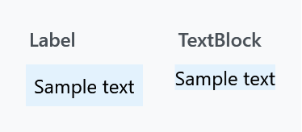
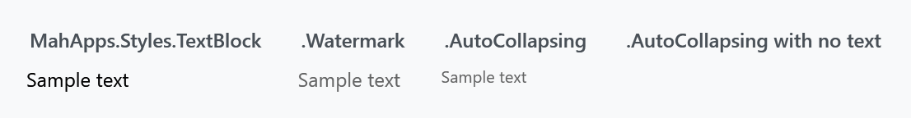
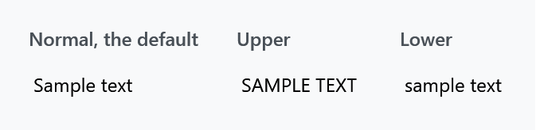
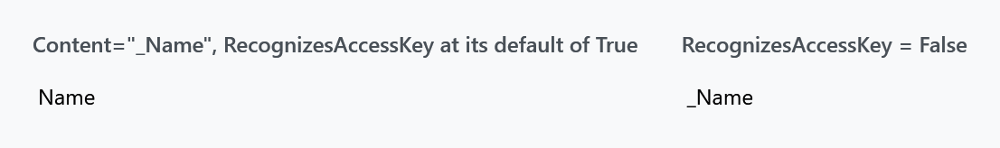
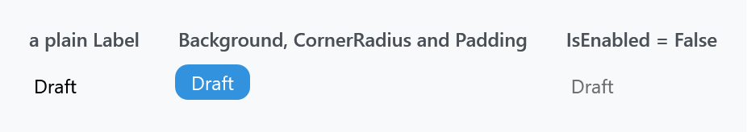
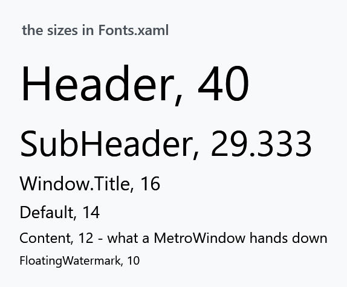

Title: Text
Description: The TextBlock and Label styles
---

Two ways to put a line of text on screen, and MahApps treats them very differently: `Label` gets a full style and a template, `TextBlock` deliberately gets almost nothing.



The colour and the size match, because both come from the window rather than from either style. The `Label` is a `ContentControl` and brings WPF's five units of padding with it; the `TextBlock` sits flush.

## TextBlock

:::{.alert .alert-warning}
**`MahApps.Styles.TextBlock` is empty.** It has no setters at all:

```xml
<!--  never ever make a default style for TextBlock in App.xaml !!!  -->
<Style x:Key="MahApps.Styles.TextBlock" TargetType="{x:Type TextBlock}" />
```

That comment, capitals and all, is in `Styles/Controls.TextBlock.xaml`, and it is the reason there is no implicit `TextBlock` style. A `TextBlock` is not just your text — it is inside almost every control template in WPF, in combo box items, data grid cells, headers, menu items, tooltips. An implicit style reaches all of them and there is no way to scope it back out. MahApps will not do that to you, and neither should you.
:::

So why does plain text look right without a style? Because the `MetroWindow` style sets two inherited values and every `TextBlock` under it picks them up:

| | |
| --- | --- |
| `Foreground` | `MahApps.Brushes.ThemeForeground` |
| `TextElement.FontSize` | `MahApps.Font.Size.Content`, which is 12 |

A plain `Window` sets neither, which is worth knowing if a dialog of yours comes out in the wrong size or colour.

To style your own text blocks, give them an `x:Key`ed style and apply it where you mean to. `MahApps.Styles.TextBlock` exists to be the `BasedOn` for those:

```xml
<Style x:Key="MyCaption" BasedOn="{StaticResource MahApps.Styles.TextBlock}" TargetType="{x:Type TextBlock}">
    <Setter Property="FontSize" Value="{DynamicResource MahApps.Font.Size.Default}" />
    <Setter Property="Opacity" Value="0.7" />
</Style>
```

### The two variants



| Style | |
| --- | --- |
| `MahApps.Styles.TextBlock.Watermark` | `Opacity` 0.6 and `IsHitTestVisible="False"`, so it sits behind whatever it labels without swallowing clicks |
| `MahApps.Styles.TextBlock.AutoCollapsing` | `Opacity` 0.6, `FontSize` from `MahApps.Font.Size.FloatingWatermark`, and collapses itself when `Text` is empty |

```xml
<TextBlock Text="{Binding Hint}" Style="{DynamicResource MahApps.Styles.TextBlock.AutoCollapsing}" />
```

The fourth panel above is an `AutoCollapsing` block with `Text=""` — nothing at all, not blank space, because the trigger sets `Visibility="Collapsed"`. That is what makes it useful for optional captions: the layout closes up instead of leaving a gap.

Both are what the [TextBox](textbox) watermark and floating watermark are drawn with.

## Label

`MahApps.Styles.Label` **is** applied implicitly by `Styles/Controls.xaml`, so every `Label` gets it. Beyond `Foreground` and `SnapsToDevicePixels` the style is one template, and what that template adds over WPF's own is four things.

### Character casing



```xml
<Label Content="Sample text" mah:ControlsHelper.ContentCharacterCasing="Upper" />
```

Unlike the [GroupBox](groupbox) and [Expander](expander) headers, a `Label` is left at `Normal`, so this one only does something when you ask for it.

### Access keys



`ControlsHelper.RecognizesAccessKey` defaults to `True`, which is what makes the underscore in `Content="_Name"` an access key rather than a character — WPF underlines the *N* while Alt is held, and Alt+N moves focus to whatever the `Target` points at. This is the one thing a `Label` does that a `TextBlock` cannot, and the reason to use one for form captions:

```xml
<Label Content="_Name" Target="{Binding ElementName=nameBox}" />
<TextBox x:Name="nameBox" />
```

Set it to `False` when the text is data rather than a caption and an underscore should stay an underscore.

### Corners and the disabled colour

`ControlsHelper.CornerRadius` rounds the border the template draws, which — with a `Background` and a little `Padding` — turns a `Label` into a serviceable chip or badge without a control of its own:



```xml
<Label Content="Draft"
       Background="{DynamicResource MahApps.Brushes.Accent}"
       Foreground="{DynamicResource MahApps.Brushes.IdealForeground}"
       Padding="10 3"
       mah:ControlsHelper.CornerRadius="8" />
```

A disabled `Label` goes to the system grey-text colour. Note that this is one of the few places MahApps reaches for a `SystemColors` brush rather than a theme one, so it does not follow the accent or the light/dark base.

See [ControlsHelper](../helper/controlshelper) for the three attached properties in full.

## Fonts and sizes

`Styles/Fonts.xaml` holds the font families and the size scale. The [quick start](../guides/quick-start) merges it, and it has to be merged — the keys are not reachable from your own XAML otherwise.



The general-purpose sizes are `MahApps.Font.Size.Header` (40), `.SubHeader` (29.333), `.Window.Title` (16), `.Default` (14), `.Content` (12) and `.FloatingWatermark` (10). The rest are per control — `.Button`, `.Menu`, `.StatusBar`, `.Dialog.Title` and so on — and are there so a control can be resized in one place rather than so you can use them directly.

```xml
<TextBlock Text="Settings" FontSize="{DynamicResource MahApps.Font.Size.SubHeader}" />
```

Families are `MahApps.Fonts.Family.Control` and `.Button` (Segoe UI), `.Header` and `.Window.Title` (Segoe UI Light), and `MahApps.Fonts.Family.SymbolTheme`, which is the Segoe MDL2 Assets icon font the library ships so the icons work on Windows versions that do not have it — see [FontIcon](../controls/FontIcon).

MahApps sets no font family for ordinary text, only the size, so plain text uses whatever the window inherits from the system.

## Which to use

Reach for a `Label` when the text is a caption for another control and should carry its access key, or when you want the border, background and rounded corners its template gives you. Reach for a `TextBlock` for everything else: it is lighter, it wraps and trims, and it is what the rest of WPF expects inside item templates.
