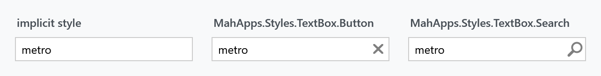
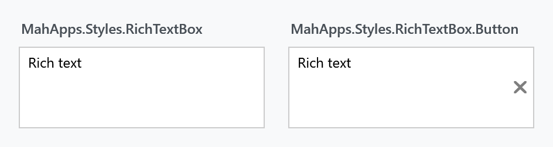

Title: TextBox
Description: The TextBox styles
---

Every `TextBox` in a MahApps application is styled without any markup on your side. On top of that the library adds a watermark, a clear button, a command button and a search variant — all through attached properties, so nothing has to be subclassed.



## The implicit style

`Styles/Controls.xaml` contains a keyless style for `TextBox` based on `MahApps.Styles.TextBox`, and another for `RichTextBox`. Merging that dictionary — which the [quick start](../guides/quick-start) does — is all it takes:

```xml
<ResourceDictionary Source="pack://application:,,,/MahApps.Metro;component/Styles/Controls.xaml" />
```

From then on a plain `<TextBox />` is the MahApps one, with a 26 pixel minimum height, 4 pixels of padding, the theme's border brushes and the MahApps context menu.

To extend it rather than replace it, base your own style on the keyed one:

```xml
<Style BasedOn="{StaticResource MahApps.Styles.TextBox}" TargetType="{x:Type TextBox}">
    <Setter Property="mah:TextBoxHelper.ClearTextButton" Value="True" />
</Style>
```

Leaving out the `BasedOn` throws the template away with it, and with the template go the watermark, the buttons and the validation adorner.

## The explicit styles

Three styles are meant to be set on a `TextBox`, each inheriting from the one above it.

| Style | |
| --- | --- |
| `MahApps.Styles.TextBox` | the base. What the implicit style applies |
| `MahApps.Styles.TextBox.Button` | adds a command button, driven by `TextBoxHelper.ButtonCommand` |
| `MahApps.Styles.TextBox.Search` | the same with a magnifier as the button's icon |

```xml
<TextBox Style="{StaticResource MahApps.Styles.TextBox.Search}"
         mah:TextBoxHelper.ButtonCommand="{Binding SearchCommand}"
         mah:TextBoxHelper.Watermark="Search" />
```

### Which flag shows the button

The base style and the `.Button` style put the same button in the same place, but gate it differently — which is the thing to know before wondering why a `ButtonCommand` never fires.

| | Button appears when | What clicking it does |
| --- | --- | --- |
| `MahApps.Styles.TextBox` | `TextBoxHelper.ClearTextButton` is `True` | clears the box |
| `MahApps.Styles.TextBox.Button` | always — the style sets `TextBoxHelper.TextButton` | runs `ButtonCommand` |

On the `.Button` style the click handler is wired unconditionally, so setting `ClearTextButton` as well makes the button run the command *and* clear the box.

Clearing calls `TextBox.Clear()` and pushes the empty value back through the `Text` binding, so a bound view model sees the change.

## The Windows 10 and WinUI styles

:::{.alert .alert-info}
**`MahApps.Styles.TextBox.Win10` and `MahApps.Styles.TextBox.WinUI` are on `develop` and ship with the next release.** Neither is in 2.4.11.
:::

Two further styles draw the box the way Windows draws one rather than the way Metro does. They share a template and differ in what they paint.

`MahApps.Styles.TextBox.Win10` is a fill darker than the page, a frame two pixels thick all the way round, and the box turning white with the accent around it once the caret is in. `MahApps.Styles.TextBox.WinUI` is nearly the opposite: a light translucent fill, a border you have to look for that is a touch stronger along its bottom edge, and with the caret a solid fill, a line of accent underneath and rounded corners.

On both of them the delete button comes and goes with the caret, the way the UWP box does, while a button carrying a `ButtonCommand` of your own stays where it is.

What each one is made of sits in the theme, `MahApps.Brushes.TextControl.*` for the Win10 style and `MahApps.Brushes.TextControl.WinUI.*` for the other, the WinUI set taken from the WinUI values themselves. Both point `ControlsHelper.DisabledBorderBrush` at what their own set has for a control with nothing left to say.

The border thicknesses and the padding are resources too, so a style of your own can answer them differently without replacing the template:

| Resource | |
| --- | --- |
| `TextControlBorderThemeThickness` | the border with no caret in the box |
| `TextControlBorderThemeThicknessFocused` | the border with the caret in it |
| `TextControlThemePadding` | the room around the text |
| `TextControlPlaceholderMargin` | where the watermark sits |

:::{.alert .alert-warning}
**Along an edge that only changes colour, keep both thicknesses the same.** A border counts towards the height of the control, so one that grows when the box takes the caret moves everything standing under it — visible at 100% scaling, hidden at 125% by the rounding of the layout. That is why the WinUI style draws its bottom edge two pixels thick either way.
:::

Each of the two is also a whole style set, applied to every control at once rather than box by box: see [Win 10 (UWP)](../stylevariants/win10) and [WinUI](../stylevariants/winui).

## Watermark


```xml
<TextBox mah:TextBoxHelper.Watermark="Search" />

<TextBox mah:TextBoxHelper.Watermark="Search"
         mah:TextBoxHelper.UseFloatingWatermark="True" />
```

A plain watermark disappears as soon as the first character is typed. A floating one moves above the content instead and stays there, which keeps the label visible while the box is being filled in.

`WatermarkAlignment` and `WatermarkTrimming` control how it sits and how it is cut off. `WatermarkWrapping` follows the box's own `TextWrapping` unless you set it — the base style binds the two together, so a wrapping text box gets a wrapping watermark for free.

`AutoWatermark` takes the text from the bound property instead:

```csharp
[Display(Prompt = "Search")]
public string Query { get; set; }
```

```xml
<TextBox Text="{Binding Query}" mah:TextBoxHelper.AutoWatermark="True" />
```

## Buttons


```xml
<TextBox mah:TextBoxHelper.ClearTextButton="True" />

<TextBox mah:TextBoxHelper.ClearTextButton="True"
         mah:TextBoxHelper.ButtonsAlignment="Left" />
```

`ButtonsAlignment` takes `Left`, `Right` or `Opposite`. `ButtonContent`, `ButtonContentTemplate`, `ButtonTemplate`, `ButtonWidth`, `ButtonFontFamily` and `ButtonFontSize` decide what the button looks like; the base style sets the width to 22 and the font size to `MahApps.Font.Size.Button.ClearText`.

## Helper properties

Everything above comes from `TextBoxHelper`, and the border and corner from `ControlsHelper`. The full tables are on the helper pages — [TextBoxHelper](../helper/textboxhelper) and [ControlsHelper](../helper/controlshelper) — but three of them are worth repeating because the style depends on them:

| Property | Set by the style to | |
| --- | --- | --- |
| `TextBoxHelper.IsMonitoring` | `True` | keeps `HasText` and `TextLength` current, and drives the watermark |
| `TextBoxHelper.IsSpellCheckContextMenuEnabled` | bound to `SpellCheck.IsEnabled` | turning spell check on gets you the spell-check context menu as well |
| `ControlsHelper.FocusBorderBrush` | `MahApps.Brushes.TextBox.Border.Focus` | the border while the box has focus |

That second one is a nicety worth knowing about: this is enough to get both.

```xml
<TextBox SpellCheck.IsEnabled="True" />
```

## RichTextBox

`RichTextBox` gets the same treatment — an implicit style, and a `.Button` variant.



| Style | |
| --- | --- |
| `MahApps.Styles.RichTextBox` | the base, matching the `TextBox` look |
| `MahApps.Styles.RichTextBox.Button` | adds a command button |

:::{.alert .alert-info}
The `RichTextBox` variant behaves differently from the `TextBox` one. Its button is **always visible** — no flag hides it — and it never clears: the clearing behaviour is switched off and the button binds straight to `ButtonCommand`. `ButtonCommandParameter` defaults to the `RichTextBox` itself, so the command receives the control without you passing anything.
:::

## Validation and busy state

`Validation.ErrorTemplate` is set to `MahApps.Templates.ValidationError`, so a failing validation rule is drawn the way it is on every other MahApps input control. How that popup behaves — whether it shows on hover, whether a click dismisses it — is [ValidationHelper](../helper/validationhelper).

`TextBoxHelper.IsWaitingForData` runs a pulsing glow around the box, which suits a value that is being fetched or checked:

```xml
<TextBox mah:TextBoxHelper.IsWaitingForData="{Binding IsLoading}" />
```
