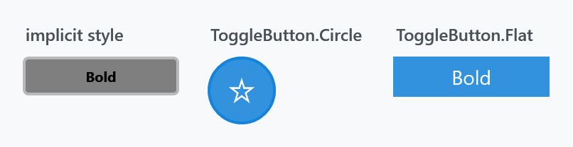
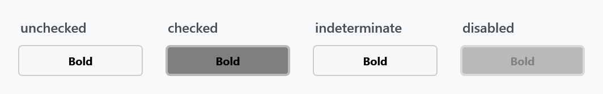
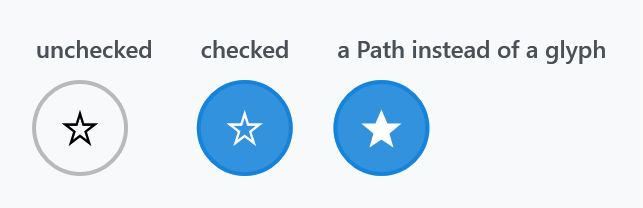

Title: ToggleButton
Description: The ToggleButton styles
---

A `ToggleButton` is a button that stays pressed. MahApps styles it to match the ordinary [buttons](buttons) and adds a circular and a flat variant.



## The implicit style

`Styles/Controls.xaml` applies `MahApps.Styles.ToggleButton` to every `ToggleButton`, so a plain one already looks like the figure:

```xml
<ToggleButton Content="Bold" />
```

Because `CheckBox` and `RadioButton` derive from `ToggleButton`, this style is *not* what they use — each has its own, and their look is controlled through [CheckBoxHelper](../helper/checkboxhelper) and [RadioButtonHelper](../helper/radiobuttonhelper).

## The styles

| Style | |
| --- | --- |
| `MahApps.Styles.ToggleButton` | the implicit one; filled while checked |
| `MahApps.Styles.ToggleButton.Circle` | round and transparent, filled with the accent colour while checked |
| `MahApps.Styles.ToggleButton.Flat` | no border, filled while checked |

```xml
<ToggleButton Width="48" Height="48"
              Style="{StaticResource MahApps.Styles.ToggleButton.Circle}" />
```

These are the general-purpose ones. The library has a dozen more `ToggleButton` styles that belong to particular controls — the `Expander` header, the `ComboBox` arrow, the `TreeViewItem` expander — which the [buttons](buttons) page lists.

## The states



:::{.alert .alert-warning}
Note the third one. `IsThreeState="True"` makes the value cycle through `null`, and that works — but the style draws the indeterminate state **exactly like unchecked**, so the user has no way to tell the two apart. Where a third state has to be visible, use a `CheckBox`: its style has a distinct dash glyph for it.
:::

## Icons

The circle style has no content of its own and is meant to carry an icon. Anything that renders works — a glyph from an icon font is the least trouble:



```xml
<ToggleButton Width="48" Height="48" Style="{StaticResource MahApps.Styles.ToggleButton.Circle}">
    <TextBlock FontFamily="Segoe MDL2 Assets" FontSize="18" Text="&#xE734;" />
</ToggleButton>
```

The icon takes the button's `Foreground`, and the template switches that to `MahApps.Brushes.IdealForeground` while the button is checked — so a glyph you draw in the accent colour disappears against the checked fill. Leave the `Foreground` alone unless you also handle the checked state.

For a `Path` rather than a glyph, the library's own icon style keeps it scaled and coloured correctly:

```xml
<ToggleButton Width="48" Height="48" Style="{StaticResource MahApps.Styles.ToggleButton.Circle}">
    <ContentControl Width="20" Height="20"
                    Content="M12,2L15,9L22,9L16,14L18,21L12,17L6,21L8,14L2,9L9,9Z"
                    Style="{DynamicResource MahApps.Styles.ContentControl.PathIcon}" />
</ToggleButton>
```

## ToggleButtonHelper does not apply here

`ToggleButtonHelper` is named after this control, but its one property — `ContentDirection`, which puts the box on the other side of the label — is read only by the `CheckBox` and `RadioButton` templates. A plain `ToggleButton` has no separate box and label to swap, and none of the three styles above look at the property. See [CheckBoxHelper](../helper/checkboxhelper) and [RadioButtonHelper](../helper/radiobuttonhelper) for the controls where it does something.

## Related

For a switch rather than a button that stays pressed, use the `ToggleSwitch` control — it has an on/off track and its own header, and reads as a setting rather than as an action.
