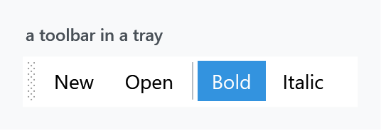
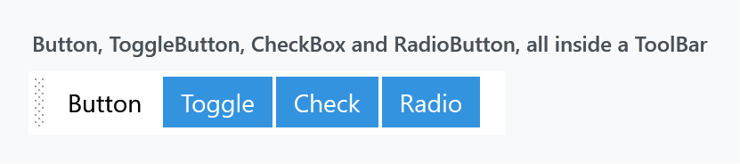
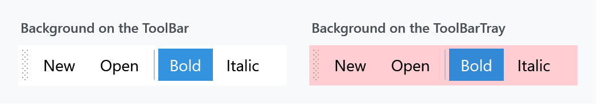
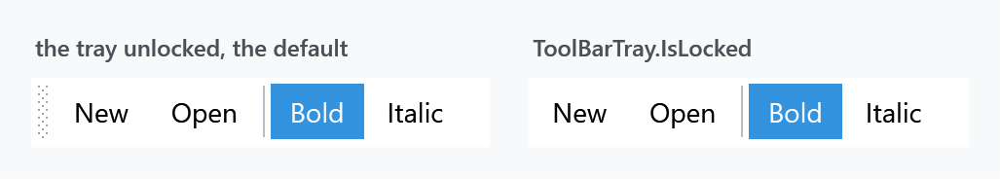

Title: ToolBar
Description: The ToolBar and ToolBarTray styles
---

Two implicit styles — the bar and the tray it sits in — plus a set of styles for the controls that go inside one, which WPF applies for you through its own style keys.



```xml
<ToolBarTray>
    <ToolBar>
        <Button Content="New" />
        <Button Content="Open" />
        <Separator />
        <ToggleButton Content="Bold" IsChecked="True" />
        <ToggleButton Content="Italic" />
    </ToolBar>
</ToolBarTray>
```

`Styles/Controls.xaml` applies `MahApps.Styles.ToolBar` and `MahApps.Styles.ToolBarTray`, so the [quick start](../guides/quick-start) is the whole setup.

## Controls inside a toolbar are restyled for you

A `ToolBar` re-styles its children through eight style keys that WPF looks up by name. MahApps fills in six of them:

| WPF key | MahApps style |
| --- | --- |
| `ToolBar.ButtonStyleKey` | `MahApps.Styles.Button.ToolBar` |
| `ToolBar.ToggleButtonStyleKey` | `MahApps.Styles.ToggleButton.ToolBar` |
| `ToolBar.CheckBoxStyleKey` | `MahApps.Styles.ToggleButton.ToolBar` |
| `ToolBar.RadioButtonStyleKey` | `MahApps.Styles.ToggleButton.ToolBar` |
| `ToolBar.TextBoxStyleKey` | `MahApps.Styles.TextBox` |
| `ToolBar.ComboBoxStyleKey` | `MahApps.Styles.ComboBox` |

Note rows three and four: a `CheckBox` or a `RadioButton` dropped into a toolbar is given the **toggle button** style. It loses its box or its dot and becomes a button that stays pressed:



All four items in that figure are different control types, and three of them look identical because three keys point at the same style.

:::{.alert .alert-info}
That is WPF's behaviour, not a MahApps decision. The stock Aero theme maps `CheckBoxStyleKey` and `RadioButtonStyleKey` to the same toolbar button appearance, so a check box in a plain WPF toolbar loses its tick as well — MahApps only supplies its own look for it. A toolbar wants latching buttons, the way *Bold* and *Italic* work, so if you need a visible tick or dot, put the control next to the toolbar rather than in it.
:::

`ToolBar.MenuStyleKey` and `ToolBar.SeparatorStyleKey` are the two MahApps leaves alone, so a `Menu` or a `Separator` inside a toolbar keeps WPF's own look. The separator is a plain vertical line, which fits; a `Menu` is worth styling yourself if you put one there.

## Background belongs on the tray

:::{.alert .alert-warning}
**Setting `Background` on a `ToolBar` does nothing.** The template's root border hardcodes both its brushes:

```xml
<Border x:Name="Border"
        Background="{DynamicResource MahApps.Brushes.Transparent}"
        BorderBrush="{DynamicResource MahApps.Brushes.Transparent}"
        BorderThickness="1"
        CornerRadius="2">
```

Neither is a `TemplateBinding`, so `Background` and `BorderBrush` on the control are ignored. The colour behind a toolbar is the tray's:
:::



```xml
<ToolBarTray Background="{DynamicResource MahApps.Brushes.Gray10}">
    <ToolBar>
        <!-- items -->
    </ToolBar>
</ToolBarTray>
```

`MahApps.Styles.ToolBarTray` is one setter — a `Background` of `MahApps.Brushes.Window.Background` — so that is the only place the colour comes from unless you change it.

To colour a single bar rather than the whole tray, base a style on `MahApps.Styles.ToolBar` and replace the template, or put the bar in a tray of its own.

## The drag grip



The dotted grip on the left is a `Thumb` with a `SizeAll` cursor, and it is what lets the user drag a bar to another row of the tray. `ToolBarTray.IsLocked` collapses it:

```xml
<ToolBarTray IsLocked="True" />
```

The template also disables the grip while the overflow popup is open, so a bar cannot be dragged out from under its own menu.

## Overflow

When the bar is narrower than its items, the ones that do not fit move into a popup behind a chevron at the right-hand end. That button is `MahApps.Styles.ToggleButton.ToolBarOverflow`; it is disabled while `HasOverflowItems` is false, so it only lights up when there is something to show.

The popup itself is a bordered panel in `MahApps.Brushes.Control.Background` with a `ToolBarOverflowPanel` that wraps at 200 units. Mark an item as always overflowing, or never, with WPF's own attached property:

```xml
<Button Content="Rarely used" ToolBar.OverflowMode="Always" />
```

## Related

The toolbar button styles are variants of the ones on the [Buttons](buttons) page, and the text box and combo box inside a toolbar are the ordinary [TextBox](textbox) and [ComboBox](combobox) styles.
