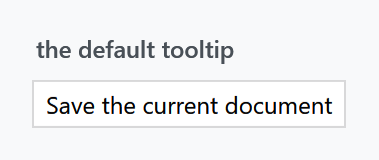
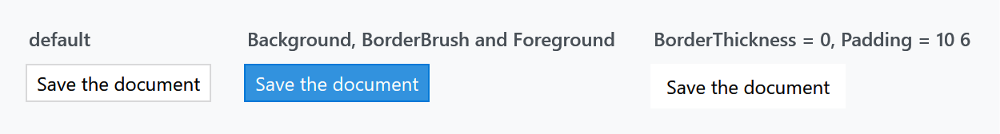
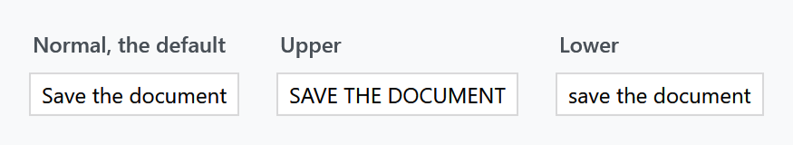
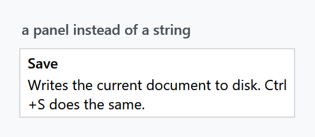

Title: ToolTip
Description: The ToolTip style
---

One style, applied implicitly, that turns WPF's tooltip into a flat bordered card in the theme colours and fades it in and out.



```xml
<Button Content="Save" ToolTip="Save the current document" />
```

`Styles/Controls.xaml` applies `MahApps.Styles.ToolTip` to every `ToolTip`, so the [quick start](../guides/quick-start) is all the setup there is. There is no second style and no variant.

## What the style sets

| Property | Set to |
| --- | --- |
| `Background` | `MahApps.Brushes.Control.Background` |
| `BorderBrush` | `MahApps.Brushes.Gray7` |
| `BorderThickness` | `1` |
| `Foreground` | `MahApps.Brushes.ThemeForeground` |
| `FontSize` | `MahApps.Font.Size.Tooltip`, which is 12 |
| `Padding` | `6 3` |
| `SnapsToDevicePixels` | `True` |

All seven are ordinary properties on a border the template draws, so all seven can be changed on the control:



```xml
<Button Content="Save">
    <Button.ToolTip>
        <ToolTip Content="Save the document"
                 Background="{DynamicResource MahApps.Brushes.Accent}"
                 BorderBrush="{DynamicResource MahApps.Brushes.AccentBase}"
                 Foreground="{DynamicResource MahApps.Brushes.IdealForeground}" />
    </Button.ToolTip>
</Button>
```

Note what is missing: the template's border has no `CornerRadius` binding, so a tooltip is always square-cornered — `ControlsHelper.CornerRadius` does nothing here, unlike on a [Label](text) or a [Button](buttons). There is no drop shadow either.

:::{.alert .alert-info}
Both are already fixed in `develop` and will arrive with the next release: the border gets `CornerRadius="{TemplateBinding mah:ControlsHelper.CornerRadius}"`, and a `HasDropShadow` setter — `True` by default — applies a new `MahApps.DropShadowEffect.ToolTip`. Until then, rounding a tooltip means replacing the template, and if you do, mind the visual states below.
:::

## The fade

:::{.alert .alert-warning}
The template's root border is written as `Opacity="0"`, and an `OpenStates` visual state group fades it to 1 over 0.3 seconds when the tooltip opens, then back to 0 over 0.4 on close.

That means **a replacement template must keep those visual states**. Drop them and you get a tooltip that is measured, positioned and completely invisible — with no error to tell you why. If you write your own, copy the `VisualStateManager.VisualStateGroups` block across with it, or start the root at `Opacity="1"` and give up the fade.
:::

## Content

The template's presenter is a `mah:ContentControlEx`, which is what makes `ControlsHelper.ContentCharacterCasing` work on a tooltip:



```xml
<ToolTip Content="Save the document" mah:ControlsHelper.ContentCharacterCasing="Upper" />
```

Being a `ContentControl`, a tooltip is not limited to a string. `ContentTemplate` and `ContentStringFormat` are template-bound, and anything you put in the content is laid out normally:



```xml
<Button Content="Save">
    <Button.ToolTip>
        <ToolTip>
            <StackPanel MaxWidth="220">
                <TextBlock FontWeight="SemiBold" Text="Save" />
                <TextBlock Margin="0 2 0 0"
                           TextWrapping="Wrap"
                           Text="Writes the current document to disk. Ctrl+S does the same." />
            </StackPanel>
        </ToolTip>
    </Button.ToolTip>
</Button>
```

A tooltip does not size itself, so give a wrapping block a `MaxWidth` or a long sentence turns into one very long line.

## Timing and placement

None of this is MahApps — the style changes how a tooltip looks, not when it appears. That stays with WPF's `ToolTipService`, and the library sets no defaults for it:

| Attached property | WPF default | |
| --- | --- | --- |
| `InitialShowDelay` | system, ~1000 ms | how long the pointer has to rest first |
| `ShowDuration` | 5000 ms | how long it stays; raise it for anything worth reading |
| `BetweenShowDelay` | system, ~100 ms | grace period in which the next tooltip appears at once |
| `ShowOnDisabled` | `False` | set it to show *why* a control is disabled |
| `Placement`, `PlacementTarget` | `Mouse` | |

```xml
<Button Content="Save"
        IsEnabled="False"
        ToolTip="Nothing to save yet"
        ToolTipService.ShowOnDisabled="True"
        ToolTipService.ShowDuration="20000" />
```

`ShowOnDisabled` is the one worth remembering: a disabled control with an unexplained reason is exactly where a tooltip earns its keep, and by default it will not show one.

## Related

[Slider](slider) and [RangeSlider](../controls/rangeslider) have their own value tooltip through `AutoToolTipPlacement`, which is a separate mechanism and does not use this style. Validation errors are drawn by `CustomValidationPopup` rather than by a tooltip — see [Validation](validation).
