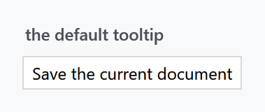
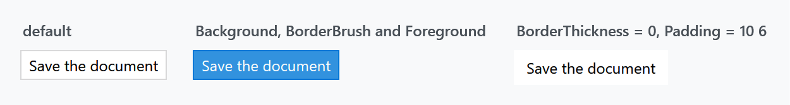
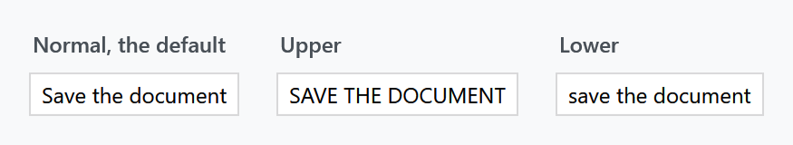
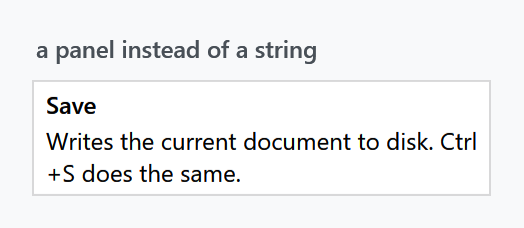

Title: ToolTip
Description: The ToolTip style
---

One style, applied implicitly, that turns WPF's tooltip into a flat bordered card in the theme colours and fades it in and out.



```xml
<Button Content="Save" ToolTip="Save the current document" />
```

`Styles/Controls.xaml` applies `MahApps.Styles.ToolTip` to every `ToolTip`, so the [quick start](../guides/quick-start) is all the setup there is. In 2.4.11 there is no second style. On `develop` the two Windows sets bring one each, see [The Windows looks](#the-windows-looks).

## What the style sets

| Property | Set to |
| --- | --- |
| `Background` | `MahApps.Brushes.Control.Background` |
| `BorderBrush` | `MahApps.Brushes.Gray7` |
| `BorderThickness` | `1` |
| `Foreground` | `MahApps.Brushes.ThemeForeground` |
| `FontSize` | `MahApps.Font.Size.Tooltip`, which is 12 |
| `Padding` | `6 3` |
| `SnapsToDevicePixels` | `True` |

All seven are ordinary properties on a border the template draws, so all seven can be changed on the control:



```xml
<Button Content="Save">
    <Button.ToolTip>
        <ToolTip Content="Save the document"
                 Background="{DynamicResource MahApps.Brushes.Accent}"
                 BorderBrush="{DynamicResource MahApps.Brushes.AccentBase}"
                 Foreground="{DynamicResource MahApps.Brushes.IdealForeground}" />
    </Button.ToolTip>
</Button>
```

Note what is missing: the template's border has no `CornerRadius` binding, so a tooltip is always square-cornered — `ControlsHelper.CornerRadius` does nothing here, unlike on a [Label](text) or a [Button](buttons). There is no drop shadow either.

:::{.alert .alert-info}
Both are already fixed in `develop` and will arrive with the next release: the border gets `CornerRadius="{TemplateBinding mah:ControlsHelper.CornerRadius}"`, and a `HasDropShadow` setter — `True` by default — applies a new `MahApps.DropShadowEffect.ToolTip`. Until then, rounding a tooltip means replacing the template, and if you do, mind the visual states below.
:::

## The fade

:::{.alert .alert-warning}
The template's root border is written as `Opacity="0"`, and an `OpenStates` visual state group fades it to 1 over 0.3 seconds when the tooltip opens, then back to 0 over 0.4 on close.

That means **a replacement template must keep those visual states**. Drop them and you get a tooltip that is measured, positioned and completely invisible — with no error to tell you why. If you write your own, copy the `VisualStateManager.VisualStateGroups` block across with it, or start the root at `Opacity="1"` and give up the fade.
:::

## Content

The template's presenter is a `mah:ContentControlEx`, which is what makes `ControlsHelper.ContentCharacterCasing` work on a tooltip:



```xml
<ToolTip Content="Save the document" mah:ControlsHelper.ContentCharacterCasing="Upper" />
```

Being a `ContentControl`, a tooltip is not limited to a string. `ContentTemplate` and `ContentStringFormat` are template-bound, and anything you put in the content is laid out normally:



```xml
<Button Content="Save">
    <Button.ToolTip>
        <ToolTip>
            <StackPanel MaxWidth="220">
                <TextBlock FontWeight="SemiBold" Text="Save" />
                <TextBlock Margin="0 2 0 0"
                           TextWrapping="Wrap"
                           Text="Writes the current document to disk. Ctrl+S does the same." />
            </StackPanel>
        </ToolTip>
    </Button.ToolTip>
</Button>
```

A tooltip does not size itself, so give a wrapping block a `MaxWidth` or a long sentence turns into one very long line.

## The Windows looks

:::{.alert .alert-info}
Both styles are on `develop` and ship with the next release.
:::

`MahApps.Styles.ToolTip.Win10` and `MahApps.Styles.ToolTip.WinUI` are the tool tips Windows draws, read off the ToolTip style of the UWP `generic.xaml` and off `ToolTip_themeresources.xaml` of WinUI 3. The [Win10](../stylevariants/win10) and the [WinUI](../stylevariants/winui) set apply them by type, so merging a set is all it takes.

| | Win10 | WinUI |
| --- | --- | --- |
| `Background` | `MahApps.Brushes.ToolTip.Win10.Background`, the chrome of a flyout | `MahApps.Brushes.ToolTip.WinUI.Background`, see below |
| `BorderBrush` | `MahApps.Brushes.ToolTip.Win10.BorderBrush` | `MahApps.Brushes.ToolTip.WinUI.BorderBrush` |
| `Foreground` | `MahApps.Brushes.ToolTip.Win10.Foreground` | `MahApps.Brushes.ToolTip.WinUI.Foreground` |
| `FontFamily` | `MahApps.Fonts.Family.Control.Win10` | `MahApps.Fonts.Family.Caption.WinUI`, the Small cut |
| `FontSize` | `MahApps.Font.Size.Caption.Win10`, 12 | `MahApps.Font.Size.Caption.WinUI`, 12 |
| `Padding` | `8 5 8 7` | `9 6 9 8` |
| `ControlsHelper.CornerRadius` | none | `MahApps.CornerRadius.WinUI.Control`, 4 |
| `HasDropShadow` | `False` | `True`, the shadow of a WinUI flyout |

Both write at the Caption step of the [type ramp](typography), so making that step larger makes the tool tips larger too. Neither fades in or out: Windows shows its tool tip at once, so these two templates have no `OpenStates` group, and the warning about the fade below is about the Metro template only.

A plain string breaks into lines at 320, the width Microsoft gives its tool tip, so a long sentence needs no `MaxWidth` of its own in these two looks. Anything else in the content is laid out as before. A number with a `ContentStringFormat` is formatted and stays on one line.

Windows lays acrylic under the WinUI tool tip. WPF cannot draw that, so the style takes the colour the acrylic falls back to, `#F9F9F9` in the light theme and `#2C2C2C` in the dark one. That colour is `MahApps.Colors.WinUI.AcrylicInAppFillDefault` in the theme.

The shadow needs room around the tip, so the WinUI style moves the popup back by its `HorizontalOffset` and `VerticalOffset` and sets a `MaxWidth` of 336, which is 320 for the tip and 8 either side for the shadow. Keep that in mind when you change either.

## Timing and placement

None of this is MahApps — the style changes how a tooltip looks, not when it appears. That stays with WPF's `ToolTipService`, and the library sets no defaults for it:

| Attached property | WPF default | |
| --- | --- | --- |
| `InitialShowDelay` | 1000 ms | how long the pointer has to rest first |
| `ShowDuration` | `Int32.MaxValue` | how long it stays, which is until the pointer leaves |
| `BetweenShowDelay` | 100 ms | grace period in which the next tooltip appears at once |
| `ShowOnDisabled` | `False` | set it to show *why* a control is disabled |
| `Placement`, `PlacementTarget` | `Mouse` | |

```xml
<Button Content="Save"
        IsEnabled="False"
        ToolTip="Nothing to save yet"
        ToolTipService.ShowOnDisabled="True" />
```

`ShowOnDisabled` is the one worth remembering: a disabled control with an unexplained reason is exactly where a tooltip earns its keep, and by default it will not show one.

The five seconds quoted for `ShowDuration` in most places is not what WPF registers. The default is `Int32.MaxValue`, on .NET Framework and on modern .NET alike, so a tooltip stays for as long as the pointer rests on the control. Setting the property shortens it rather than lengthening it.

## Related

[Slider](slider) and [RangeSlider](../controls/rangeslider) have their own value tooltip through `AutoToolTipPlacement`, which is a separate mechanism and does not use this style. Validation errors are drawn by `CustomValidationPopup` rather than by a tooltip — see [Validation](validation).
