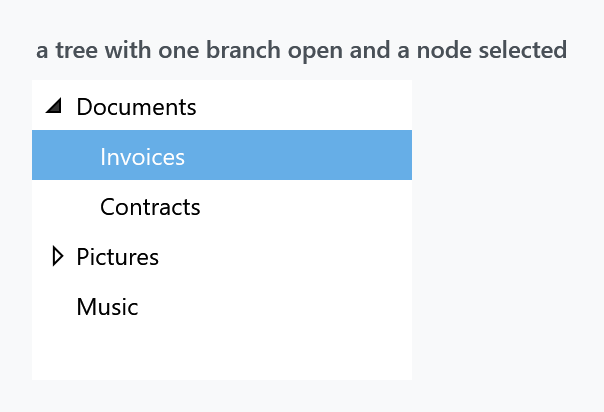
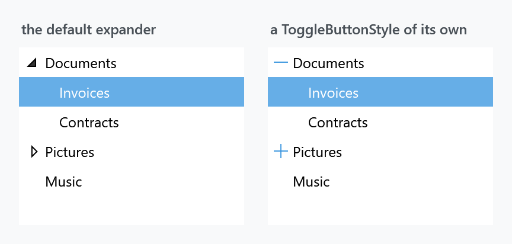

Title: TreeView
Description: The TreeView and TreeViewItem styles
---

Two implicit styles, one for the tree and one for its nodes, applied by `Styles/Controls.xaml`.



```xml
<TreeView>
    <TreeViewItem Header="Documents" IsExpanded="True">
        <TreeViewItem Header="Invoices" IsSelected="True" />
        <TreeViewItem Header="Contracts" />
    </TreeViewItem>
    <TreeViewItem Header="Pictures">
        <TreeViewItem Header="Holiday" />
    </TreeViewItem>
    <TreeViewItem Header="Music" />
</TreeView>
```

| Style | |
| --- | --- |
| `MahApps.Styles.TreeView` | the implicit one |
| `MahApps.Styles.TreeViewItem` | the implicit node style |
| `MahApps.Styles.TreeView.Virtualized` | the same tree with recycling virtualisation |

The node states — the two selection colours, hover, disabled — are the same [ItemHelper](../helper/itemhelper) brushes with the same defaults as a [ListBox](listbox), so that page covers them. What follows is what a tree adds.

## The selection spans the row

Look at the figure: the highlight behind *Invoices* runs the full width of the tree, indent and all, not just behind the text. The node template wraps the whole row in the border that carries the background, which is what most file managers do and what makes a deep tree readable.

It also means `HorizontalContentAlignment` on the tree reaches the nodes — the style binds it from the ancestor `ItemsControl`, defaulting to `Stretch`.

## No border

As with [ListBox](listbox), `BorderThickness` is **`0`** — the same `<!-- default to 0 -->` in the source — while `BorderBrush` is `MahApps.Brushes.ThemeForeground`. Switching the frame on without also setting the brush gives a black box:

```xml
<TreeView BorderThickness="1"
          BorderBrush="{DynamicResource MahApps.Brushes.Control.Border}"
          mah:ControlsHelper.CornerRadius="4" />
```

A rounded corner is bitten out at the top for the same reason it is on a [ListBox](listbox) — the template root is a plain `Border` and the opaque item background covers the arc. That page has the two workarounds.

## Indentation

Nodes are indented by a `TreeViewMarginConverter` with `Length="12"`, which walks up the parent chain and multiplies. Twelve units per level is baked into the converter instance in the dictionary, so changing it means replacing the node template — there is no property for it.

## The expander button



The little triangle is a `ToggleButton` bound two-way to `IsExpanded`, and the style it uses comes from an attached property, so it can be replaced without touching the node template:

```xml
<TreeView.ItemContainerStyle>
    <Style BasedOn="{StaticResource MahApps.Styles.TreeViewItem}" TargetType="{x:Type TreeViewItem}">
        <Setter Property="mah:TreeViewItemHelper.ToggleButtonStyle" Value="{StaticResource MyExpander}" />
    </Style>
</TreeView.ItemContainerStyle>
```

The default is `MahApps.Styles.ToggleButton.TreeViewItem.ExpandCollapse`, a filled triangle from the `TreeArrow` geometry that rotates when the node opens. The right-hand figure replaces it with plus and minus glyphs from the symbol font:

```xml
<Style x:Key="MyExpander" TargetType="{x:Type ToggleButton}">
    <Setter Property="Focusable" Value="False" />
    <Setter Property="Width" Value="20" />
    <Setter Property="Template">
        <Setter.Value>
            <ControlTemplate TargetType="{x:Type ToggleButton}">
                <Border Background="Transparent">
                    <TextBlock x:Name="Glyph"
                               HorizontalAlignment="Center"
                               VerticalAlignment="Center"
                               FontFamily="{DynamicResource MahApps.Fonts.Family.SymbolTheme}"
                               FontSize="12"
                               Foreground="{DynamicResource MahApps.Brushes.Accent}"
                               Text="&#xE710;" />
                </Border>
                <ControlTemplate.Triggers>
                    <Trigger Property="IsChecked" Value="True">
                        <Setter TargetName="Glyph" Property="Text" Value="&#xE738;" />
                    </Trigger>
                </ControlTemplate.Triggers>
            </ControlTemplate>
        </Setter.Value>
    </Setter>
</Style>
```

`Background="Transparent"` on the border matters — without it only the glyph itself answers clicks, and hitting a 12-unit triangle is fiddly. See [TreeViewItemHelper](../helper/treeviewitemhelper).

A node with no children hides the button rather than drawing a disabled one: the template has a `HasItems="False"` trigger for that, which is why *Music* in the figure has no triangle.

## Virtualisation

A tree is the control where this matters most, because every expanded branch adds nodes:

```xml
<TreeView Style="{StaticResource MahApps.Styles.TreeView.Virtualized}" ItemsSource="{Binding Roots}" />
```

The variant sets `VirtualizingStackPanel.IsVirtualizing` and `VirtualizationMode="Recycling"`. The base style watches the first of those and swaps its `ItemsPanel` for a `VirtualizingStackPanel` and `CanContentScroll` to `True` when it sees it, so setting the property by hand works too.

Note that the node style carries the same trigger for its own child panel — a tree has to virtualise at every level, not just the root.

## Related

[ListBox](listbox) shares the item brushes, and [ItemHelper](../helper/itemhelper) documents all of them.
