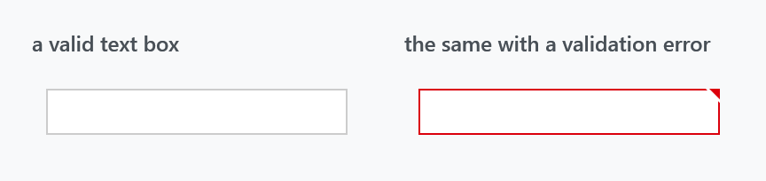
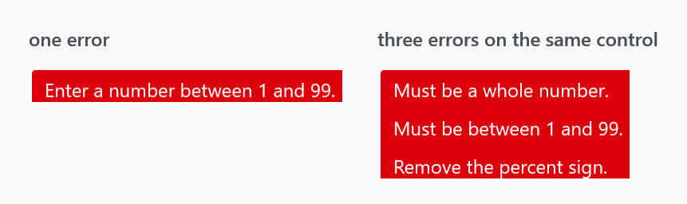

Title: Validation
Description: The validation error template and its popup
---

WPF marks a control whose binding failed validation by drawing an *adorner* over it, and which adorner is up to `Validation.ErrorTemplate`. MahApps supplies one — `MahApps.Templates.ValidationError` — and sets it on the input controls it styles.



```xml
<TextBox Text="{Binding Age, ValidatesOnDataErrors=True, UpdateSourceTrigger=PropertyChanged}" />
```

Nothing to switch on: the template is already set. It draws two things — a border in `MahApps.Brushes.Control.Validation` around the control, and a small red triangle in the top-right corner, which is the handle for the message.

## Which controls have it

`Validation.ErrorTemplate` is set to the MahApps template by the styles for `TextBox`, `RichTextBox`, `PasswordBox`, `ComboBox`, `DatePicker`, `DateTimePicker`, `TimePicker`, `NumericUpDown`, `HotKeyBox`, `ToggleSwitch` and the `ColorPicker`.

:::{.alert .alert-info}
`DataGrid` is the exception, and deliberately so: its style sets `Validation.ErrorTemplate` to `{x:Null}`. A grid draws its own row-level error indicator, and an adorner per cell on top of that would be noise. See [DataGrid](datagrid).
:::

Anything else — a control of your own, a `CheckBox`, a panel — gets WPF's default red rectangle unless you set the template yourself:

```xml
<Slider Validation.ErrorTemplate="{DynamicResource MahApps.Templates.ValidationError}" />
```

## The popup



The message is not printed next to the control; it appears in a popup, and the popup is a `mah:CustomValidationPopup` placed to the right of the control. Five borders stacked with one-unit offsets and shrinking corner radii — `MahApps.Brushes.Validation1` through `Validation5` — give it its layered edge, and the text is `MahApps.Brushes.Text.Validation`, wrapping at 250 units.

It opens on any of three conditions, all of which also require the control to actually have an error:

| | |
| --- | --- |
| the control has keyboard focus within it | the default: tab into a bad field and the message appears |
| the pointer is over the red triangle, with `ValidationHelper.ShowValidationErrorOnMouseOver` | opt in per control |
| the pointer is over the triangle, with `ShowValidationErrorOnMouseOver` on the popup | the same, set on the popup instead |

```xml
<TextBox Text="{Binding Age, ValidatesOnDataErrors=True}"
         mah:ValidationHelper.ShowValidationErrorOnMouseOver="True" />
```

[ValidationHelper](../helper/validationhelper) also has `CloseOnMouseLeftButtonDown`, which dismisses the popup on any click.

:::{.alert .alert-info}
Hover the popup itself and it fades to 15% opacity over a tenth of a second, then back when you leave. That is deliberate: the message sits to the right of the field, often over something you were about to read or click, and moving the pointer onto it gets it out of the way rather than requiring a dismissal.
:::

## Every error, not just the first

The right-hand panel above is one text box with three errors. The popup's content is an `ItemsControl` bound to the whole `Validation.Errors` collection with a `DataTemplate` for `ValidationError`, so each one gets its own line. WPF's own habit of binding to `(Validation.Errors)[0]` — and the debug spew that comes with it when the collection is empty — is avoided here.

Getting several errors at once takes a source that offers them. A binding stops at the first `ValidationRule` that fails, so rules give you one message; `INotifyDataErrorInfo` can return a whole list for one property, and every entry becomes a `ValidationError`:

```csharp
public IEnumerable GetErrors(string propertyName)
{
    if (propertyName == nameof(this.Age))
    {
        if (!int.TryParse(this.Age, out var value))
        {
            yield return "Must be a whole number.";
        }
        else if (value < 1 || value > 99)
        {
            yield return "Must be between 1 and 99.";
        }
    }
}
```

```xml
<TextBox Text="{Binding Age, ValidatesOnNotifyDataErrors=True, UpdateSourceTrigger=PropertyChanged}" />
```

The popup grows with the list, so a control with a long set of rules is worth collapsing into one message rather than five.

## Restyling it

`MahApps.Templates.ValidationError` is a keyed `ControlTemplate`, so the whole adornment can be replaced at once by defining that key again after the MahApps dictionaries:

```xml
<ControlTemplate x:Key="MahApps.Templates.ValidationError">
    <AdornedElementPlaceholder>
        <Border BorderBrush="{DynamicResource MahApps.Brushes.Control.Validation}" BorderThickness="2" />
    </AdornedElementPlaceholder>
</ControlTemplate>
```

For a change of colour only, the six brushes are enough: `MahApps.Brushes.Control.Validation` for the border, `Validation1` to `Validation5` for the popup's layers, and `MahApps.Brushes.Text.Validation` for the message.

The template also reads `ControlsHelper.CornerRadius` from the adorned control and rounds its top-right corner to match, so a rounded text box keeps its shape when it goes red.

## Related

[TextBox](textbox), [ComboBox](combobox) and [DatePicker](datepicker) are the controls that carry the template; [ValidationHelper](../helper/validationhelper) has the two attached properties.
