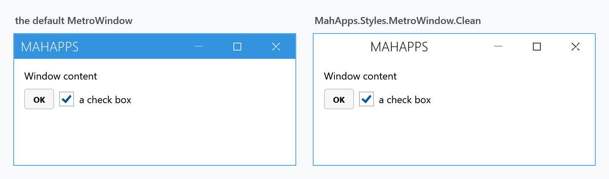

Title: Clean
Description: A quieter window chrome, with a white title bar
---

The Clean variant replaces the accent-coloured window chrome with a white title bar, a centred title and dark buttons. It is the smaller of the library's two variants: it restyles the window and four other things, and leaves every ordinary control alone.



## Opting in

Merge the variant's dictionary and set the window's style:

```xml
<mah:MetroWindow x:Class="MyApp.MainWindow"
                 xmlns:mah="http://metro.mahapps.com/winfx/xaml/controls"
                 Style="{DynamicResource MahApps.Styles.MetroWindow.Clean}">
    <mah:MetroWindow.Resources>
        <ResourceDictionary>
            <ResourceDictionary.MergedDictionaries>
                <ResourceDictionary Source="pack://application:,,,/MahApps.Metro;component/Styles/Clean/Controls.xaml" />
            </ResourceDictionary.MergedDictionaries>
        </ResourceDictionary>
    </mah:MetroWindow.Resources>
</mah:MetroWindow>
```

That is what the demo's `CleanWindowDemo` does. `Clean/Controls.xaml` merges the five dictionaries below **and** declares implicit styles for each of them, so the explicit `Style=` on the window is belt-and-braces rather than required — but harmless, and clearer about intent.

Merge the dictionary into `App.xaml` instead if the whole application should use it.

## What it restyles

| Dictionary | Applied to |
| --- | --- |
| `Clean/MetroWindow.xaml` | `MetroWindow` |
| `Clean/WindowButtonCommands.xaml` | [WindowButtonCommands](../controls/WindowButtonCommands) |
| `Clean/WindowCommands.xaml` | [WindowCommands](../controls/WindowCommands) |
| `Clean/GroupBox.xaml` | `GroupBox` |
| `Clean/StatusBar.xaml` | `StatusBar` |

The keyed styles are `MahApps.Styles.MetroWindow.Clean`, `…WindowButtonCommands.Clean`, `…WindowCommands.Clean`, `…GroupBox.Clean`, `…StatusBar.Clean`, plus `MahApps.Styles.Separator.Clean` and four `Button.MetroWindow.*.Clean` styles for the title-bar buttons in their light and dark forms.

:::{.alert .alert-info}
`Clean/Controls.xaml` applies `MahApps.Styles.WindowButtonCommands.Clean.Win10` to the window buttons — the Clean variant borrows the [Win10](win10) button look rather than defining its own.
:::

Notice what is *not* in that list: buttons, text boxes, check boxes, lists, tabs. Clean is a window-chrome variant. If you want it to change more, it is a starting point to extend rather than a full theme.

## Related

[Visual Studio](vs) is the library's other variant and a much broader one. [Win10](win10) and [WinUI](winui) are not variants in the same sense — see those pages.
