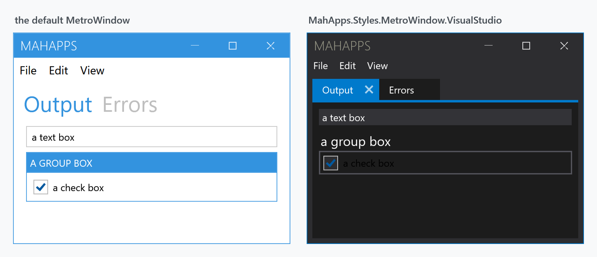

Title: Visual Studio
Description: The dark Visual Studio look, for tool-window style applications
---

The Visual Studio variant is the library's broad one: a dark palette, tabs with close buttons, flat menus and thin scrollbars — the look of a tool-window application rather than a document one.



Both windows above hold the same markup: a `Menu`, a `TabControl` with two tabs, a `TextBox`, a `GroupBox` and a `CheckBox`.

## Opting in

**Two dictionaries, not one.** This is the part that catches people out:

```xml
<mah:MetroWindow x:Class="MyApp.MainWindow"
                 xmlns:mah="http://metro.mahapps.com/winfx/xaml/controls"
                 Style="{DynamicResource MahApps.Styles.MetroWindow.VisualStudio}">
    <mah:MetroWindow.Resources>
        <ResourceDictionary>
            <ResourceDictionary.MergedDictionaries>
                <ResourceDictionary Source="pack://application:,,,/MahApps.Metro;component/Styles/VS/Controls.xaml" />
                <ResourceDictionary Source="pack://application:,,,/MahApps.Metro;component/Styles/VS/Colors.xaml" />
            </ResourceDictionary.MergedDictionaries>
        </ResourceDictionary>
    </mah:MetroWindow.Resources>
</mah:MetroWindow>
```

:::{.alert .alert-warning}
`Controls.xaml` brings the templates; **`Colors.xaml` brings the dark palette**. Merge only the first and the variant applies but keeps the ordinary theme colours, so a window comes out looking barely different from the default — the templates are there, the darkness is not.

The demo's `VSDemo` merges both, and so should you.
:::

## What it restyles

`VS/Controls.xaml` merges twelve dictionaries and declares an implicit style for each:

| Implicit style | Target |
| --- | --- |
| `MahApps.Styles.MetroWindow.VisualStudio` | `MetroWindow` |
| `MahApps.Styles.Menu.VisualStudio`, `…MenuItem…`, `…ContextMenu…` | `Menu`, `MenuItem`, `ContextMenu` |
| `MahApps.Styles.TabControl.VisualStudio`, `…TabItem…` | `TabControl`, `TabItem` |
| `MahApps.Styles.Button.VisualStudio` | `Button` |
| `MahApps.Styles.TextBox.VisualStudio` | `TextBox` |
| `MahApps.Styles.ListBox.VisualStudio`, `…ListBoxItem…` | `ListBox`, `ListBoxItem` |
| `MahApps.Styles.ScrollBar.VisualStudio` | `ScrollBar` |
| `MahApps.Styles.GroupBox.VisualStudio` | `GroupBox` |
| `MahApps.Styles.Expander.VisualStudio` | `Expander` |

`VS/Shadows.xaml` is merged too, for the drop shadows the variant uses.

Because these are **implicit** styles, merging the dictionary restyles every one of those controls in scope — you do not opt in per control. Set a `Style` explicitly on a control to keep it out.

## Tabs

The tab look is the most distinctive part: the selected tab is accent-filled and carries a close button, as in the figure. That comes from `MahApps.Styles.TabItem.VisualStudio` — see [TabControl](../styles/tabcontrol) and [MetroTabItem](../controls/MetroTabItem) for how closeable tabs work generally.

## Related

[Clean](clean) is the library's other variant, and a much smaller one. [Win10](win10) is a set of individual control styles rather than a variant, and [WinUI](winui) is not in the library at all.
