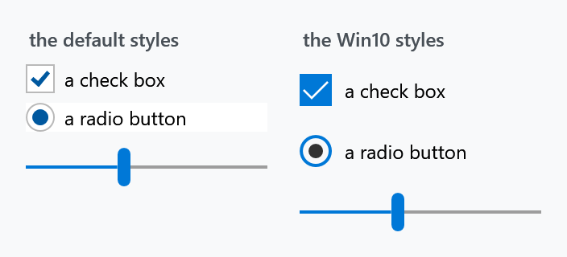

Title: Win 10 (UWP)
Description: Individual control styles in the Windows 10 look
---

Win10 is **not a variant in the sense that [Clean](clean) and [Visual Studio](vs) are.** There is no `Styles/Win10/` folder and no dictionary to merge. What the library ships is a handful of individually keyed styles that you apply one control at a time.



```xml
<CheckBox Content="a check box" Style="{DynamicResource MahApps.Styles.CheckBox.Win10}" />
<RadioButton Content="a radio button" Style="{DynamicResource MahApps.Styles.RadioButton.Win10}" />
<Slider Value="40" Style="{DynamicResource MahApps.Styles.Slider.Win10}" />
```

The Win10 check box is a filled accent square rather than an outline with a tick, the radio button a ring with a solid centre, and the slider thumb a rounded pill instead of a bar.

## What the library provides

| Style | Covered on |
| --- | --- |
| `MahApps.Styles.CheckBox.Win10` | [CheckBox](../styles/checkbox) |
| `MahApps.Styles.CheckBox.DataGrid.Win10` | [DataGrid columns](../styles/datagridcolumns) |
| `MahApps.Styles.RadioButton.Win10` | [RadioButton](../styles/radiobutton) |
| `MahApps.Styles.Slider.Win10` | [Slider](../styles/slider) |
| `MahApps.Styles.RangeSlider.Win10` | [RangeSlider](../controls/rangeslider) |
| `MahApps.Styles.WindowButtonCommands.Win10` | [WindowButtonCommands](../controls/WindowButtonCommands) |

Each brings its own supporting pieces — `MahApps.Templates.Slider.Horizontal.Win10` and `.Vertical.Win10`, `MahApps.Styles.Thumb.Slider.Win10`, the two `RepeatButton.Slider.*Track.Win10` styles, the range slider's thumb and templates, and light and dark close-button styles for the window buttons.

To apply one everywhere, declare an implicit style based on it:

```xml
<Style BasedOn="{StaticResource MahApps.Styles.CheckBox.Win10}" TargetType="{x:Type CheckBox}" />
```

:::{.alert .alert-info}
The [Clean](clean) variant uses `MahApps.Styles.WindowButtonCommands.Clean.Win10` for its title-bar buttons, so if you are already on Clean you have the Win10 window buttons.
:::

## Additions from this site

The library stops at those six. For several other controls this documentation ships **drop-in dictionaries** in the same look, written for these pages and not part of the package:

| | |
| --- | --- |
| [`Controls.Calendar.Win10.xaml`](../../assets/xaml/Controls.Calendar.Win10.xaml) | a square calendar — see [Calendar](../styles/calendar) |
| [`Controls.DateTimePicker.Win10.xaml`](../../assets/xaml/Controls.DateTimePicker.Win10.xaml) | [DateTimePicker](../controls/DateTimePicker) and [TimePicker](../controls/TimePicker) |
| [`Controls.ScrollBar.Win10.xaml`](../../assets/xaml/Controls.ScrollBar.Win10.xaml) | [ScrollBars](../styles/scrollbars) |

Download them, merge them after `Controls.xaml`, and read the page each one belongs to — several note what the built-in templates do and do not let a style reach.

## Related

[WinUI](winui) for the newer Fluent look, which the library does not cover at all. [Clean](clean) and [Visual Studio](vs) for the two real variants.
