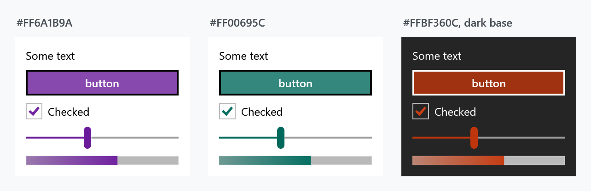

Order: 20
Title: Thememanager
Description: Changing, detecting and creating themes at run time
---

`ThemeManager` is the class behind everything a theme does after startup: switching, detecting, following the Windows setting, and building themes that are not in the box. It lives in **ControlzEx**, not in MahApps.Metro, so every snippet here starts with

```csharp
using ControlzEx.Theming;
```

and works through the singleton `ThemeManager.Current`. For the forty-six themes that ship with the library and how to pick one in `App.xaml`, see [Usage](usage).

## Changing the theme

```csharp
ThemeManager.Current.ChangeTheme(Application.Current, "Dark.Green");
```

That swaps the theme for the whole application, and every control follows immediately — the styles reach their colours through `DynamicResource`, so nothing needs recreating.

The same call takes a `FrameworkElement` instead, which is how one window, or one panel, gets a theme of its own while the rest of the application keeps the application theme:

```csharp
public partial class MainWindow : MetroWindow
{
    public MainWindow()
    {
        this.InitializeComponent();

        ThemeManager.Current.ChangeTheme(this, "Dark.Red");
    }
}
```

In XAML the equivalent is merging the theme dictionary into the window's own resources:

```xml
<mah:MetroWindow.Resources>
    <ResourceDictionary>
        <ResourceDictionary.MergedDictionaries>
            <ResourceDictionary Source="pack://application:,,,/MahApps.Metro;component/Styles/Themes/Dark.Red.xaml" />
        </ResourceDictionary.MergedDictionaries>
    </ResourceDictionary>
</mah:MetroWindow.Resources>
```

### One axis at a time

Two shortcuts change the base theme or the colour scheme and leave the other alone, which is what a light/dark toggle wants:

```csharp
ThemeManager.Current.ChangeThemeBaseColor(Application.Current, "Dark");
ThemeManager.Current.ChangeThemeColorScheme(Application.Current, "Emerald");
```

## Finding out what is applied

| Member | |
| --- | --- |
| `DetectTheme()` | the theme currently applied to the application, or `null` |
| `DetectTheme(element)` | the same for one element |
| `GetTheme("Dark.Red")` | look a theme up by name without applying it |
| `GetInverseTheme(theme)` | the same colour scheme on the other base — the light/dark toggle in one call |
| `Themes` | every theme known to the manager, the built-in ones and any you added |
| `ThemeChanged` | raised after a change, with the old and new theme |

```csharp
var current = ThemeManager.Current.DetectTheme(Application.Current);

if (current is not null)
{
    ThemeManager.Current.ChangeTheme(Application.Current, ThemeManager.Current.GetInverseTheme(current));
}
```

`Themes` is what to bind a theme picker to; each `Theme` carries a `DisplayName`, a `BaseColorScheme`, a `ColorScheme` and a `ShowcaseBrush` for the swatch.

## Following Windows

`ThemeSyncMode` decides how much of the Windows personalisation setting the application adopts. It is a flags enum:

| Value | |
| --- | --- |
| `DoNotSync` | ignore Windows entirely |
| `SyncWithAppMode` | follow the light/dark app mode |
| `SyncWithAccent` | follow the Windows accent colour |
| `SyncWithHighContrast` | follow the high-contrast setting |
| `SyncAll` | all three |

Set the mode, then sync once; after that the manager keeps up with changes on its own:

```csharp
protected override void OnStartup(StartupEventArgs e)
{
    base.OnStartup(e);

    ThemeManager.Current.ThemeSyncMode = ThemeSyncMode.SyncAll;
    ThemeManager.Current.SyncTheme();
}
```

`SyncWithAccent` generates a theme from whatever colour the user picked, which is the mechanism the next section uses directly.

## A theme from any colour

`RuntimeThemeGenerator` builds a complete theme — every brush, both the accent ramp and the greys — from a base theme and one colour. No dictionary to write:



```csharp
var theme = RuntimeThemeGenerator.Current.GenerateRuntimeTheme("Light", Color.FromRgb(0x6A, 0x1B, 0x9A));

ThemeManager.Current.AddTheme(theme);
ThemeManager.Current.ChangeTheme(Application.Current, theme);
```

Each panel in the figure is that call with a different colour, applied to the panel rather than to the application — `ChangeTheme` takes an element, so a theme can be scoped to as little as one `Border`.

Generate both bases if the application has a light/dark toggle, so `GetInverseTheme` has somewhere to go:

```csharp
foreach (var baseTheme in new[] { "Light", "Dark" })
{
    ThemeManager.Current.AddTheme(RuntimeThemeGenerator.Current.GenerateRuntimeTheme(baseTheme, brandColour));
}
```

`AddTheme` also takes a hand-built `Theme`, if you want to control the name and the showcase brush:

```csharp
ThemeManager.Current.AddTheme(new Theme("CustomDarkRed", "CustomDarkRed", "Dark", "Red", Colors.DarkRed, Brushes.DarkRed, true, false));
```

## A theme written by hand

When the generated ramp is not what you want — a brand palette with its own greys, say — write the dictionary yourself and register it as a *library theme*:

```csharp
var theme = ThemeManager.Current.AddLibraryTheme(
    new LibraryTheme(
        new Uri("pack://application:,,,/SampleApp;component/CustomAccents/Light.Accent1.xaml"),
        MahAppsLibraryThemeProvider.DefaultInstance));

ThemeManager.Current.ChangeTheme(this, theme);
```

The dictionary needs seven metadata keys at the top, and the manager reads them to place the theme:

```xml
<system:String x:Key="Theme.Name">Light.Accent1</system:String>
<system:String x:Key="Theme.Origin">MahAppsMetroThemesSample</system:String>
<system:String x:Key="Theme.DisplayName">Accent1 (Light)</system:String>
<system:String x:Key="Theme.BaseColorScheme">Light</system:String>
<system:String x:Key="Theme.ColorScheme">Accent1</system:String>
<Color x:Key="Theme.PrimaryAccentColor">#FFD80073</Color>
<SolidColorBrush x:Key="Theme.ShowcaseBrush" Color="#FFD80073" options:Freeze="True" />
```

Everything after that is colours and brushes. A **[complete worked example](../../assets/xaml/Light.Accent1.xaml)** is available as a file — five hundred lines, which is why it is not printed here.

:::{.alert .alert-info}
Two things to plan for.

Write the **dark counterpart** as well, `Dark.Accent1.xaml` with `Theme.BaseColorScheme` set to `Dark`. A theme that exists in only one base leaves `GetInverseTheme` and `SyncWithAppMode` with nowhere to go.

The authoritative list of what a theme can define is [`Theme.Template.xaml`](https://github.com/MahApps/MahApps.Metro/blob/develop/src/MahApps.Metro/Styles/Themes/Theme.Template.xaml) in the library — 422 keys, of which 79 vary between themes. A dictionary that omits one falls back to whatever was there before, which is rarely what you meant. See [Usage](usage) for how the shipped themes are generated from that template.
:::

A complete sample project is on [GitHub](https://github.com/punker76/code-samples#mahappsmetro-themes).

## Related

[Usage](usage) for the themes that ship with the library and the naming, and the [quick start](../guides/quick-start) for putting the first one in place.
